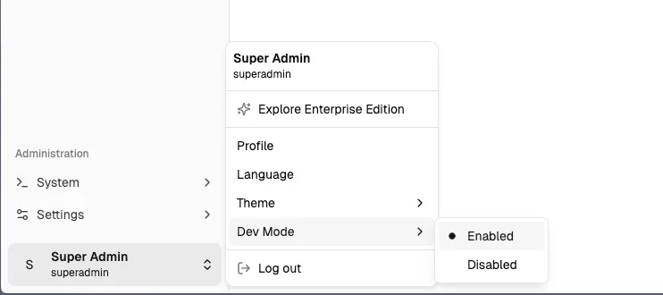
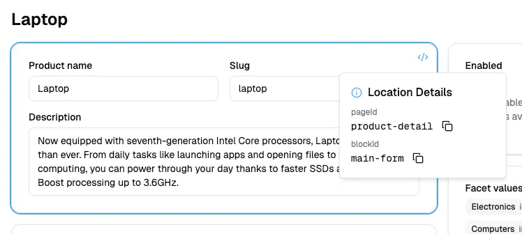

The custom functionality you create in your Vendure plugins often needs to be exposed via the Dashboard so that
administrators can interact with it.

This guide covers how you can set up your plugins with extensions to the Dashboard.

## Plugin Setup

For the purposes of the guides in this section of the docs, we will work with a simple Content Management System (CMS)
plugin that allows us to create and manage content articles.

Let's create the plugin:

```bash
npx vendure add --plugin cms
```

Now let's add an entity to the plugin:

```bash
npx vendure add --entity Article --selected-plugin CmsPlugin --custom-fields
```

You now have your `CmsPlugin` created with a new `Article` entity. You can find the plugin in the `./src/plugins/cms` directory.

Let's edit the entity to add the appropriate fields:

```ts title="src/plugins/cms/entities/article.entity.ts"
import { DeepPartial, HasCustomFields, VendureEntity } from '@vendure/core';
import { Column, Entity } from 'typeorm';

export class ArticleCustomFields {}

@Entity()
export class Article extends VendureEntity implements HasCustomFields {
    constructor(input?: DeepPartial<Article>) {
        super(input);
    }

    @Column()
    slug: string;

    @Column()
    title: string;

    @Column('text')
    body: string;

    @Column()
    isPublished: boolean;

    @Column(type => ArticleCustomFields)
    customFields: ArticleCustomFields;
}
```

Now let's create a new `ArticleService` to handle the business logic of our new entity:

```bash
npx vendure add --service ArticleService --selected-plugin CmsPlugin --selected-entity Article
```

The service will be created in the `./src/plugins/cms/services` directory.

Finally, we'll extend the GraphQL API to expose those CRUD operations:

```bash
npx vendure add --api-extension CmsPlugin --selected-service ArticleService --query-name ArticleQuery
```

Now the api extensions and resolver has been created in the `./src/plugins/cms/api-extensions` directory.

The last step is to create a migration for our newly-created entity:

```bash
npx vendure migrate --generate article
```

Your project should now have the following structure:

```
src
└── plugins/
    └── cms/
        ├── api/
        │   ├── api-extensions.ts
        │   └── article-admin.resolver.ts
        ├── entities/
        │   └── article.entity.ts
        ├── services/
        │   └── article.service.ts
        ├── cms.plugin.ts
        ├── constants.ts
        └── types.ts
```

## Add Dashboard to Plugin

Dashboard extensions are declared directly on the plugin metadata. Unlike the old AdminUiPlugin, you do not need to separately
declare ui extensions anywhere except on the plugin itself.

```ts title="src/plugins/cms/cms.plugin.ts"
@VendurePlugin({
    // ...
    entities: [Article],
    adminApiExtensions: {
        schema: adminApiExtensions,
        resolvers: [ArticleAdminResolver],
    },
    dashboard: './dashboard/index.tsx', // [!code highlight]
})
export class CmsPlugin {
    // ...
}
```

You can do this automatically with the CLI command:

```bash
npx vendure add --dashboard CmsPlugin
```

This will add the `dashboard` property to your plugin as above, and will also create the `/dashboard/index.tsx` file
which looks like this:

```tsx title="src/plugins/cms/dashboard/index.tsx"
import { Button, defineDashboardExtension, Page, PageBlock, PageLayout, PageTitle } from '@vendure/dashboard';
import { useState } from 'react';

defineDashboardExtension({
    routes: [
        // Here's a custom page so you can test that your Dashboard extensions are working.
        // You should be able to access this page via the "Catalog > Test Page" nav menu item.
        {
            path: '/test',
            loader: () => ({ breadcrumb: 'Test Page' }),
            navMenuItem: {
                id: 'test',
                title: 'Test Page',
                sectionId: 'catalog',
            },
            component: () => {
                const [count, setCount] = useState(0);
                return (
                    <Page pageId="test-page">
                        <PageTitle>Test Page</PageTitle>
                        <PageLayout>
                            <PageBlock column="main" blockId="counter">
                                <p>Congratulations, your Dashboard extension is working!</p>
                                <p className="text-muted-foreground mb-4">
                                    As is traditional, let's include a counter:
                                </p>
                                <Button variant="secondary" onClick={() => setCount(c => c + 1)}>
                                    Clicked {count} times
                                </Button>
                            </PageBlock>
                        </PageLayout>
                    </Page>
                );
            },
        },
    ],
    // The following extension points are only listed here
    // to give you an idea of all the ways that the Dashboard
    // can be extended. Feel free to delete any that you don't need.
    pageBlocks: [],
    navSections: [],
    actionBarItems: [],
    alerts: [],
    widgets: [],
    customFormComponents: {},
    dataTables: [],
    detailForms: [],
    login: {},
    historyEntries: [],
});
```

## IDE GraphQL Integration

When extending the dashboard, you'll very often need to work with GraphQL documents for fetching data and executing mutations.

Plugins are available for most popular IDEs & editors which provide auto-complete and type-checking for GraphQL operations
as you write them. This is a huge productivity boost, and is **highly recommended**.

- [GraphQL extension for VS Code](https://marketplace.visualstudio.com/items?itemName=GraphQL.vscode-graphql)
- [GraphQL plugin for IntelliJ](https://plugins.jetbrains.com/plugin/8097-graphql) (including WebStorm)

:::cli
Run the `npx vendure schema` to generate a GraphQL schema file that your IDE plugin
can use to provide autocomplete.
:::

1. Install the GraphQL plugin for your IDE
2. Run `npx vendure schema --api admin` to generate a `schema.graphql` file in your root directory
3. Create a `graphql.config.yml` file in your root directory with the following content:
   ```yaml title="graphql.config.yml"
   schema: 'schema.graphql'
   ```

## Dev Mode

Once you have logged in to the dashboard, you can toggle on "Dev Mode" using the user menu in the bottom left:



In Dev Mode, hovering any block in the dashboard will allow you to find the corresponding `pageId` and `blockId` values, which you can later use when customizing the dashboard. This is essential for:

- Identifying where to place custom page blocks
- Finding action bar locations
- Understanding the page structure



## What's Next?

Now that you understand the fundamentals of extending the dashboard, explore these specific guides:

- [Creating Pages](/extending-the-dashboard/creating-pages/) 
- [Customizing Pages](/extending-the-dashboard/customizing-pages/) 
- [Navigation](/extending-the-dashboard/navigation/) 
