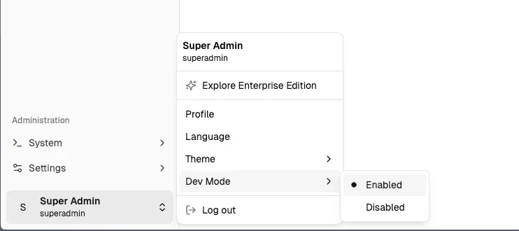
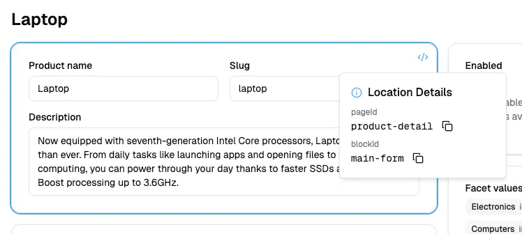

import Tabs from '@theme/Tabs';
import TabItem from '@theme/TabItem';

:::warning
The `@vendure/dashboard` package is currently **beta** and is not yet recommended for production use. The API may change in future releases. **The first stable release is targeted for the end of July 2025.**
:::

Our new React-based dashboard is currently in beta, and you can try it out now!

The goal of the new dashboard:

- Improve the developer experience to make it significantly easier and faster to build customizations
- Reduce boilerplate (repetitive code) by using schema-driven UI generation
- Modern, AI-ready stack using React, Tailwind & Shadcn.
- Built-in type-safety with zero extra configuration

Because the dashboard is in beta, not all planned features are available yet. However, enough has been implemented that
you can try it out and give us feedback.

## Installation & Setup

:::note
This guide assumes an existing project based on the `@vendure/create` folder structure.
If you have a different setup (e.g. an Nx monorepo), you may need to adapt the instructions accordingly.
:::

First install the `@vendure/dashboard` package:

```bash
npm install @vendure/dashboard
```

Then create a `vite.config.mts` file in the root of your project with the following content:

```ts title="vite.config.mts"
import { vendureDashboardPlugin } from '@vendure/dashboard/plugin';
import { pathToFileURL } from 'url';
import { defineConfig } from 'vite';
import { resolve, join } from 'path';

export default defineConfig({
    build: {
        outDir: join(__dirname, 'dist/dashboard'),
    },
    plugins: [
        vendureDashboardPlugin({
            // The vendureDashboardPlugin will scan your configuration in order
            // to find any plugins which have dashboard extensions, as well as
            // to introspect the GraphQL schema based on any API extensions
            // and custom fields that are configured.
            vendureConfigPath: pathToFileURL('./src/vendure-config.ts'),
            // Points to the location of your Vendure server.
            adminUiConfig: { apiHost: 'http://localhost', apiPort: 3000 },
            // When you start the Vite server, your Admin API schema will
            // be introspected and the types will be generated in this location.
            // These types can be used in your dashboard extensions to provide
            // type safety when writing queries and mutations.
            gqlTadaOutputPath: './src/gql',
        }),
    ],
    resolve: {
        alias: {
            // This allows all plugins to reference a shared set of
            // GraphQL types.
            '@/gql': resolve(__dirname, './src/gql/graphql.ts'),
        },
    },
});
```

You should also add the following to your `tsconfig.json` file to allow your IDE
to correctly resolve imports of GraphQL types & interpret JSX in your dashboard extensions:

```json title="tsconfig.json"
{
    "compilerOptions": {
        // highlight-start
        "module": "nodenext",
        "moduleResolution": "nodenext",
        // highlight-end
        // ... existing options
        // highlight-start
        "jsx": "react-jsx",
        "paths": {
            "@/gql": ["./src/gql/graphql.ts"]
        }
        // highlight-end
    },
    "exclude": [
        "node_modules",
        "migration.ts",
        "src/plugins/**/ui/*",
        "admin-ui",
        // highlight-start
        "src/plugins/**/dashboard/*",
        "vite.*.*ts"
        // highlight-end
    ]
}
```

## Running the Dashboard

Now you can run the dashboard in development mode with:

```bash
npx vite
```

To stop the running dashboard, type `q` and hit enter.

## Dev Mode

Once you have logged in to the dashboard, you can toggle on "Dev Mode" using the user menu in the bottom left:



In Dev Mode, hovering any block in the dashboard will allow you to find the corresponding `pageId` and `blockId` values,
which you can later use when customizing the dashboard.



## What's Next?

Now that you have the dashboard up and running, you can start extending it:

- [CMS Tutorial](/guides/extending-the-dashboard/cms-tutorial/) - Complete tutorial showing how to build a CMS plugin with custom pages and forms
- [Navigation](/guides/extending-the-dashboard/navigation/) - Add custom navigation sections and menu items
- [Page Blocks](/guides/extending-the-dashboard/page-blocks/) - Add custom blocks to existing pages
- [Action Bar Items](/guides/extending-the-dashboard/action-bar-items/) - Add custom buttons to page action bars
- [Tech Stack](/guides/extending-the-dashboard/tech-stack/) - Learn about the technologies used in the dashboard

## Still to come

We hope this gives you a taste of what is possible with the new dashboard.

We're still working to bring feature-parity with the existing Admin UI - so support for things like:

- bulk actions,
- history timeline components
- theming & branding
- translations

The final release (expected Q3 2025) will also include much more extensive documentation & guides.
