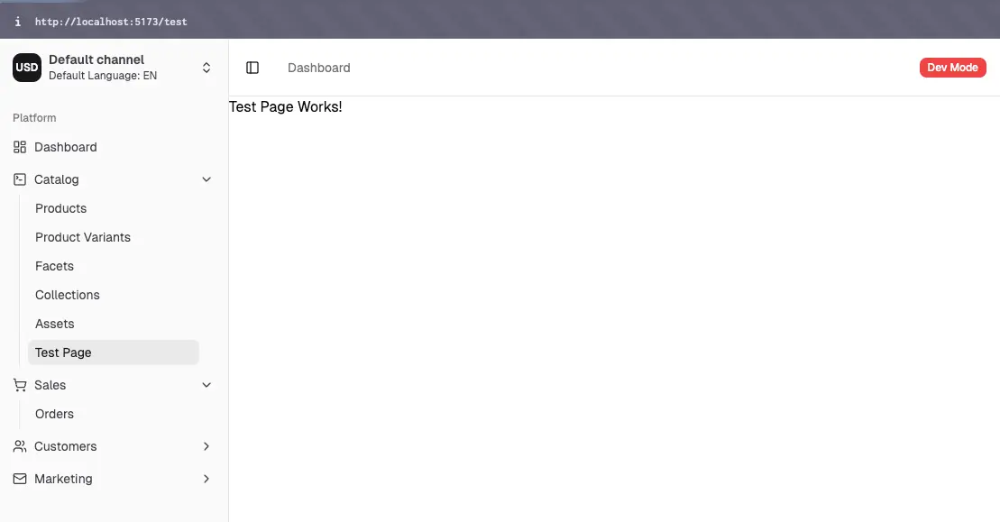
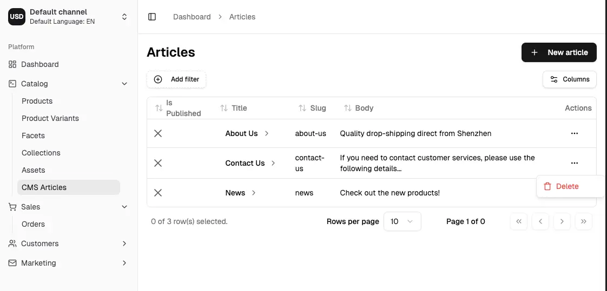
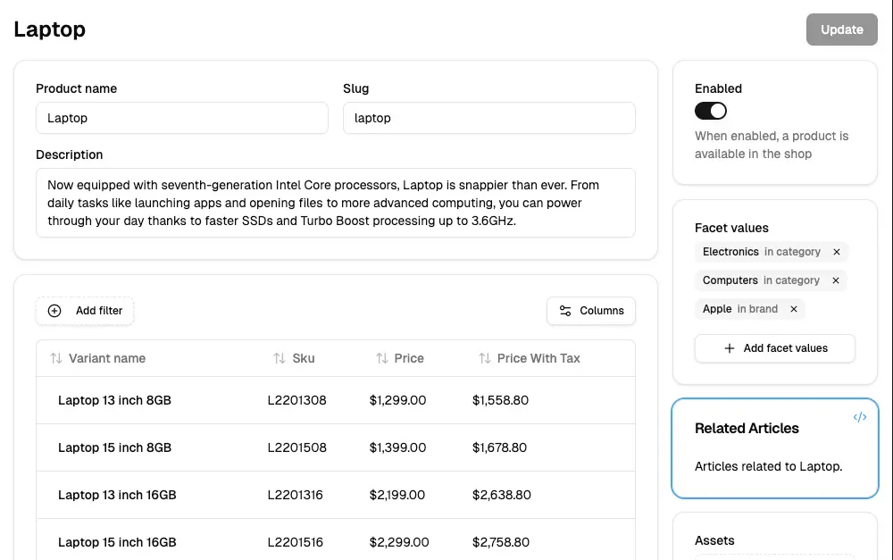

import Tabs from '@theme/Tabs';
import TabItem from '@theme/TabItem';

:::warning
The `@vendure/dashboard` package is currently **beta** and is not yet recommended for production use. The API may change in future releases.
:::

Our new React-based dashboard is currently in beta, and you can try it out now!

The goal of the new dashboard:

- Improve the developer experience to make it significantly easier and faster to build customizations
- Reduce boilerplate (repetitive code) by using schema-driven UI generation
- Modern, AI-ready stack using React, Tailwind & Shadcn.
- Built-in type-safety with zero extra configuration

Because the dashboard is in beta, not all planned features are available yet. However, enough has been implemented that
you can try it out and give us feedback.

## Installation & Setup

:::note
This guide assumes an existing project based on the `@vendure/create` folder structure.
If you have a different setup (e.g. an Nx monorepo), you may need to adapt the instructions accordingly.
:::

First install the `@vendure/dashboard` package:

```bash
npm install @vendure/dashboard
```

Then create a `vite.config.mts` file in the root of your project with the following content:

```ts title="vite.config.mts"
import { vendureDashboardPlugin } from '@vendure/dashboard/plugin';
import { pathToFileURL } from 'url';
import { defineConfig } from 'vite';
import { resolve, join } from 'path';

export default defineConfig({
    build: {
        outDir: join(__dirname, 'dist/dashboard')
    },
    plugins: [
        vendureDashboardPlugin({
            // The vendureDashboardPlugin will scan your configuration in order
            // to find any plugins which have dashboard extensions, as well as
            // to introspect the GraphQL schema based on any API extensions 
            // and custom fields that are configured.
            vendureConfigPath: pathToFileURL('./src/vendure-config.ts'),
            // Points to the location of your Vendure server. 
            adminUiConfig: { apiHost: 'http://localhost', apiPort: 3000 },
            // When you start the Vite server, your Admin API schema will
            // be introspected and the types will be generated in this location.
            // These types can be used in your dashboard extensions to provide
            // type safety when writing queries and mutations.
            gqlTadaOutputPath: './src/gql',
        }),
    ],
    resolve: {
        alias: {
            // This allows all plugins to reference a shared set of
            // GraphQL types.
            '@/gql': resolve(__dirname, './src/gql/graphql.ts'),
        }
    }
});
```

You should also add the following to your `tsconfig.json` file to allow your IDE
to correctly resolve imports of GraphQL types & interpret JSX in your dashboard extensions:

```json title="tsconfig.json"
{
    "compilerOptions": {
        // highlight-start
        "module": "nodenext",
        "moduleResolution": "nodenext",
        // highlight-end
        // ... existing options
        // highlight-start
        "jsx": "react-jsx",
        "paths": {
            "@/gql": ["./src/gql/graphql.ts"]
        }
        // highlight-end
    },
    "exclude": [
        "node_modules", 
        "migration.ts", 
        "src/plugins/**/ui/*",
        "admin-ui",
        // highlight-start
        "src/plugins/**/dashboard/*", 
        "vite.*.*ts"
        // highlight-end
    ]
}
```

## Running the Dashboard

Now you can run the dashboard in development mode with:

```bash
npx vite
```

To stop the running dashboard, type `q` and hit enter.

## Dev Mode

Once you have logged in to the dashboard, you can toggle on "Dev Mode" using the user menu in the bottom left:


In Dev Mode, hovering any block in the dashboard will allow you to find the corresponding `pageId` and `blockId` values,
which you can later use when customizing the dashboard.


## Extending the Dashboard

Follow this guide to see how to extend the dashboard with custom pages, blocks, and components.

We will create a brand new `CmsPlugin` that implements a simple content management system (CMS) for Vendure in
order to demonstrate how to extend the dashboard.

### Creating the plugin

Let's create the plugin:

```bash
npx vendure add
```
- `Which feature would you like to add?`: `[Plugin] Create a new Vendure plugin`
- `What is the name of the plugin?`: `cms`
- `Add features to cms?`: `[Plugin: Entity] Add a new entity to a plugin`
- `What is the name of the custom entity?`: `Article`
- `Entity features`: (hit enter to keep defaults)
- `[Finish] No, I'm done!`

You now have you `CmsPlugin` created with a new `Article` entity. You can find the plugin in the `./src/plugins/cms` directory.

Let's edit the entity to add the appropriate fields:

```ts title="src/plugins/cms/entities/article.entity.ts"
import {
    DeepPartial,
    HasCustomFields,
    VendureEntity,
} from '@vendure/core';
import { Column, Entity } from 'typeorm';

export class ArticleCustomFields {}

@Entity()
export class Article extends VendureEntity implements HasCustomFields {
    constructor(input?: DeepPartial<Article>) {
        super(input);
    }

    @Column()
    slug: string;

    @Column()
    title: string;

    @Column('text')
    body: string;

    @Column()
    isPublished: boolean;

    @Column(type => ArticleCustomFields)
    customFields: ArticleCustomFields;
}
```

Now let's create a new `ArticleService` to handle the business logic of our new entity:

```bash
npx vendure add
```

- `Which feature would you like to add?`: `[Plugin: Service] Add a new service to a plugin`
- `To which plugin would you like to add the feature?`: `CmsPlugin`
- `What type of service would you like to add?`: `Service to perform CRUD operations on an entity`
- `Select an entity`: `Article`

The service will be created in the `./src/plugins/cms/services` directory.

Finally, we'll extend the GraphQL API to expose those CRUD operations:

```bash
npx vendure add
```

- `Which feature would you like to add?`: `[Plugin: API] Adds GraphQL API extensions to a plugin`
- `To which plugin would you like to add the feature?`: `CmsPlugin`
- `Which service contains the business logic for this API extension?`: `ArticleService: (CRUD service for Article)`

Now the api extensions and resolver has been created in the `./src/plugins/cms/api-extensions` directory.

The last step is to create a migration for our newly-created entity:

```bash
npx vendure migrate
```

- `What would you like to do?`: `Generate a new migration`
- `Enter a meaningful name for the migration`: `article`
- `Migration file location`: (pick the first option in the `src/migrations` dir)


### Setting up Dashboard extensions

Dashboard extensions are declared directly on the plugin metadata. Unlike the old AdminUiPlugin, you do not need to separately
declare ui extensions anywhere except on the plugin itself.

```ts title="src/plugins/cms/cms.plugin.ts"
@VendurePlugin({
    // ...
    entities: [Article],
    adminApiExtensions: {
        schema: adminApiExtensions,
        resolvers: [ArticleAdminResolver]
    },
    // highlight-next-line
    dashboard: './dashboard/index.tsx',
})
export class CmsPlugin {
  // ...
}
```

Now we'll create the entry point of our dashboard extension:

```tsx title="src/plugins/cms/dashboard/index.tsx"
import { defineDashboardExtension } from '@vendure/dashboard';

export default defineDashboardExtension({
    // Let's add a simple test page to check things are working
    routes: [
        {
            component: () => <div>Test Page Works!</div>,
            path: '/test',
            navMenuItem: {
                id: 'test',
                title: 'Test Page',
                sectionId: 'catalog'
            }
        }
    ]
})
```

Restart the Vite server (`q, enter` to quit if still running), and then you should be able to see your new test page!




### Creating a list page

Now that the test page is working, let's create a list page for our `Article` entity.

First we'll create a new `article-list.tsx` file in the `./src/plugins/cms/dashboard` directory:

```tsx title="src/plugins/cms/dashboard/article-list.tsx"
import { Button, DashboardRouteDefinition, ListPage, PageActionBarRight, DetailPageButton } from '@vendure/dashboard';
import { Link } from '@tanstack/react-router';
import { PlusIcon } from 'lucide-react';

// This function is generated for you by the `vendureDashboardPlugin` in your Vite config.
// It uses gql-tada to generate TypeScript types which give you type safety as you write
// your queries and mutations.
import { graphql } from '@/gql';

// The fields you select here will be automatically used to generate the appropriate columns in the
// data table below.
const getArticleList = graphql(`
    query GetArticles($options: ArticleListOptions) {
        articles(options: $options) {
            items {
                id
                createdAt
                updatedAt
                isPublished
                title
                slug
                body
                customFields
            }
        }
    }
`);

const deleteArticleDocument = graphql(`
    mutation DeleteArticle($id: ID!) {
        deleteArticle(id: $id) {
            result
        }
    }
`);

export const articleList: DashboardRouteDefinition = {
    navMenuItem: {
        sectionId: 'catalog',
        id: 'articles',
        url: '/articles',
        title: 'CMS Articles',
    },
    path: '/articles',
    loader: () => ({
        breadcrumb: 'Articles',
    }),
    component: route => (
        <ListPage
            pageId="article-list"
            title="Articles"
            listQuery={getArticleList}
            deleteMutation={deleteArticleDocument}
            route={route}
            customizeColumns={{
                title: {
                    cell: ({ row }) => {
                        const post = row.original;
                        return <DetailPageButton id={post.id} label={post.title}/>;
                    },
                }
            }}
        >
            <PageActionBarRight>
                <Button asChild>
                    <Link to="./new">
                        <PlusIcon className="mr-2 h-4 w-4"/>
                        New article
                    </Link>
                </Button>
            </PageActionBarRight>
        </ListPage>
    ),
};
```

Let's register this route (and we can also remove the test page) in our `index.tsx` file:

```tsx title="src/plugins/cms/dashboard/index.tsx"
import { defineDashboardExtension } from '@vendure/dashboard';

// highlight-next-line
import { articleList } from "./article-list";

export default defineDashboardExtension({
    routes: [
        // highlight-next-line
        articleList,
    ],
});
```

You should now be able to see the list view, which will be empty:


### Creating a detail page

Now let's create a detail page so we can start adding articles.

We'll begin with the simplest approach, where the form will be auto-generated for us based on the GraphQL schema
using the [DetailPage](/reference/dashboard/components/detail-page) component.
This is useful for quickly getting started, but you will probably want to customize the form later on.

Create a new file called `article-detail.tsx` in the `./src/plugins/cms/dashboard` directory:

```tsx title="src/plugins/cms/dashboard/article-detail.tsx"
import {
    DashboardRouteDefinition,
    DetailPage,
    detailPageRouteLoader
} from '@vendure/dashboard';
import { graphql } from '@/gql';

const articleDetailDocument = graphql(`
    query GetArticleDetail($id: ID!) {
        article(id: $id) {
            id
            createdAt
            updatedAt
            isPublished
            title
            slug
            body
            customFields
        }
    }
`);

const createArticleDocument = graphql(`
    mutation CreateArticle($input: CreateArticleInput!) {
        createArticle(input: $input) {
            id
        }
    }
`);

const updateArticleDocument = graphql(`
    mutation UpdateArticle($input: UpdateArticleInput!) {
        updateArticle(input: $input) {
            id
        }
    }
`);

export const articleDetail: DashboardRouteDefinition = {
    path: '/articles/$id',
    loader: detailPageRouteLoader({
        queryDocument: articleDetailDocument,
        breadcrumb: (isNew, entity) => [
            { path: '/articles', label: 'Articles' },
            isNew ? 'New article' : entity?.title,
        ],
    }),
    component: route => {
        return (
            <DetailPage
                pageId="article-detail"
                queryDocument={articleDetailDocument}
                createDocument={createArticleDocument}
                updateDocument={updateArticleDocument}
                route={route}
                title={article => article?.title ?? 'New article'}
                setValuesForUpdate={article => {
                    return {
                        id: article?.id ?? '',
                        isPublished: article?.isPublished ?? false,
                        title: article?.title ?? '',
                        slug: article?.slug ?? '',
                        body: article?.body ?? '',
                    };
                }}
            />
        );
    },
};
```

Now we can register this route in our `index.tsx` file:

```tsx title="src/plugins/cms/dashboard/index.tsx"
import {defineDashboardExtension} from '@vendure/dashboard';

import {articleList} from "./article-list";
// highlight-next-line
import {articleDetail} from "./article-detail";

export default defineDashboardExtension({
    routes: [
        articleList,
        // highlight-next-line
        articleDetail,
    ]
});
```

You should now be able to click on the "New article" button in the list view, and see the detail page:


Congratulations! You can now add, edit and delete articles in the dashboard.



### Customizing the detail page

The auto-generated [DetailPage](/reference/dashboard/components/detail-page) is a great way to get started and quickly be able
to interact with your entities. But let's now see how we can fully customize the layout and form fields.

```tsx title="src/plugins/cms/dashboard/article-detail.tsx"
import {
    DashboardRouteDefinition,
    detailPageRouteLoader,
    useDetailPage,
    Page,
    PageTitle,
    PageActionBar,
    PageActionBarRight,
    PermissionGuard,
    Button,
    PageLayout,
    PageBlock,
    FormFieldWrapper,
    DetailFormGrid,
    Switch,
    Input,
    RichTextInput,
    CustomFieldsPageBlock,
} from '@vendure/dashboard';
import {AnyRoute, useNavigate} from '@tanstack/react-router'
import {toast} from 'sonner';

import {graphql} from '@/gql';

const articleDetailDocument = graphql(`
    query GetArticleDetail($id: ID!) {
        article(id: $id) {
            id
            createdAt
            updatedAt
            isPublished
            title
            slug
            body
            customFields
        }
    }
`);

const createArticleDocument = graphql(`
    mutation CreateArticle($input: CreateArticleInput!) {
        createArticle(input: $input) {
            id
        }
    }
`);

const updateArticleDocument = graphql(`
    mutation UpdateArticle($input: UpdateArticleInput!) {
        updateArticle(input: $input) {
            id
        }
    }
`);

export const articleDetail: DashboardRouteDefinition = {
    path: '/articles/$id',
    loader: detailPageRouteLoader({
        queryDocument: articleDetailDocument,
        breadcrumb: (isNew, entity) => [
            {path: '/articles', label: 'Articles'},
            isNew ? 'New article' : entity?.title,
        ],
    }),
    component: route => {
        return (
            <ArticleDetailPage route={route} />
        );
    },
};


function ArticleDetailPage({route}: { route: AnyRoute }) {
    const params = route.useParams();
    const navigate = useNavigate();
    const creatingNewEntity = params.id === 'new';

    const {form, submitHandler, entity, isPending, resetForm} = useDetailPage({
        queryDocument: articleDetailDocument,
        createDocument: createArticleDocument,
        updateDocument: updateArticleDocument,
        setValuesForUpdate: article => {
            return {
                id: article?.id ?? '',
                isPublished: article?.isPublished ?? false,
                title: article?.title ?? '',
                slug: article?.slug ?? '',
                body: article?.body ?? '',
            };
        },
        params: {id: params.id},
        onSuccess: async data => {
            toast('Successfully updated article');
            resetForm();
            if (creatingNewEntity) {
                await navigate({to: `../$id`, params: { id: data.id } });
            }
        },
        onError: err => {
            toast('Failed to update article', {
                description: err instanceof Error ? err.message : 'Unknown error',
            });
        },
    });

    return (
        <Page pageId="article-detail" form={form} submitHandler={submitHandler}>
            <PageTitle>{creatingNewEntity ? 'New article' : (entity?.title ?? '')}</PageTitle>
            <PageActionBar>
                <PageActionBarRight>
                    <PermissionGuard requires={['UpdateProduct', 'UpdateCatalog']}>
                        <Button
                            type="submit"
                            disabled={!form.formState.isDirty || !form.formState.isValid || isPending}
                        >
                            Update
                        </Button>
                    </PermissionGuard>
                </PageActionBarRight>
            </PageActionBar>
            <PageLayout>
                <PageBlock column="side" blockId="publish-status">
                    <FormFieldWrapper
                        control={form.control}
                        name="isPublished"
                        label="Is Published"
                        render={({field}) => (
                            <Switch checked={field.value} onCheckedChange={field.onChange}/>
                        )}
                    />
                </PageBlock>
                <PageBlock column="main" blockId="main-form">
                    <DetailFormGrid>
                        <FormFieldWrapper
                            control={form.control}
                            name="title"
                            label="Title"
                            render={({field}) => <Input {...field} />}
                        />
                        <FormFieldWrapper
                            control={form.control}
                            name="slug"
                            label="Slug"
                            render={({field}) => <Input {...field} />}
                        />
                    </DetailFormGrid>
                    <FormFieldWrapper
                        control={form.control}
                        name="body"
                        label="Content"
                        render={({field}) => <RichTextInput value={field.value ?? ''} onChange={field.onChange} />}
                    />
                </PageBlock>
                <CustomFieldsPageBlock column="main" entityType="Article" control={form.control}/>
            </PageLayout>
        </Page>
    );
}
```

In the above example, we have:

- Used the [Page](/reference/dashboard/components/page), [PageTitle](/reference/dashboard/components/page-title), 
  [PageActionBar](/reference/dashboard/components/page-action-bar) and [PageLayout](/reference/dashboard/components/page-layout) components to create a layout for our page.
- Used [PageBlock](/reference/dashboard/components/page-block) components to structure the page into blocks.
- Used custom form components (such as the `RichTextInput`) to better represent the data.

### Defining page blocks

In the Dashboard, all pages are build from blocks. Every block has a `pageId` and a `blockId` which uniquely locates it in the
app (see earlier section on Dev Mode).

You can also define your own blocks, which can be added to any page and can even replace the default blocks. 

Here's an example which you can add to the existing `index.tsx` file:

```tsx title="src/plugins/cms/dashboard/index.tsx"
import { defineDashboardExtension } from '@vendure/dashboard';

import { articleList } from "./article-list";
import { articleDetail } from "./article-detail";

export default defineDashboardExtension({
    routes: [
        articleList,
        articleDetail,
    ],
    // highlight-start
    pageBlocks: [
        {
            id: 'related-articles',
            title: 'Related Articles',
            location: {
                // This is the pageId of the page where this block will be
                pageId: 'product-detail',
                // can be "main" or "side"
                column: 'side',
                position: {
                    // Blocks are positioned relative to existing blocks on
                    // the page.
                    blockId: 'facet-values',
                    // Can be "before", "after" or "replace"
                    // Here we'll place it after the `facet-values` block.
                    order: 'after'
                }
            },
            component: ({ context }) => {
                // In the component, you can use the `context` prop to
                // access the entity and the form instance.
                return (
                    <div className="text-sm">
                        Articles related to {context.entity.name}
                    </div>
                );
            }
        }
    ],
    // highlight-end
});
```

This will look this:



### Adding action bar items

Like in the old Admin UI, we have the concept of the "action bar", which is the bar at the top of the page where you can add
buttons and other actions.

Currently, we only support adding buttons, but dropdown menu support is coming soon.

```tsx title="src/plugins/cms/dashboard/index.tsx"
import { Button, defineDashboardExtension } from '@vendure/dashboard';
import { useState } from 'react';

export default defineDashboardExtension({
    actionBarItems: [
        {
            pageId: 'product-detail',
            component: ({ context }) => {
                const [count, setCount] = useState(0);
                return (<Button type="button" 
                               variant="secondary" 
                               onClick={() => setCount(x => x + 1)}>
                    Counter: { count }
                </Button>);
            }
        }
    ],
});
```

## Tech Stack

In your custom components, you also have access to the following libraries and tools which the Dashboard is built upon:

- Tailwind CSS
- Shadcn UI
- React Query
- Tanstack Router
- React Hook Form

## API Reference

A partial API reference of the new Dashboard API can be found here:

- [Dashboard API Reference](/reference/dashboard/extensions/)

## Still to come

We hope this gives you a taste of what is possible with the new dashboard.

We're still working to bring feature-parity with the existing Admin UI - so support for things like:

- bulk actions, 
- history timeline components
- theming & branding
- translations

The final release (expected Q3 2025) will also include much more extensive documentation & guides.
