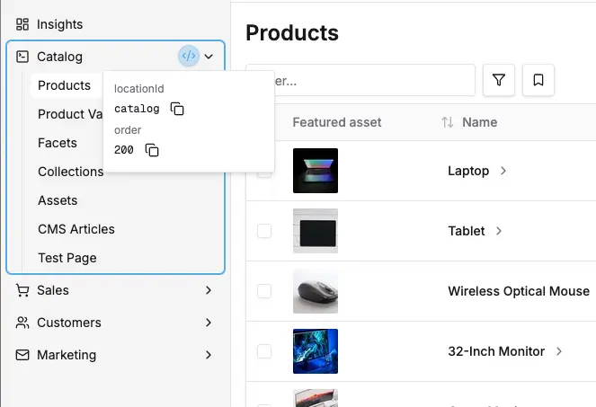
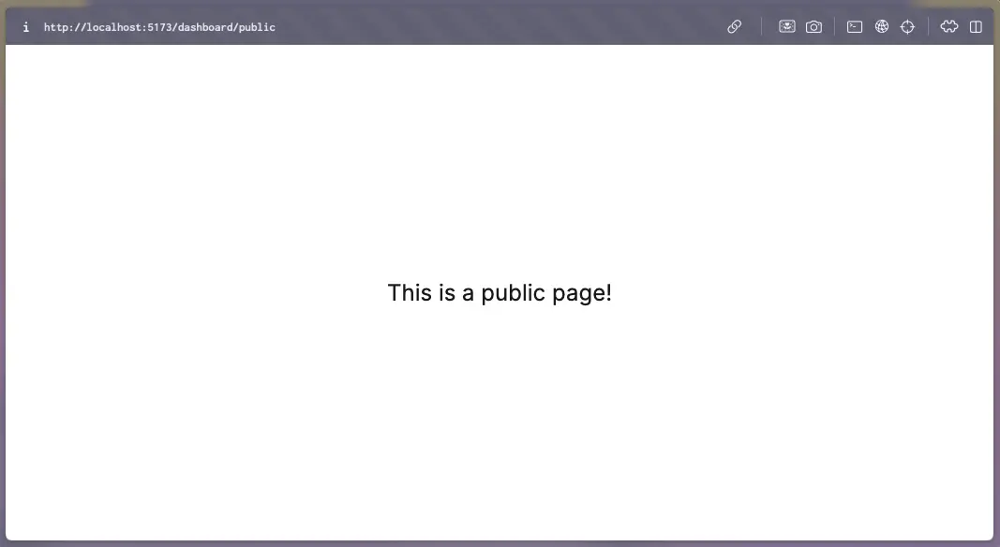

The dashboard provides a flexible navigation system that allows you to add custom navigation sections and menu items. Navigation items are organized into sections that can be placed in either the "Platform" (top) or "Administration" (bottom) areas of the sidebar.

## Adding Navigation Items to Existing Sections

The simplest way to add navigation is to add menu items to existing sections. This is done automatically when you define routes with `navMenuItem` properties.

```tsx title="src/plugins/my-plugin/dashboard/index.tsx"
import { defineDashboardExtension } from '@vendure/dashboard';

defineDashboardExtension({
    routes: [
        {
            path: '/my-custom-page',
            component: () => <div>My Custom Page</div>,
            navMenuItem: {
                // The section where this item should appear
                sectionId: 'catalog',
                // Unique identifier for this menu item
                id: 'my-custom-page',
                // Display text in the navigation
                title: 'My Custom Page',
                // Optional: URL if different from path
                url: '/my-custom-page',
            },
        },
    ],
});
```

### Available Section IDs

The dashboard comes with several built-in sections:

- **`catalog`** - For product-related functionality
- **`orders`** - For order management
- **`customers`** - For customer management
- **`marketing`** - For promotions and marketing tools
- **`settings`** - For configuration and admin settings

### Finding Section IDs & Ordering

You can find the available IDs & their order value for all navigation sections and items using [Dev mode](/extending-the-dashboard/extending-overview/#dev-mode):



## Creating Custom Navigation Sections

You can create entirely new navigation sections with their own icons and ordering:

```tsx title="src/plugins/my-plugin/dashboard/index.tsx"
import { defineDashboardExtension } from '@vendure/dashboard';
import { FileTextIcon, SettingsIcon } from 'lucide-react';

defineDashboardExtension({
    // Define custom navigation sections
    navSections: [
        {
            id: 'content-management',
            title: 'Content',
            icon: FileTextIcon,
            placement: 'top', // Platform area
            order: 350, // After Customers (400), before Marketing (500)
        },
        {
            id: 'integrations',
            title: 'Integrations',
            icon: SettingsIcon,
            placement: 'bottom', // Administration area
            order: 150, // Between System (100) and Settings (200)
        },
    ],
    routes: [
        {
            path: '/articles',
            component: () => <div>Articles</div>,
            navMenuItem: {
                sectionId: 'content-management', // Use our custom section
                id: 'articles',
                title: 'Articles',
            },
        },
        {
            path: '/pages',
            component: () => <div>Pages</div>,
            navMenuItem: {
                sectionId: 'content-management',
                id: 'pages',
                title: 'Pages',
            },
        },
    ],
});
```

For documentation on all the configuration properties available, see the reference docs:

- [DashboardNavSectionDefinition](/reference/dashboard/extensions-api/navigation#dashboardnavsectiondefinition)
- [NavMenuItem](/reference/dashboard/extensions-api/navigation#navmenuitem)

## Section Placement and Ordering

The navigation sidebar is divided into two areas:

- **Top Placement (`'top'`)**: The "Platform" area for core functionality (Dashboard, Catalog, Sales, etc.)
- **Bottom Placement (`'bottom'`)**: The "Administration" area for system and configuration sections (System, Settings)

### Placement Examples

```tsx
defineDashboardExtension({
    navSections: [
        {
            id: 'reports',
            title: 'Reports',
            icon: BarChartIcon,
            placement: 'top', // Appears in Platform area
            order: 150, // Positioned within top sections
        },
        {
            id: 'integrations',
            title: 'Integrations',
            icon: PlugIcon,
            placement: 'bottom', // Appears in Administration area
            order: 150, // Positioned within bottom sections
        },
    ],
});
```

### Order Scoping

:::important Order Scoping
Order values are scoped within each placement area. This means:

- Top sections compete only with other top sections for positioning
- Bottom sections compete only with other bottom sections for positioning
- You can use the same order value in both top and bottom without conflict
  :::

### Default Section Orders

**Top Placement (Platform):**

- Dashboard: 100
- Catalog: 200
- Sales: 300
- Customers: 400
- Marketing: 500

**Bottom Placement (Administration):**

- System: 100
- Settings: 200

This means if you want to add a section between Catalog and Sales in the top area, you might use `order: 250`. If you want to add a section before Settings in the bottom area, you could use `order: 150`.

:::note[Default Placement]
If you don't specify a `placement`, sections default to `'top'` placement.
:::

## Unauthenticated Routes

By default, all navigation is assumed to be for authenticated routes, i.e. the routes are only accessible to administrators
who are logged in.

Sometimes you want to make a certain route accessible to unauthenticated users. For example, you may want to implement
a completely custom login page or a password recovery page, which must be accessible to everyone.

This is done by setting `authenticated: false` in your route definition:

```tsx
import { defineDashboardExtension } from '@vendure/dashboard';

defineDashboardExtension({
    routes: [
        {
            path: '/public',
            component: () => (
                <div className="flex h-screen items-center justify-center text-2xl">This is a public page!</div>
            ),
            authenticated: false // [!code highlight]
        },
    ]
});
```

This page will then be accessible to all users at `http://localhost:4873/dashboard/public`



## Complete Example

Here's a comprehensive example showing how to create a complete navigation structure for a content management system:

```tsx title="src/plugins/cms/dashboard/index.tsx"
import { defineDashboardExtension } from '@vendure/dashboard';
import { FileTextIcon, ImageIcon, TagIcon, FolderIcon, SettingsIcon } from 'lucide-react';

defineDashboardExtension({
    // Create custom navigation sections
    navSections: [
        {
            id: 'content',
            title: 'Content',
            icon: FileTextIcon,
            placement: 'top', // Platform area
            order: 250, // Between Catalog (200) and Sales (300)
        },
        {
            id: 'media',
            title: 'Media',
            icon: ImageIcon,
            placement: 'top', // Platform area
            order: 275, // After Content section
        },
    ],

    routes: [
        // Content section items
        {
            path: '/articles',
            component: () => <div>Articles List</div>,
            navMenuItem: {
                sectionId: 'content',
                id: 'articles',
                title: 'Articles',
            },
        },
        {
            path: '/pages',
            component: () => <div>Pages List</div>,
            navMenuItem: {
                sectionId: 'content',
                id: 'pages',
                title: 'Pages',
            },
        },
        {
            path: '/categories',
            component: () => <div>Categories List</div>,
            navMenuItem: {
                sectionId: 'content',
                id: 'categories',
                title: 'Categories',
            },
        },

        // Media section items
        {
            path: '/media-library',
            component: () => <div>Media Library</div>,
            navMenuItem: {
                sectionId: 'media',
                id: 'media-library',
                title: 'Library',
            },
        },
        {
            path: '/media-folders',
            component: () => <div>Media Folders</div>,
            navMenuItem: {
                sectionId: 'media',
                id: 'media-folders',
                title: 'Folders',
            },
        },

        // Add to existing settings section
        {
            path: '/cms-settings',
            component: () => <div>CMS Settings</div>,
            navMenuItem: {
                sectionId: 'settings',
                id: 'cms-settings',
                title: 'CMS Settings',
            },
        },
    ],
});
```

## Icons

The dashboard uses [Lucide React](https://lucide.dev/) icons. You can import any icon from the library:

```tsx
import {
    HomeIcon,
    ShoppingCartIcon,
    UsersIcon,
    SettingsIcon,
    FileTextIcon,
    ImageIcon,
    BarChartIcon,
    // ... any other Lucide icon
} from 'lucide-react';
```

Common icons for navigation sections:

- **Content**: `FileTextIcon`, `EditIcon`, `BookOpenIcon`
- **Media**: `ImageIcon`, `FolderIcon`, `UploadIcon`
- **Analytics**: `BarChartIcon`, `TrendingUpIcon`, `PieChartIcon`
- **Tools**: `WrenchIcon`, `SettingsIcon`, `CogIcon`
- **Integrations**: `LinkIcon`, `ZapIcon`, `PlugIcon`

## Best Practices

:::tip[Navigation Design Guidelines]

1. **Use descriptive section names**: Choose clear, concise names that indicate the section's purpose
2. **Group related functionality**: Keep logically related menu items in the same section
3. **Choose appropriate icons**: Select icons that clearly represent the section's function
4. **Consider ordering carefully**: Place frequently used sections earlier in the navigation
5. **Keep section counts reasonable**: Avoid creating too many sections as it can clutter the navigation
6. **Use consistent naming**: Follow consistent patterns for menu item names within sections
   :::
