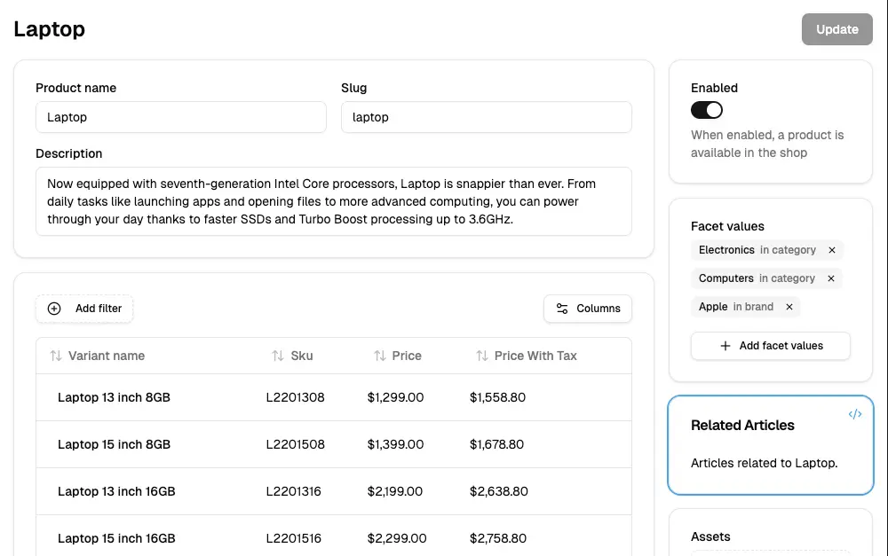

In the Dashboard, all pages are built from blocks. Every block has a `pageId` and a `blockId` which uniquely locates it in the
app (see [Dev Mode](/guides/extending-the-dashboard/getting-started/#dev-mode) section).

You can also define your own blocks, which can be added to any page and can even replace the default blocks.

## Basic Page Block Example

Here's an example of how to define a custom page block:

```tsx title="src/plugins/my-plugin/dashboard/index.tsx"
import { defineDashboardExtension } from '@vendure/dashboard';

export default defineDashboardExtension({
    pageBlocks: [
        {
            id: 'related-articles',
            title: 'Related Articles',
            location: {
                // This is the pageId of the page where this block will be
                pageId: 'product-detail',
                // can be "main" or "side"
                column: 'side',
                position: {
                    // Blocks are positioned relative to existing blocks on
                    // the page.
                    blockId: 'facet-values',
                    // Can be "before", "after" or "replace"
                    // Here we'll place it after the `facet-values` block.
                    order: 'after',
                },
            },
            component: ({ context }) => {
                // In the component, you can use the `context` prop to
                // access the entity and the form instance.
                return <div className="text-sm">Articles related to {context.entity.name}</div>;
            },
        },
    ],
});
```

This will add a "Related Articles" block to the product detail page:



## Block Positioning

Page blocks can be positioned in three ways relative to existing blocks:

### Before

Places the block before the specified `blockId`:

```tsx
position: {
    blockId: 'product-variants',
    order: 'before'
}
```

### After

Places the block after the specified `blockId`:

```tsx
position: {
    blockId: 'product-variants',
    order: 'after'
}
```

### Replace

Replaces the existing block entirely:

```tsx
position: {
    blockId: 'product-variants',
    order: 'replace'
}
```

## Block Columns

Blocks can be placed in two columns:

- **`main`**: The main content area (wider column on the left)
- **`side`**: The sidebar area (narrower column on the right)

## Context Data

The `context` prop provides access to:

- **`entity`**: The current entity being viewed/edited (e.g., Product, Customer, etc.)
- **`form`**: The React Hook Form instance for the current page (if applicable)
- **`route`**: Route information and parameters

## Advanced Example

Here's a more complex example that shows different types of blocks:

```tsx title="src/plugins/my-plugin/dashboard/index.tsx"
import { defineDashboardExtension, Button } from '@vendure/dashboard';
import { useState } from 'react';

export default defineDashboardExtension({
    pageBlocks: [
        // Analytics block for product page
        {
            id: 'product-analytics',
            title: 'Product Analytics',
            location: {
                pageId: 'product-detail',
                column: 'side',
                position: {
                    blockId: 'product-assets',
                    order: 'after',
                },
            },
            component: ({ context }) => {
                const product = context.entity;
                return (
                    <div className="space-y-2">
                        <div className="text-sm text-muted-foreground">Last 30 days</div>
                        <div className="grid grid-cols-2 gap-4">
                            <div>
                                <div className="text-2xl font-bold">142</div>
                                <div className="text-xs text-muted-foreground">Views</div>
                            </div>
                            <div>
                                <div className="text-2xl font-bold">23</div>
                                <div className="text-xs text-muted-foreground">Orders</div>
                            </div>
                        </div>
                    </div>
                );
            },
        },
        // Quick actions block
        {
            id: 'quick-actions',
            title: 'Quick Actions',
            location: {
                pageId: 'product-detail',
                column: 'main',
                position: {
                    blockId: 'product-variants',
                    order: 'after',
                },
            },
            component: ({ context }) => {
                const [isProcessing, setIsProcessing] = useState(false);

                const handleSync = async () => {
                    setIsProcessing(true);
                    // Simulate API call
                    await new Promise(resolve => setTimeout(resolve, 2000));
                    setIsProcessing(false);
                };

                return (
                    <div className="flex gap-2">
                        <Button variant="outline" onClick={handleSync} disabled={isProcessing}>
                            {isProcessing ? 'Syncing...' : 'Sync to External System'}
                        </Button>
                        <Button variant="outline">Generate QR Code</Button>
                    </div>
                );
            },
        },
    ],
});
```

## Finding Block IDs

To find the `pageId` and `blockId` values for positioning your blocks:

1. Enable [Dev Mode](/guides/extending-the-dashboard/getting-started/#dev-mode) in the dashboard
2. Navigate to the page where you want to add your block
3. Hover over existing blocks to see their IDs
4. Use these IDs in your block positioning configuration

## TypeScript Support

The dashboard provides full TypeScript support for page blocks. The `context` prop is typed based on the page you're targeting, giving you autocomplete and type safety for the entity properties.

## Best Practices

1. **Use descriptive IDs**: Choose clear, unique IDs for your blocks
2. **Position thoughtfully**: Consider the user experience when placing blocks
3. **Handle loading states**: Show appropriate loading indicators for async operations
4. **Follow design patterns**: Use the dashboard's existing UI components for consistency
5. **Test thoroughly**: Verify your blocks work correctly on different screen sizes
