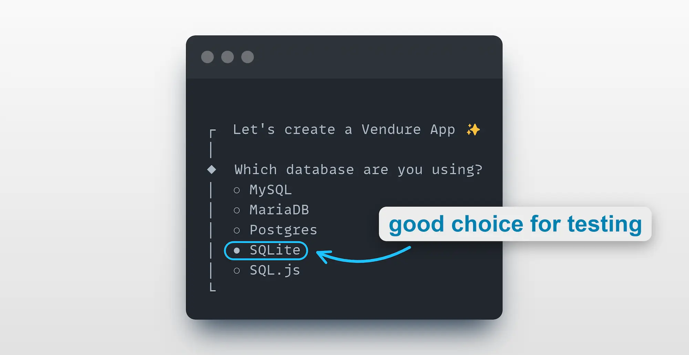
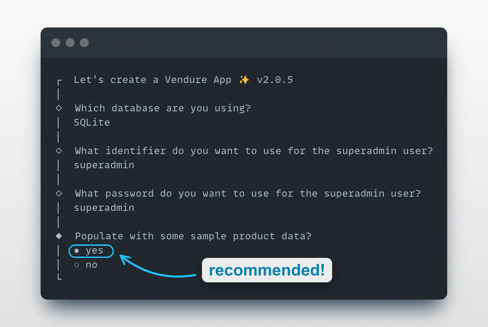
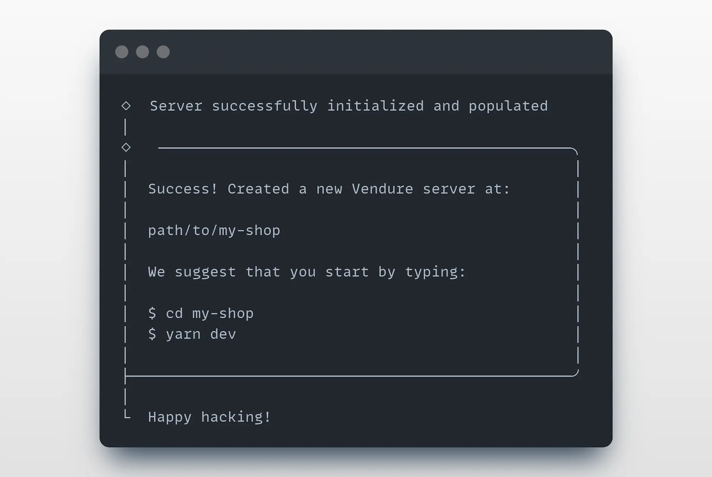
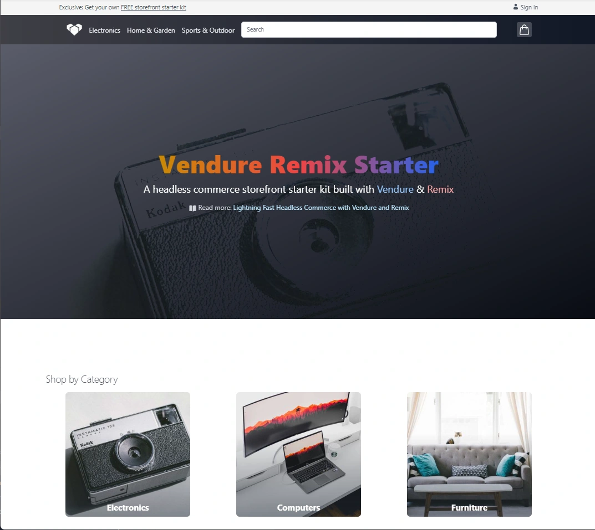

import Tabs from '@theme/Tabs';
import TabItem from '@theme/TabItem';

## Requirements
 
* [Node.js](https://nodejs.org/en/) **v18** or above, with support for **even-numbered Node.js versions**.
* The [supported TypeScript version](https://github.com/vendure-ecommerce/vendure/blob/master/packages/create/src/constants.ts#L7) is set upon installation. Upgrading to a newer version of TypeScript might result in compilation errors.
* If you want to use MySQL, MariaDB, or Postgres as your data store, then you'll need an instance available locally. However, **if you are just testing out Vendure, we recommend using SQLite**, which has no external requirements.
* If you use **Yarn**, from Vendure v2.2.0+, you'll need to use **Yarn 2** (Berry) or above.

## @vendure/create

The recommended way to get started with Vendure is by using the [@vendure/create](https://github.com/vendure-ecommerce/vendure/tree/master/packages/create) tool. This is a command-line tool which will scaffold and configure your new Vendure project and install all dependencies.

### 1. Run the command

```
npx @vendure/create my-shop
```

### 2. Select a database

Vendure supports a number of different databases. The `@vendure/create` tool will prompt you to select one. 

**To quickly test out Vendure, we recommend using SQLite**, which requires no external dependencies. You can always switch to a different database later by changing your configuration file.




:::tip
If you select MySQL, MariaDB or Postgres, you need to make sure you:

1. have the database server running and accessible
2. have created a database for Vendure to use
3. know the username and password for a user with access to that database
:::

### 3. Populate with data

The final prompt will ask whether to populate your new Vendure server with some sample product data.

**We recommend you do so**, as it will give you a good starting point for exploring the APIs which we will cover 
in the [Try the API section](/guides/getting-started/try-the-api/), as well as providing some data to use when
building your own storefront.



### 4. Complete setup

Next, a project scaffold will be created and dependencies installed. This may take a few minutes.

Once complete, you'll see a message like this:




### 5. Start the server

Follow the instructions to move into the new directory created for your project, and start the server:

```bash
cd my-shop

yarn dev
# or
npm run dev
```

You should now be able to access:

* The Vendure Admin GraphQL API: [http://localhost:3000/admin-api](http://localhost:3000/admin-api)
* The Vendure Shop GraphQL API: [http://localhost:3000/shop-api](http://localhost:3000/shop-api)
* The Vendure Admin UI: [http://localhost:3000/admin](http://localhost:3000/admin)

Congratulations! 🥳 You now have a fully-functional Vendure server running locally.

Now you can explore Vendure by following our [Try the API guide](/guides/getting-started/try-the-api/) to learn how to interact with the server.

If you are new to GraphQL, you should also check out our [Introducing GraphQL guide](/guides/getting-started/graphql-intro/).

:::tip
Open the Admin UI at [http://localhost:3000/admin](http://localhost:3000/admin) in your browser and log in with the superadmin credentials you specified, which default to:

* **username**: superadmin
* **password**: superadmin
:::


:::cli
Use `npx vendure add` to start adding plugins & custom functionality to your Vendure server.
:::

### Troubleshooting

If you encounter any issues during installation, you can get a more detailed output by setting the log level to `verbose`:

```sh
npx @vendure/create my-shop --log-level verbose
```

## Set up a storefront

Once you have a Vendure server running, you can set up a storefront to interact with it! 

We have a number of storefront starter kits available for you to use - head over to the [Storefront Starters](/guides/storefront/storefront-starters/)
page to learn more.


