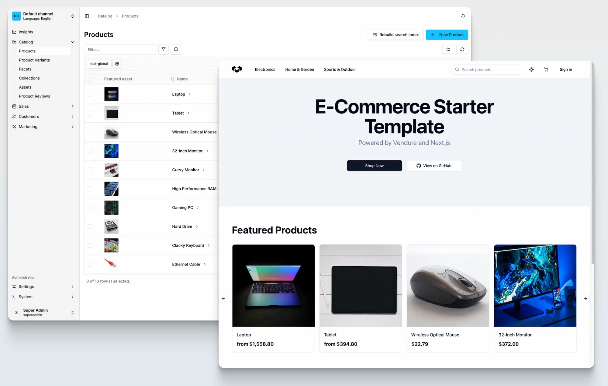

## Requirements

- [Node.js](https://nodejs.org/en/) **v20**, **v22** and **v24** - these versions are tested and supported. (Odd-numbered versions above v20 should still work but are not officially supported.)

### Optional

- [Docker Desktop](https://www.docker.com/products/docker-desktop/): If you want to use the quick start with Postgres, you must have Docker Desktop installed. If you do not have Docker Desktop installed, then SQLite will be used for your database.
- If you want to use an existing MySQL, MariaDB, or Postgres server as your data store, then you'll need an instance available locally. However, **if you are just testing out Vendure, we recommend the quick start option, which handles the database for you**.

## @vendure/create

The recommended way to get started with Vendure is by using the [@vendure/create](https://github.com/vendurehq/vendure/tree/master/packages/create) tool. This is a command-line tool which will scaffold and configure your new Vendure project and install all dependencies.

### Quick Start

First, run the following command in your terminal, replacing `my-shop` with the name of your project:

```bash
npx @vendure/create my-shop
```

Next, choose the "Quick Start" option. This is the fastest way to get a Vendure server up and running and will handle all the configuration for you.
If you have Docker Desktop installed, it will create and configure a Postgres database for you. If not, it will use SQLite.

```console
┌  Let's create a Vendure App ✨
│
◆  How should we proceed?
│  ● Quick Start (Get up and running in a single step) # [!code highlight]
│  ○ Manual Configuration
└
```

Next you'll be prompted to include our official Next.js storefront starter in your project. This is optional, but recommended if you want to
quickly see a working storefront connected to your Vendure server.

```console
┌  Let's create a Vendure App ✨
│
◇  How should we proceed?
│  Quick Start
│
◇  Using port 3000
│
◇  Docker is running
│
◆  Would you like to include the Next.js storefront? # [!code highlight]
│  ○ No # [!code highlight]
│  ● Yes # [!code highlight]
└ # [!code highlight]
```

And that's it! After a minute or two, you'll have a **fully-functional Vendure server** installed locally.

Once the installation is done, your terminal will output a message indicating a successful installation with:

- The URL to access the **Dashboard**
- Your admin log-in credentials
- The project file path

Proceed to the [Start the server](#start-the-server) section below to run your Vendure server.

### Manual Configuration

If you'd rather have more control over the configuration, you can choose the "Manual Configuration" option. This will prompt you to select a database and whether to populate the database with sample data.

#### 1. Select a database

Vendure supports a number of different databases. The `@vendure/create` tool will prompt you to select one.

**To quickly test out Vendure, we recommend using SQLite**, which requires no external dependencies. You can always switch to a different database later [by changing your configuration file](/developer-guide/configuration/#connecting-to-the-database).

```console
┌  Let's create a Vendure App ✨
│
◇  How should we proceed?
│  Manual Configuration
│
◇  Using port 3000
│
◆  Which database are you using?
│  ○ MySQL
│  ○ MariaDB
│  ○ Postgres
│  ● SQLite # [!code highlight]
└
```

:::tip
If you select MySQL, MariaDB, or Postgres, you need to make sure you:

1. **Have the database server running**: You can either install the database locally on your machine, use a cloud provider, or run it via Docker. For local development with Docker, you can use the provided `docker-compose.yml` file in your project.

2. **Have created a database**: Use your database client to create an empty database (e.g., `CREATE DATABASE vendure;` in most SQL databases).

3. **Have database credentials**: You need the username and password for a database user that has full permissions (CREATE, ALTER, DROP, INSERT, UPDATE, DELETE, SELECT) on the database you created.

For detailed database configuration examples, see the [Configuration guide](/developer-guide/configuration/#connecting-to-the-database).

:::

#### 2. Populate with data

The final prompt will ask whether to populate your new Vendure server with some sample product data.

**We recommend you do so**, as it will give you a good starting point for exploring the APIs, which we will cover in the [Try the API section](/getting-started/try-the-api/), as well as providing some data to use when building your own storefront.

```console
┌  Let's create a Vendure App ✨
│
◇  How should we proceed?
│  Manual Configuration
│
# ...
│
◆  Populate with some sample product data?
│  ● yes # [!code highlight]
│  ○ no
└
```

#### 3. Optional storefront setup

From v3.5.2 onwards, you can choose to include an official Next.js Storefront Starter as part of your new Vendure project.

#### 4. Complete setup

Next, a project scaffold will be created and dependencies installed. This may take a few minutes.

Once complete, you'll see a message like this:

```console
◇  Setup complete! ─────────────────────────────────────╮
│                                                       │
│  Your new Vendure project was created!                │
│  /Users/username/path/my-shop                         │
│                                                       │
│                                                       │
│  This is a monorepo with the following apps:          │
│    apps/server     - Vendure backend                  │
│    apps/storefront - Next.js frontend                 │
│                                                       │
│                                                       │
│  Next, run:                                           │
│  $ cd my-shop                                         │
│  $ npm run dev                                        │
│                                                       │
│                                                       │
│  This will start both the server and storefront.      │
│                                                       │
│                                                       │
│  Access points:                                       │
│    Dashboard:  http://localhost:3000/dashboard        │
│    Storefront: http://localhost:3001                  │
│                                                       │
│                                                       │
│  Use the following credentials to log in:             │
│  Username: superadmin                                 │
│  Password: superadmin                                 │
│                                                       │
│                                                       │
│  ➡️ Docs: https://docs.vendure.io                     │
│  ➡️ Discord community: https://vendure.io/community   │
│  ➡️ Star us on GitHub:                                │
│     https://github.com/vendurehq/vendure      │
│                                                       │
├───────────────────────────────────────────────────────╯
│
└  Happy hacking!
```

### Start the server

Follow the instructions to move into the new directory created for your project, and start the server:

```bash
cd my-shop

npm run dev
```

You should now be able to access:

- The Vendure Admin GraphQL API: [http://localhost:3000/admin-api](http://localhost:3000/admin-api)
- The Vendure Shop GraphQL API: [http://localhost:3000/shop-api](http://localhost:3000/shop-api)
- The Vendure Dashboard: [http://localhost:3000/dashboard](http://localhost:3000/dashboard/)

If you included the Next.js Storefront Starter, you can also access:

- The Next.js Storefront: [http://localhost:3001](http://localhost:3001/)



Congratulations! 🥳 You now have a fully functional Vendure server running locally.

Now you can explore Vendure by following our [Try the API guide](/getting-started/try-the-api/) to learn how to interact with the server.

If you are new to GraphQL, you should also check out our [Introducing GraphQL guide](/getting-started/graphql-intro/).

:::tip
Open the Dashboard at [http://localhost:3000/dashboard](http://localhost:3000/dashboard) in your browser and log in with the superadmin credentials you specified, which default to:

- **username**: superadmin
- **password**: superadmin

:::

:::cli
Use `npx vendure add` to start adding plugins & custom functionality to your Vendure server.
:::

### Troubleshooting

- If you encounter any issues during installation, you can get a more detailed output by setting the log level to `verbose`:

    ```bash
    npx @vendure/create my-shop --log-level verbose
    ```

- The [supported TypeScript version](https://github.com/vendurehq/vendure/blob/master/packages/create/src/constants.ts#L7) is set upon installation. Upgrading to a newer version of TypeScript might result in compilation errors because TypeScript sometimes introduces stricter checks in newer versions.
- If you want to use **Yarn**, from Vendure v2.2.0+, you'll need to use **Yarn 2** (Berry) or above.
