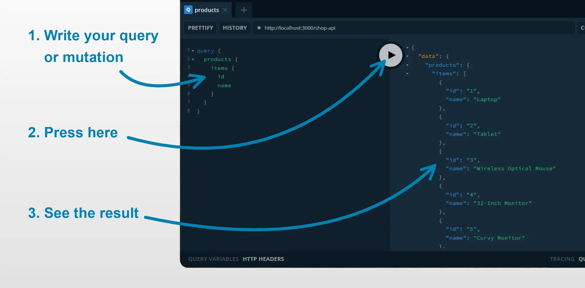
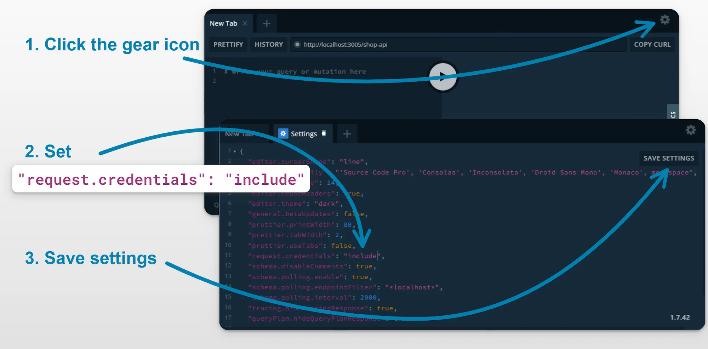
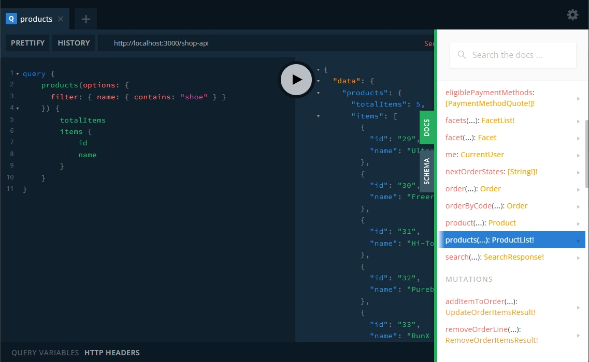

import Playground from '@site/src/components/Playground';

Once you have successfully installed Vendure locally following the [installation guide](/guides/getting-started/installation),
it's time to try out the API!

:::note
This guide assumes you chose to populate sample data when installing Vendure.

You can also follow along with these example using the public demo playground at [demo.vendure.io/shop-api](https://demo.vendure.io/shop-api)
:::

## GraphQL Playground

The Vendure server comes with a GraphQL Playground which allows you to explore the API and run queries and mutations. It is
a great way to explore the API and to get a feel for how it works.

In this guide, we'll be using the GraphQL Playground to run queries and mutations against the Shop and Admin APIs. At each
step, you paste the query or mutation into the left-hand pane of the Playground, and then click the "Play" button to run it.
You'll then see the response in the right-hand pane.



:::note
Before we start using the GraphQL Playground, we need to alter a setting to make sure it is handling session cookies
correctly.

In the "settings" panel, we need to change the `request.credentials` setting from `omit` to `include`:


:::

## Shop API

The Shop API is the public-facing API which is used by the storefront application.

Open the GraphQL Playground at [http://localhost:3000/shop-api](http://localhost:3000/shop-api).

### Fetch a list of products

Let's start with a **query**. Queries are used to fetch data. We will make a query to get a list of products.

<Playground api="shop" document={`
query {
  products {
    totalItems
    items {
      id
      name
    }
  }
}
`} />


Note that the response only includes the properties we asked for in our query (id and name). This is one of the key benefits
of GraphQL - the client can specify exactly which data it needs, and the server will only return that data!

Let's add a few more properties to the query:

<Playground api="shop" document={`
query {
  products {
    totalItems
    items {
      id
      name
      slug
      description
      featuredAsset {
        id
        preview
      }
    }
  }
}
`} />

You should see that the response now includes the `slug`, `description` and `featuredAsset` properties. Note that the
`featuredAsset` property is itself an object, and we can specify which properties of that object we want to include in the
response. This is another benefit of GraphQL - you can "drill down" into the data and specify exactly which properties you
want to include.

Now let's add some arguments to the query. Some queries (and most mutations) can accept argument, which you put in parentheses
after the query name. For example, let's fetch the first 5 products:

<Playground api="shop" document={`
query {
  products(options: { take: 5 }) {
    totalItems
    items {
      id
      name
    }
  }
}
`} />

On running this query, you should see just the first 5 results being returned.

Let's add a more complex argument: this time we'll filter for only those products which contain the string "shoe" in the
name:

<Playground api="shop" document={`
query {
  products(options: {
    filter: { name: { contains: "shoe" } }
  }) {
    totalItems
    items {
      id
      name
    }
  }
}
`} />

### Add a product to an order

Next, let's look at a **mutation**. Mutations are used to modify data on the server.

Here's a mutation which adds a product to an order:

<Playground api="shop" document={`
mutation {
  addItemToOrder(productVariantId: 42, quantity: 1) {
    ...on Order {
      id
      code
      totalQuantity
      totalWithTax
      lines {
        productVariant {
          name
        }
        quantity
        linePriceWithTax
      }
    }
    ...on ErrorResult {
      errorCode
      message
    }
  }
}
`} />

This mutation adds a product variant with ID `42` to the order. The response will either be an `Order` object, or an `ErrorResult`.
We use a special syntax called a **fragment** to specify which properties we want to include in the response. In this case,
we are saying that if the response is an `Order`, we want to include the `id`, `code`, `totalQuantity`, `totalWithTax` etc., and
if the response is an `ErrorResult`, we want to include the `errorCode` and `message`.

Running this mutation a second time should show that the quantity of the product in the order has increased by 1. If not,
then the session is not being persisted correctly (see the note earlier in this guide about the `request.credentials` setting).

:::info
For more information about `ErrorResult` and the handling of errors in Vendure, see the [Error Handling guide](/guides/developer-guide/error-handling).
:::

## Admin API

The Admin API exposes all the functionality required to manage the store. It is used by the Admin UI, but can also be used
by integrations and custom scripts.

:::note
The examples in this section are not interactive, due to security settings on our demo server,
but you can paste them into your local GraphQL playground.
:::

Open the GraphQL Playground at [http://localhost:3000/admin-api](http://localhost:3000/admin-api).

### Logging in

Most Admin API operations are restricted to authenticated users. So first of all we'll need to log in.

```graphql title="Admin API"
mutation {
  login(username: "superadmin", password: "superadmin") {
    ...on CurrentUser {
      id
      identifier
    }
    ...on ErrorResult {
      errorCode
      message
    }
  }
}
```

### Fetch a product

The Admin API exposes a lot more information about products than you can get from the Shop API:

```graphql title="Admin API"
query {
  product(id: 42) {
    // highlight-next-line
    enabled
    name
    variants {
      id
      name
      // highlight-next-line
      enabled
      prices {
        currencyCode
        price
      }
      // highlight-start
      stockLevels {
        stockLocationId
        stockOnHand
        stockAllocated
      }
      // highlight-end
    }
  }
}
```

:::info
GraphQL is statically typed and uses a **schema** containing information about all the available queries, mutations and types. In the
GraphQL playground, you can explore the schema by clicking the "docs" tab on the right hand side.


:::
