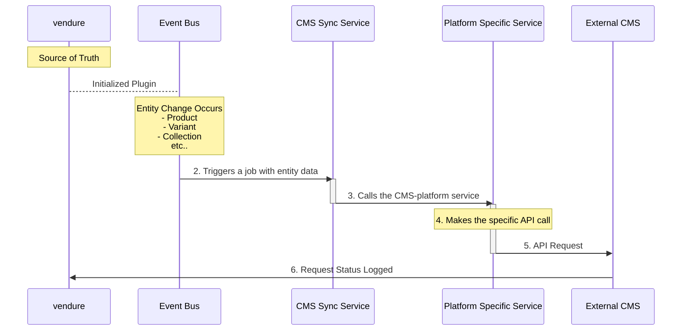

A CMS integration plugin allows you to automatically synchronize your Vendure product catalog with an external Content Management System.

This is done in a way that establishes Vendure as the source of truth for the ecommerce's data.

This guide demonstrates how to build a production-ready CMS integration plugin. The principles covered here are designed to be CMS-agnostic, however we do have [working examples](/how-to/cms-integration-plugin/#platform-specific-setup) for various platforms.

Platfroms covered in the [guide](/how-to/cms-integration-plugin/#platform-specific-setup):

- [Payload](https://payloadcms.com/)
- [Sanity](https://www.sanity.io/)
- [Storyblok](https://www.storyblok.com/)
- [Strapi](https://strapi.io/)
- [Contentful](https://www.contentful.com/)

## Working Example Repository

:::info
This guide provides a high-level overview of building a CMS integration plugin. For complete implementations, refer to [working examples repository](https://github.com/vendurehq/examples/tree/master/examples/cms-integration-plugin)

The code examples in this guide are simplified for educational purposes. The actual implementations contain additional features like error handling, retry logic, and performance optimizations.
:::

## Prerequisites

- Node.js 20+ with npm package manager
- An existing Vendure project created with the [Vendure create command](/getting-started/installation/)
- An access key to a CMS platform that provides an API

## Core Concepts

This [plugin](/developer-guide/plugins/) leverages several key Vendure concepts:

- **[EventBus](/developer-guide/events/)**: Provides real-time notifications when entities are created, updated, or deleted.
- **[Job Queues](/developer-guide/worker-job-queue/)**: Ensures that synchronization tasks are performed reliably and asynchronously, with retries on failure.
- **[Plugin API](/developer-guide/plugins/)**: The foundation for extending Vendure with custom capabilities.

## How It Works

The CMS integration follows a simple event-driven flow:



This ensures reliable, asynchronous synchronization with built-in retry capabilities.

## Plugin Structure and Types

First, let's use the Vendure CLI to scaffold the basic plugin structure:

```bash
npx vendure add -p CmsPlugin
```

This command will create the basic plugin structure. Next, we'll generate the required services:

```bash
# Generate the main sync service
npx vendure add -s CmsSyncService --selected-plugin CmsPlugin

# Generate the CMS-specific service (replace with your CMS)
npx vendure add -s CmsSpecificService --selected-plugin CmsPlugin
# Explained later in the Event-Driven Synchronization Section
```

Now we start by defining the main [plugin](/developer-guide/plugins/) class, its [services](/developer-guide/the-service-layer/), and the configuration types.

### Plugin Definition

The `CmsPlugin` class registers the necessary [services](/developer-guide/the-service-layer/) (`CmsSyncService`, `CmsSpecificService`) and sets up any Admin API extensions.

```ts title="src/plugins/cms/cms.plugin.ts"
import { VendurePlugin, PluginCommonModule, Type, OnModuleInit } from '@vendure/core';
import { CmsSyncService } from './services/cms-sync.service';
import { CmsSpecificService } from './services/cms-specific.service';
import { PluginInitOptions, CMS_PLUGIN_OPTIONS } from './types';
// ...

@VendurePlugin({
    imports: [PluginCommonModule],
    providers: [
        { provide: CMS_PLUGIN_OPTIONS, useFactory: () => CmsPlugin.options },
        CmsSyncService,
        CmsSpecificService, // The service for the specific CMS platform
    ],
    // ...
})
export class CmsPlugin {
    static options: PluginInitOptions;

    static init(options: PluginInitOptions): Type<CmsPlugin> {
        this.options = options;
        return CmsPlugin;
    }
}
```

### Configuration Types

The plugin's configuration options are defined in a `types.ts` file.

Create this file in your plugin directory to define the interfaces. These options will be passed to the plugin from your `vendure-config.ts`.

:::note
This would be created for you automatically when you run the CLI command `npx vendure add`
:::

```ts title="src/plugins/cms/types.ts"
import { ID, InjectionToken } from '@vendure/core';

export interface PluginInitOptions {
    cmsApiKey?: string;
    CmsSpecificOptions?: any;
    retryAttempts?: number;
    retryDelay?: number;
}

export interface SyncJobData {
    entityType: 'Product' | 'ProductVariant' | 'Collection';
    entityId: ID;
    operationType: 'create' | 'update' | 'delete';
    timestamp: string;
    retryCount: number;
}

export interface SyncResponse {
    success: boolean;
    message?: string;
    error?: string;
}
```

## Event-Driven Synchronization

The plugin uses Vendure's [EventBus](/developer-guide/events/) to capture changes in real-time.

In the [onModuleInit](/developer-guide/events/#subscribing-to-events) lifecycle hook, we create job queues and subscribe to entity events.

### Creating Job Queues and Subscribing to Events

You can also scaffold job queue handlers using the CLI:

```bash
npx vendure add -j CmsProductSync --name productSyncQueue --selected-service CmsSyncService
```

This creates a `productSyncQueue ` in the `CmsSyncService`. The service will be responsible for setting up the queues and processing the jobs. It will expose public methods to trigger new jobs.

```ts title="src/plugins/cms/services/cms-sync.service.ts"
import { Injectable, OnModuleInit } from '@nestjs/common';
import { JobQueue, JobQueueService /* ... other imports */ } from '@vendure/core';
import { SyncJobData } from '../types';

@Injectable()
export class CmsSyncService implements OnModuleInit {
    private productSyncQueue: JobQueue<SyncJobData>;
    private variantSyncQueue: JobQueue<SyncJobData>;
    private collectionSyncQueue: JobQueue<SyncJobData>;

    constructor(
        private jobQueueService: JobQueueService,
        // ... other dependencies
    ) {}

    async onModuleInit() {
        this.productSyncQueue = await this.jobQueueService.createQueue({
            name: 'cms-product-sync',
            process: async job => {
                return this.syncProductToCms(job.data);
            },
        });

        this.variantSyncQueue = await this.jobQueueService.createQueue({
            name: 'cms-variant-sync',
            process: async job => {
                return this.syncVariantToCms(job.data);
            },
        });

        this.collectionSyncQueue = await this.jobQueueService.createQueue({
            name: 'cms-collection-sync',
            process: async job => {
                return this.syncCollectionToCms(job.data);
            },
        });
    }

    triggerProductSync(data: SyncJobData) {
        return this.productSyncQueue.add(data);
    }

    triggerVariantSync(data: SyncJobData) {
        return this.variantSyncQueue.add(data);
    }

    triggerCollectionSync(data: SyncJobData) {
        return this.collectionSyncQueue.add(data);
    }

    // ... other methods for the actual sync logic (e.g. syncProductToCms)
}
```

Next, in the `CmsPlugin`, we subscribe to the `EventBus` and call the new service method to add a job to the queue whenever a relevant event occurs.

```ts title="src/plugins/cms/cms.plugin.ts"
import { OnModuleInit, EventBus, ProductEvent, VendurePlugin } from '@vendure/core';
import { CmsSyncService } from './services/cms-sync.service';

@VendurePlugin({
    // ...
    providers: [CmsSyncService /* ... */],
})
export class CmsPlugin implements OnModuleInit {
    constructor(
        private eventBus: EventBus,
        private cmsSyncService: CmsSyncService,
    ) {}

    async onModuleInit() {
        // Listen for Product events
        this.eventBus.ofType(ProductEvent).subscribe(event => {
            const syncData = this.extractSyncData(event);
            this.cmsSyncService.triggerProductSync(syncData);
        });

        // Similar listeners for ProductVariantEvent and CollectionEvent...
    }
    // ...
}
```

## Implementing the Sync Logic

The sync logic is split into two services: a generic service to fetch data, and a specific service to communicate with the CMS.

`CmsSyncService` orchestrates the synchronization logic. It acts as the bridge between Vendure's internal systems and your CMS platform, handling data fetching, relationship resolution, and error management.

:::tip
Separating orchestration logic from CMS-specific API calls allows for better testability and maintainability. The sync service handles Vendure-specific operations while CMS services focus on API communication.
:::

#### Core Responsibilities

The sync service handles several critical functions:

- **Entity Data Fetching**: Retrieves complete entity data with necessary relations
- **Translation Management**: Handles Vendure's multi-language support
- **Relationship Resolution**: Manages complex entity relationships
- **Error Handling**: Provides consistent error handling and logging

### Service Structure and Dependencies

The service follows Vendure's [dependency injection pattern](/developer-guide/the-service-layer/) and requires several core Vendure services:

```ts title="src/plugins/cms/services/cms-sync.service.ts"
@Injectable()
export class CmsSyncService implements OnApplicationBootstrap {
    constructor(
        @Inject(CMS_PLUGIN_OPTIONS) private options: PluginInitOptions,
        private readonly connection: TransactionalConnection,
        private readonly channelService: ChannelService,
        private readonly collectionService: CollectionService,
        private readonly requestContextService: RequestContextService,
        // Your CMS-specific service
        private readonly CmsSpecificService: CmsSpecificService,
        private processContext: ProcessContext,
    ) {}

    async onApplicationBootstrap() {
        // Ensure this logic only runs on the Vendure worker, and not the server
        if (this.processContext.isWorker) {
            // This is where you would add any necessary setup or initialization logic
            // for example, ensuring that the CMS has compatible content types.
        }
    }
}
```

### Product Synchronization

Product sync demonstrates the complete workflow from job processing to CMS communication:

```ts
async syncProductToCms(jobData: SyncJobData): Promise<SyncResponse> {
  try {
    // Fetch fresh product data from database with translations
    const product = await this.connection.rawConnection
      .getRepository(Product)
      .findOne({
        where: { id: jobData.entityId },
        relations: { translations: true },
      });

    if (!product) {
      throw new Error(`Product with ID ${jobData.entityId} not found`);
    }

    const operationType = jobData.operationType;
    const defaultLanguageCode = await this.getDefaultLanguageCode();

    // Get product slug using translation utilities
    const productSlug = this.translationUtils.getSlugByLanguage(
      product.translations,
      defaultLanguageCode,
    );

    // Delegate to CMS-specific service
    await this.CmsSpecificService.syncProduct({
      product,
      defaultLanguageCode,
      operationType,
      productSlug,
    });

    return {
      success: true,
      message: `Product ${jobData.operationType} synced successfully`,
      timestamp: new Date(),
    };
  } catch (error) {
    const errorMessage = error instanceof Error ? error.message : 'Unknown error';
    Logger.error(`Product sync failed: ${errorMessage}`, error.stack);
    return {
      success: false,
      message: `Product sync failed: ${errorMessage}`,
    };
  }
}
```

### Relationship Handling

The service includes methods to resolve entity relationships. For example, finding collections that contain a specific variant:

```ts
async findCollectionsForVariant(
  variantId: string | number,
): Promise<Collection[]> {
  try {
    const variant = await this.connection.rawConnection
      .getRepository(ProductVariant)
      .findOne({
        where: {
          id: variantId,
        },
        relations: ["collections"],
      });

    return variant?.collections || [];

  } catch (error) {
    Logger.error(
      `Failed to find collections for variant ${variantId}`,
      String(error),
    );
    return [];
  }
}
    return collectionsWithVariant;
  } catch (error) {
    // Variants can have no collecitons, therefore, sync anyways.
    Logger.error(`Failed to find collections for variant ${variantId}`, String(error));
    return [];
  }
}
```

:::info[Additional Entity Types]
The service can also includes `syncVariantToCms()` and `syncCollectionToCms()` methods that follow the same pattern as the product sync shown above.

These implementations are omitted from this guide for brevity, but they handle their respective entity types with similar data fetching, relationship resolution, and error handling patterns.

The complete implementations can be found in the working [example repositories](https://github.com/vendurehq/examples/tree/master/examples/cms-integration-plugin).
:::

This sync service provides the foundation for handling all Vendure-specific complexity while delegating CMS API communication to specialized services.

## Platform specific setup

<Tabs>
<TabItem value="storyblok" label="Storyblok">

:::tip[Working Example]
The complete, production-ready Storyblok implementation can be found in the [Storyblok integration example](https://github.com/vendurehq/examples/tree/master/examples/storyblok-cms-integration). Refer to it for a minimal working implementation.
:::

**Setting up Storyblok Space**

#### 1. Create a Storyblok Account and Space

1. Sign up at [storyblok.com](https://app.storyblok.com/#!/signup) if you don't have an account
2. Create a new Space (equivalent to a project in Storyblok)
3. Choose a suitable plan based on your needs

#### 2. Get Your API Credentials

1. Navigate to **Settings → Access Tokens** in your Storyblok space
2. Create a new **Management API Token** with write permissions
3. Note down your **Space ID** (found in Settings → General)

#### 3. Configure Environment Variables

Add these variables to your `.env` file:

```env
STORYBLOK_API_KEY=your_management_api_token
STORYBLOK_SPACE_ID=your_space_id
```

**The Storyblok Service**

`StoryblokService` handles all Storyblok-specific operations including API communication, content type management, and data transformation. Key features include:

- **Content Type Management**: Automatically creates Vendure-specific content types (components) in Storyblok
- **Story Management**: CRUD operations for stories representing products, variants, and collections
- **Relationship Handling**: Manages references between products, variants, and collections

---

**Basic Service Structure**

The service follows Vendure's standard dependency injection pattern and implements OnApplicationBootstrap to ensure Storyblok is properly configured before handling sync operations.

```ts title="src/plugins/cms/services/storyblok.service.ts"
// Define component types as constants for consistency and maintainability
const COMPONENT_TYPE = {
    product: 'vendure_product',
    product_variant: 'vendure_product_variant',
    collection: 'vendure_collection',
};

@Injectable()
export class StoryblokService implements OnApplicationBootstrap {
    constructor(@Inject(CMS_PLUGIN_OPTIONS) private options: PluginInitOptions) {}

    async onApplicationBootstrap() {
        // This is where you would add any necessary setup or initialization logic
        // for example, ensuring that the CMS has compatible content types.
    }

    // Main entry point for product synchronization
    // The operationType determines which CRUD operation to perform
    async syncProduct({ product, defaultLanguageCode, operationType }) {
        switch (operationType) {
            case 'create':
                return this.createStoryFromProduct(product, defaultLanguageCode);
            case 'update':
                return this.updateStoryFromProduct(product, defaultLanguageCode);
            case 'delete':
                return this.deleteStoryFromProduct(product, defaultLanguageCode);
        }
    }
}
```

---

**Making API Requests**

All Storyblok API communication is centralized through a single method that handles authentication, error handling, and response parsing. This approach ensures consistent behavior across all operations.

```ts
private async makeStoryblokRequest({ method, endpoint, data }) {
    // Construct the full API URL using the configured space ID
    const url = `https://mapi.storyblok.com/v1/spaces/${this.options.storyblokSpaceId}/${endpoint}`;

    const response = await fetch(url, {
        method,
        headers: {
            Authorization: this.options.storyblokApiKey,
            'Content-Type': 'application/json',
        },
        // Only include request body for POST/PUT operations
        body: data ? JSON.stringify(data) : undefined,
    });

    if (!response.ok) {
        // Provide clear error messages for debugging API issues
        throw new Error(`Storyblok API error: ${response.status}`);
    }
    return response.json();
}
```

---

**Data Transformation**

Transformation methods convert Vendure entities into the format expected by Storyblok's API. The `content` object structure must match the component schema defined in Storyblok.

```ts
private async transformProductData(product, defaultLanguageCode, productSlug?) {
    // Extract the translation for the default language
    // Vendure stores translations in an array, so we need to find the correct one
    const translation = product.translations.find(
        t => t.languageCode === defaultLanguageCode
    );

    if (!translation) {
        return undefined; // Skip if no translation exists
    }

    // Find all variant story UUIDs for this product using relationship handling
    const variantStoryIds = await this.findVariantStoriesForProductUuids(
        product.id,
        defaultLanguageCode,
        productSlug,
    );

    return {
        story: {
            name: translation?.name, // Story name in Storyblok
            slug: translation?.slug,  // URL slug for the story
            content: {
                component: COMPONENT_TYPE.product, // Must match the component name in Storyblok
                vendureId: product.id.toString(),  // Store Vendure ID for reference
                variants: variantStoryIds, // Array of story UUIDs for product variants
            },
        },
        publish: 1, // Auto-publish the story (1 = published, 0 = draft)
    };
}
```

---

**Relationship Handling**

One of the most important aspects of CMS integration is maintaining relationships between entities. Products have variants, variants belong to collections, and these relationships need to be reflected in the CMS. Storyblok uses story UUIDs to create references between content pieces.

- **Finding Related Entities**

> First, we need methods to query the Vendure database for related entities:

```ts
// Find all product variants for a given product ID from the database
private async findProductVariants(productId: string | number): Promise<ProductVariant[]> {
    try {
        return await this.connection.rawConnection
            .getRepository(ProductVariant)
            .find({
                where: { productId: productId as any },
                relations: ['translations'], // Include translations for slug generation
                order: { id: 'ASC' },
            });
    } catch (error) {
        Logger.error(`Failed to find variants for product ${productId}`, String(error));
        return [];
    }
}
```

- **Batch Story Lookups**

> We can also use batch lookups to find multiple stories at once:

```ts
// Batch lookup method for efficient story retrieval
private async findStoriesBySlugs(slugs: string[]): Promise<Map<string, any>> {
    const storyMap = new Map<string, any>();
    if (slugs.length === 0) return storyMap;

    try {
        // Storyblok supports comma-separated slugs for batch lookup
        const slugsParam = slugs.join(',');
        const response = await this.makeStoryblokRequest({
            method: 'GET',
            endpoint: `stories?by_slugs=${slugsParam}`,
        });

        if (response.stories) {
            for (const story of response.stories) {
                storyMap.set(story.slug, story);
            }
        }
    } catch (error) {
        Logger.error(`Failed to find stories by slugs: ${slugs.join(', ')}`, String(error));
    }

    return storyMap;
}
```

- **Building Relationships**

> Finally, we combine database queries with CMS lookups to build relationships:

```ts
// Find variant stories using batch lookup for efficiency
private async findVariantStoriesForProductUuids(
    productId: string | number,
    defaultLanguageCode: LanguageCode,
    productSlug?: string | null,
): Promise<string[]> {
    if (!productSlug) return [];
    // Get all variants for this product from Vendure database
    const variants = await this.findProductVariants(productId);
    // Generate slugs for all variants (convention: product-slug-variant-id)
    const variantSlugs = variants.map(
        (variant) => `${productSlug}-variant-${variant.id}`,
    );
    if (variantSlugs.length === 0) return [];
    // Batch lookup all variant stories and extract UUIDs
    const storiesMap = await this.findStoriesBySlugs(variantSlugs);
    const storyUuids: string[] = [];

    for (const [slug, story] of storiesMap) {
        if (story?.uuid) {
            storyUuids.push(story.uuid.toString()); // Storyblok uses UUIDs for references
        }
    }
    return storyUuids;
}
// Example: Transform variant data with relationships
private async transformVariantData(
    variant: ProductVariant,
    defaultLanguageCode: LanguageCode,
    variantSlug: string,
    collections?: Collection[],
) {
    const translation = variant.translations.find(
        t => t.languageCode === defaultLanguageCode
    );
    if (!translation) return undefined;

    // Find parent product and collection references using the same batch lookup patterns
    const parentProductStoryUuid = await this.findParentProductStoryUuid(variant, defaultLanguageCode);
    const collectionStoryUuids = await this.findCollectionStoryUuids(collections, defaultLanguageCode);

    return {
        story: {
            name: translation.name,
            slug: variantSlug,
            content: {
                component: COMPONENT_TYPE.product_variant,
                vendureId: variant.id.toString(),
                parentProduct: parentProductStoryUuid ? [parentProductStoryUuid] : [],
                collections: collectionStoryUuids,
            },
        },
        publish: 1,
    };
}

// Additional relationship methods like findParentProductStoryUuid and findCollectionStoryUuids
// follow similar patterns and are available in the working example repository.
```

**CRUD Operations**

These methods handle the basic Create, Read, Update, and Delete operations for stories in Storyblok. They follow REST API conventions and leverage the centralized request method for consistent behavior.

```ts
// Create a new story in Storyblok
private async createStoryFromProduct(product, defaultLanguageCode) {
    // Transform Vendure product data into Storyblok story format
    const data = this.transformProductData(product, defaultLanguageCode);

    // POST to the stories endpoint to create a new story
    return this.makeStoryblokRequest({
        method: 'POST',
        endpoint: 'stories',
        data,
    });
}

// Find an existing story by its slug
private async findStoryBySlug(slug: string) {
    // Use Storyblok's by_slugs query parameter for efficient lookup
    const response = await this.makeStoryblokRequest({
        method: 'GET',
        endpoint: `stories?by_slugs=${slug}`,
    });

    // Return the matching story or undefined if not found
    return response.stories.find((story: any) => story.slug === slug);
}

// Additional CRUD methods like updateStoryFromProduct and deleteStoryFromProduct
// follow similar patterns with PUT and DELETE HTTP methods respectively.
// Full implementations are available in the working example repository.

```

**Final Plugin Configuration**

```ts title="src/vendure-config.ts"
CmsPlugin.init({
  cmsApiKey: process.env.STORYBLOK_API_KEY,
  storyblokSpaceId: process.env.STORYBLOK_SPACE_ID,
}),
```

This setup provides a complete Storyblok CMS integration that automatically creates the necessary content types and syncs your Vendure catalog with structured content in Storyblok.

The complete implementations can be found in the working [example repositories](https://github.com/vendurehq/examples/tree/master/examples/storyblok-cms-integration).

</TabItem>
<TabItem value="contentful" label="Contentful">

:::tip[Working Example]
The complete, production-ready Contentful implementation can be found in the [Contentful integration example](https://github.com/vendurehq/examples/tree/master/examples/contentful-cms-integration). It includes advanced features like locale mapping, bulk operations, and a robust setup process.
:::

**Setting up Contentful Space**

**Create a Contentful Account and Space**

1.  Sign up for a free account at [contentful.com](https://www.contentful.com/get-started/).
2.  Follow the onboarding to create a new **Space**. Think of a Space as a repository for all the content of a single project.

**Get Your API Credentials**

1.  In your Contentful space, navigate to **Settings** → **API keys**.
2.  Select the **Content management tokens** tab.
3.  Click **Generate personal token**. Give it a name (e.g., "Vendure Sync") and copy the token. This token is used to create, edit, and delete content.
4.  Navigate to **Settings** → **General settings** to find your **Space ID**.

**Configure Environment Variables**

Add the API credentials and Space ID to your project's `.env` file.

```env path=null start=null
CONTENTFUL_API_KEY=your_content_management_token
CONTENTFUL_SPACE_ID=your_space_id
```

---

**The Contentful Service**

The `ContentfulService` is the heart of the integration. It manages all communication with Contentful's **Content Management API**, transforms Vendure entities into Contentful **Entries**, and handles the relationships between them.

- **Content Type Management**: On startup, it automatically creates the necessary **Content Types** (e.g., `vendureProduct`, `vendureCollection`) in Contentful to structure your e-commerce data.
- **Entry Synchronization**: Provides full CRUD (Create, Read, Update, Delete) operations for products, variants, and collections.
- **Relationship Handling**: Correctly links related entries, such as connecting a variant to its parent product and its collections.

---

**Basic Service Structure**

The service follows Vendure's standard dependency injection pattern and implements OnApplicationBootstrap. This lifecycle hook is crucial because it ensures our custom Contentful **Content Types** are created _before_ the application starts trying to sync data, preventing errors.

```ts path=/src/plugins/cms/services/contentful.service.ts start=15
// Define content type IDs as constants for consistency and easy reference.
const CONTENT_TYPE_ID = {
    product: 'vendureProduct',
    product_variant: 'vendureProductVariant',
    collection: 'vendureCollection',
};

@Injectable()
export class ContentfulService implements OnApplicationBootstrap {
    constructor(
        private connection: TransactionalConnection,
        @Inject(CMS_PLUGIN_OPTIONS) private options: PluginInitOptions,
    ) {}

    async onApplicationBootstrap() {
        // This is where you would add any necessary setup or initialization logic
        // for example, ensuring that the CMS has compatible content types.
    }

    // Main entry point for synchronizing a product.
    // The `operationType` determines whether to create, update, or delete an entry.
    async syncProduct({ product, defaultLanguageCode, operationType }) {
        switch (operationType) {
            case 'create':
                return this.createEntryFromProduct(product, defaultLanguageCode);
            case 'update':
                return this.updateEntryFromProduct(product, defaultLanguageCode);
            case 'delete':
                return this.deleteEntryFromProduct(product, defaultLanguageCode);
        }
    }
}
```

---

**Making API Requests**

To keep our code clean and maintainable, all communication with the Contentful API is channeled through a single `makeContentfulRequest` method. This centralizes authentication, error handling, and URL construction.

```ts path=/src/plugins/cms/services/contentful.service.ts start=1505
private async makeContentfulRequest({ method, endpoint, data, headers = {} }) {
    // Construct the full API URL using the configured space and environment ID.
    const url = `https://api.contentful.com/spaces/${this.options.contentfulSpaceId}/environments/master/${endpoint}`;

    const response = await fetch(url, {
        method,
        headers: {
            // The Content Management API requires a Bearer token.
            Authorization: `Bearer ${this.options.cmsApiKey}`,
            'Content-Type': 'application/vnd.contentful.management.v1+json',
            ...headers,
        },
        body: data ? JSON.stringify(data) : undefined,
    });

    if (!response.ok) {
        const errorText = await response.text();
        // Rich error messages are critical for debugging API issues.
        throw new Error(`Contentful API error: ${response.status} - ${errorText}`);
    }

    // DELETE requests often return no body, so we handle that case.
    if (response.status === 204 || method === 'DELETE') {
        return {};
    }
    return response.json();
}
```

---

**Data Transformation**

Before we can send data to Contentful, we must transform our Vendure entities into the format Contentful expects. A Contentful **Entry** consists of a `fields` object where each key corresponds to a field in the **Content Type**. Each field is also localized, so its value is nested within a locale key (e.g., `en-US`).

```ts path=/src/plugins/cms/services/contentful.service.ts start=1260
private async transformProductData(
    product: Product,
    defaultLanguageCode: LanguageCode,
) {
    // Vendure stores translations in an array; we need to find the one
    // for the store's default language.
    const translation = product.translations.find(
        t => t.languageCode === defaultLanguageCode,
    );

    if (!translation) return undefined; // Cannot sync if default language is missing.

    // Find all variant entries that belong to this product. This is a key
    // part of relationship handling, covered in the next section.
    const variantEntryIds = await this.findVariantEntriesForProductIds(
        product.id,
        defaultLanguageCode,
        translation.slug,
    );

    // Contentful uses a specific locale format, e.g., 'en-US'.
    const contentfulLocale = this.mapToContentfulLocale(defaultLanguageCode);

    return {
        fields: {
            name: { [contentfulLocale]: translation.name },
            slug: { [contentfulLocale]: translation.slug },
            vendureId: { [contentfulLocale]: product.id.toString() },
            // Variants are linked via an array of "Link" objects.
            variants: {
                [contentfulLocale]: variantEntryIds.map(id => ({
                    sys: { type: 'Link', linkType: 'Entry', id },
                })),
            },
        },
    };
}
```

---

**Relationship Handling**

One of the most important aspects of CMS integration is maintaining relationships between entities. Products have variants, and variants belong to collections. Contentful manages these relationships using **Links**, which are essentially pointers from one entry to another. Our goal is to find the Contentful **Entry ID** of a related entity and embed it as a Link.

**Finding Related Vendure Entities**

The first step is always to query the Vendure database to find the related entities. We use the injected **TransactionalConnection** to perform efficient database lookups.

```ts path=/src/plugins/cms/services/contentful.service.ts start=418
// Finds all ProductVariant entities for a given product ID.
private async findProductVariants(productId: ID): Promise<ProductVariant[]> {
    try {
        // Use Vendure's standard pattern for database access in a service.
        return await this.connection.rawConnection
            .getRepository(ProductVariant)
            .find({
                where: { productId: productId as any },
                relations: ['translations'], // Eager load translations for slug generation.
            });
    } catch (error) {
        Logger.error(`Failed to find variants for product ${productId}`, String(error));
        return [];
    }
}
```

---

**Building the Relationships**

Now we combine these two patterns. We fetch the related Vendure entities, generate their unique identifiers (slugs), use a batch lookup to find their corresponding Contentful entries, and extract their IDs to build the **Link** objects.

```ts path=/src/plugins/cms/services/contentful.service.ts start=442
private async findVariantEntriesForProductIds(
    productId: string | number,
    defaultLanguageCode: LanguageCode,
    productSlug?: string | null,
): Promise<string[]> {
    if (!productSlug) return [];

    // 1. Get all related variants from the Vendure database.
    const variants = await this.findProductVariants(productId);

    // 2. Generate the unique slugs for each variant.
    // Convention: `product-slug-variant-id`
    const variantSlugs = variants.map(
        variant => `${productSlug}-variant-${variant.id}`,
    );
    if (variantSlugs.length === 0) return [];

    // 3. Perform a single batch lookup to find all matching Contentful entries.
    const entriesMap = await this.findEntriesByField(
        CONTENT_TYPE_ID.product_variant,
        'slug',
        variantSlugs,
    );

    // 4. Extract the system ID from each entry to be used for linking.
    const entryIds: string[] = [];
    for (const entry of entriesMap.values()) {
        if (entry?.sys?.id) {
            entryIds.push(entry.sys.id);
        }
    }
    return entryIds;
}
```

This same pattern is used to link variants to their parent product and to their collections, as shown in the complete `transformVariantData` method in the example repository.

---

**CRUD Operations**

These methods perform the core Create, Read, Update, and Delete logic. They rely on our centralized `makeContentfulRequest` method and handle the specifics of Contentful's API, such as versioning and the publish workflow.

:::info[Contentful's Publish Workflow]
Contentful requires entries to be explicitly published before they are visible in the Delivery API. After creating or updating an entry, we must make a separate API call to publish it. Similarly, to delete an entry, it must first be unpublished.
:::

```ts path=/src/plugins/cms/services/contentful.service.ts
// Creates a new entry and then publishes it.
private async createEntryFromProduct(product: Product, defaultLanguageCode: LanguageCode) {
    const data = await this.transformProductData(product, defaultLanguageCode);
    if (!data) return;

    // POST to the 'entries' endpoint with a special header specifying the content type.
    const result = await this.makeContentfulRequest({
        method: 'POST',
        endpoint: this.entriesPath,
        data,
        headers: { 'X-Contentful-Content-Type': CONTENT_TYPE_ID.product },
    });

    // An entry is created as a draft; it must be published to be live.
    if (result.sys?.id) {
        await this.publishEntry(result.sys.id, result.sys.version);
    }
}

// Updates an existing entry.
private async updateEntryFromProduct(product: Product, defaultLanguageCode: LanguageCode) {
    // 1. Find the existing entry in Contentful (e.g., by its slug).
    const slug = getSlug(product, defaultLanguageCode);
    const existingEntry = await this.findEntryByField(CONTENT_TYPE_ID.product, 'slug', slug);
    if (!existingEntry) {
        // If it doesn't exist, we can fall back to creating it.
        return this.createEntryFromProduct(product, defaultLanguageCode);
    }

    // 2. Transform the data.
    const data = await this.transformProductData(product, defaultLanguageCode);
    if (!data) return;

    // 3. PUT to the specific entry URL. This requires the current version
    // for optimistic locking, preventing race conditions.
    const result = await this.makeContentfulRequest({
        method: 'PUT',
        endpoint: `${this.entriesPath}/${existingEntry.sys.id}`,
        data,
        headers: { 'X-Contentful-Version': existingEntry.sys.version.toString() },
    });

    // 4. Publish the new version.
    if (result.sys?.id) {
        await this.publishEntry(result.sys.id, result.sys.version);
    }
}

// The full implementations for delete, as well as variant and collection CRUD,
// can be found in the working example repository. They follow similar patterns.
```

---

**Final Plugin Configuration**

Finally, we initialize the plugin in `vendure-config.ts`, providing the API credentials from our environment variables.

```ts title="src/vendure-config.ts" path=null start=null
import { CmsPlugin } from './plugins/cms/cms.plugin';

// ... other imports

export const config: VendureConfig = {
    // ... other config
    plugins: [
        // ... other plugins
        CmsPlugin.init({
            cmsApiKey: process.env.CONTENTFUL_API_KEY,
            contentfulSpaceId: process.env.CONTENTFUL_SPACE_ID,
        }),
    ],
};
```

This configuration provides a complete Contentful CMS integration that automatically creates the necessary content models and syncs your Vendure catalog with structured content in Contentful, ready to be consumed by a headless storefront.

</TabItem>

<TabItem value="strapi" label="Strapi">

:::tip[Working Example]
The complete, production-ready Strapi implementation can be found in the [Strapi integration example](https://github.com/vendurehq/examples/tree/master/examples/strapi-cms-integration). It includes advanced features like plugin-based content types, batch operations, and relationship management.
:::

This guide provides a complete integration for Vendure with Strapi CMS, including setting up a Strapi application with a custom plugin and implementing the synchronization service.

**Setting up Strapi**

#### 1. Create a new Strapi project

Initialize your Strapi project using the CLI:

```bash
npx create-strapi-app@latest strapi-integration-app
cd strapi-integration-app
```

Choose the following options when prompted:

- Installation type: **Custom (manual settings)**
- Database client: **Sqlite** (or your preferred database)
- Use TypeScript: **Yes**

#### 2. Create a Vendure Integration Plugin

Generate a custom plugin to organize Vendure content types:

```bash
npm run strapi generate plugin
# Plugin name: vendure-integration-plugin
```

#### 3. Configure Environment Variables

Add these variables to your `.env` file:

```env
STRAPI_API_TOKEN=your_api_token
STRAPI_BASE_URL=http://localhost:1337
```

**Defining Content Types**

#### 1. Create Vendure-specific content types

Create the content type schemas in your plugin's `server/content-types` folder:

**vendure-product/schema.json**

```json title="src/plugins/vendure-integration-plugin/server/content-types/vendure-product/schema.json"
{
    "kind": "collectionType",
    "collectionName": "vendure_products",
    "info": {
        "displayName": "Vendure Product",
        "singularName": "vendure-product",
        "pluralName": "vendure-products"
    },
    "attributes": {
        "vendureId": {
            "type": "integer",
            "required": true,
            "unique": true
        },
        "name": {
            "type": "string",
            "required": true
        },
        "slug": {
            "type": "string",
            "required": true,
            "unique": true
        },
        "productVariants": {
            "type": "relation",
            "relation": "oneToMany",
            "target": "api::vendure-product-variant.vendure-product-variant",
            "mappedBy": "product"
        }
    }
}
```

**Additional content types for VendureProductVariant and VendureCollection**
follow the same pattern with appropriate field definitions and relationships.

```json
// vendure-product-variant/schema.json
// vendure-collection/schema.json
```

#### 2. Enable the plugin

Update your Strapi configuration to enable the plugin:

```ts title="config/plugins.ts"
export default {
    'vendure-integration-plugin': {
        enabled: true,
        resolve: './src/plugins/vendure-integration-plugin',
    },
};
```

#### 3. Generate API tokens

After starting Strapi, create an API token:

1. Navigate to **Settings → API Tokens** in the Strapi admin panel
2. Create a new token with **Full access** or custom permissions
3. Save the token for use in your Vendure plugin configuration

**The Strapi Service**

The `StrapiService` handles all Strapi-specific operations including API communication, content management, and relationship resolution. Key features include:

- **Content Management**: CRUD operations using Strapi's REST API
- **Relationship Handling**: Manages references between products, variants, and collections
- **Batch Operations**: Efficient bulk lookups for related entities

---

**Basic Service Structure**

The service follows Vendure's standard dependency injection pattern and implements OnApplicationBootstrap to ensure the CMS is properly configured before handling sync operations.

```ts title="src/plugins/cms/services/strapi.service.ts"
@Injectable()
export class StrapiService {
    private get strapiBaseUrl(): string {
        return `${this.options.strapiBaseUrl || 'http://localhost:1337'}/api`;
    }

    constructor(@Inject(CMS_PLUGIN_OPTIONS) private options: PluginInitOptions) {}

    async syncProduct({ product, defaultLanguageCode, operationType }) {
        switch (operationType) {
            case 'create':
                return this.createDocumentFromProduct(product, defaultLanguageCode);
            case 'update':
                return this.updateDocumentFromProduct(product, defaultLanguageCode);
            case 'delete':
                return this.deleteDocumentFromProduct(product, defaultLanguageCode);
        }
    }
}
```

---

**Making API Requests**

All Strapi API communication is centralized through a single method that handles authentication, error handling, and response parsing. This approach ensures consistent behavior across all operations.

```ts
private async makeStrapiRequest({ method, endpoint, data }) {
  const url = `${this.strapiBaseUrl}/${endpoint}`;

  const headers: Record<string, string> = {
    'Content-Type': 'application/json',
  };

  if (this.options.strapiApiKey) {
    headers.Authorization = `Bearer ${this.options.strapiApiKey}`;
  }

  const response = await fetch(url, {
    method,
    headers,
    body: data ? JSON.stringify(data) : undefined,
  });

  if (!response.ok) {
    throw new Error(`Strapi API error: ${response.status}`);
  }
  return response.json();
}
```

---

**Data Transformation**

Transformation methods convert Vendure entities into the format expected by Strapi's API. The `data` object structure must match the collection schema defined in Strapi.

```ts
private async transformProductData(product: Product, defaultLanguageCode: LanguageCode, productSlug?: string | null) {
  const t = product.translations.find(tr => tr.languageCode === defaultLanguageCode);
  if (!t) return undefined;

  const variantDocumentIds = await this.findVariantDocumentsForProductIds(product.id, defaultLanguageCode, productSlug);

  return {
    vendureId: product.id,
    name: t.name,
    slug: t.slug,
    productVariants: variantDocumentIds,
  };
}
```

---

**Relationship Handling**

One of the most important aspects of CMS integration is maintaining relationships between entities. Products have variants, variants belong to collections, and these relationships need to be reflected in the CMS. Strapi uses document IDs to create references between content pieces.

```ts
private async findProductVariants(productId: string | number): Promise<ProductVariant[]> {
  return this.connection.rawConnection.getRepository(ProductVariant).find({
    where: { productId: productId as any },
    relations: ['translations'],
    order: { id: 'ASC' },
  });
}

private async findDocumentsBySlugs(collectionSlug: string, slugs: string[]): Promise<Map<string, any>> {
  const map = new Map<string, any>();
  if (slugs.length === 0) return map;

  const queryParams = slugs.map((slug, i) => `filters[slug][$in][${i}]=${encodeURIComponent(slug)}`).join('&');
  const endpoint = `${collectionSlug}?${queryParams}`;
  const response = await this.makeStrapiRequest({ method: 'GET', endpoint });

  if (response.data) {
    for (const doc of response.data) {
      if (doc?.slug) map.set(doc.slug, doc);
    }
  }
  return map;
}

private async findVariantDocumentsForProductIds(
  productId: string | number,
  defaultLanguageCode: LanguageCode,
  productSlug?: string | null,
): Promise<string[]> {
  if (!productSlug) return [];
  const variants = await this.findProductVariants(productId);
  const slugs = variants.map(v => `${productSlug}-variant-${v.id}`);
  if (slugs.length === 0) return [];
  const docs = await this.findDocumentsBySlugs('vendure-product-variant', slugs);
  const ids: string[] = [];
  docs.forEach(doc => { if (doc?.id) ids.push(String(doc.id)); });
  return ids;
}
```

---

**CRUD Operations**

These methods handle the basic Create, Read, Update, and Delete operations for documents in Strapi. They follow REST API conventions and leverage the centralized request method for consistent behavior.

```ts
private async findDocumentBySlug(collectionSlug: string, slug: string) {
  const endpoint = `${collectionSlug}?filters[slug][$eq]=${encodeURIComponent(slug)}&pagination[limit]=1`;
  const response = await this.makeStrapiRequest({ method: 'GET', endpoint });
  return response.data && response.data.length > 0 ? response.data[0] : null;
}

private async createDocumentFromProduct(product: Product, defaultLanguageCode: LanguageCode, productSlug?: string | null) {
  const data = await this.transformProductData(product, defaultLanguageCode, productSlug);
  if (!data) return;
  await this.makeStrapiRequest({ method: 'POST', endpoint: 'vendure-products', data: { data } });
}

private async updateDocumentFromProduct(product: Product, defaultLanguageCode: LanguageCode, productSlug?: string | null) {
  const slug = this.translationUtils.getSlugByLanguage(product.translations, defaultLanguageCode);
  if (!slug) return;
  const existing = await this.findDocumentBySlug('vendure-products', slug);
  if (!existing) return this.createDocumentFromProduct(product, defaultLanguageCode, productSlug);

  const data = await this.transformProductData(product, defaultLanguageCode, productSlug);
  if (!data) return;

  await this.makeStrapiRequest({
    method: 'PUT',
    endpoint: `vendure-products/${existing.id}`,
    data: { data },
  });
}

private async deleteDocumentFromProduct(product: Product, defaultLanguageCode: LanguageCode) {
  const slug = this.translationUtils.getSlugByLanguage(product.translations, defaultLanguageCode);
  if (!slug) return;
  const existing = await this.findDocumentBySlug('vendure-products', slug);
  if (!existing) return;

  await this.makeStrapiRequest({ method: 'DELETE', endpoint: `vendure-products/${existing.id}` });
}
```

**Configuration**

Update your plugin configuration to include Strapi options:

```ts title="src/plugins/cms/types.ts"
export interface PluginInitOptions {
    // ... existing options
    strapiApiKey?: string;
    strapiBaseUrl?: string;
}
```

**Environment Variables**

Add these to your `.env` file:

```env
STRAPI_API_KEY=your_strapi_api_token
STRAPI_BASE_URL=http://localhost:1337
```

**Final Plugin Configuration**

```ts title="src/vendure-config.ts"
CmsPlugin.init({
  strapiApiKey: process.env.STRAPI_API_KEY,
  strapiBaseUrl: process.env.STRAPI_BASE_URL || 'http://localhost:1337',
}),
```

This setup provides a complete Strapi CMS integration that automatically creates the necessary content types and syncs your Vendure catalog with structured content in Strapi.

The complete implementations can be found in the working [example repositories](https://github.com/vendurehq/examples/tree/master/examples/strapi-cms-integration).

</TabItem>
<TabItem value="Sanity" label="Sanity">

:::tip[Working Example]
The complete, production-ready Sanity implementation can be found in the [Sanity integration example](https://github.com/vendurehq/examples/tree/master/examples/sanity-cms-integration). It includes advanced features like content type management and bulk operations.
:::

This section provides an overview of integrating Vendure with Sanity. Refer to the working example for production patterns.

**Setting up Sanity Studio**

#### 1. Create a new Studio with Sanity CLI

```bash
npm create sanity@latest -- --project <project-id> --dataset production --template clean --typescript --output-path studio-vendure-plugin
cd studio-vendure-plugin
```

#### 2. Run Sanity Studio locally

```bash
npm run dev
```

#### 3. Log in to the Studio

Open `http://localhost:3333` and authenticate using the same provider you used for the CLI.

**Defining Schema Types**

Split content into three document types: vendureProduct, vendureProductVariant, and vendureCollection. Keep fields minimal and focused on IDs, names, slugs, and references.

```ts
import { defineField, defineType } from 'sanity';

export const vendureProduct = defineType({
    name: 'vendureProduct',
    title: 'Vendure Product',
    type: 'document',
    fields: [
        defineField({ name: 'vendureId', type: 'number', validation: r => r.required() }),
        defineField({ name: 'title', type: 'string', validation: r => r.required() }),
        defineField({
            name: 'slug',
            type: 'slug',
            options: { source: 'title' },
            validation: r => r.required(),
        }),
        defineField({
            name: 'productVariants',
            type: 'array',
            of: [{ type: 'reference', to: [{ type: 'vendureProductVariant' }] }],
        }),
    ],
});
```

Register these in `schemaTypes/index.ts`:

```ts
export const schemaTypes = [vendureProduct, vendureProductVariant, vendureCollection];
```

**The Sanity Service**

The `SanityService` encapsulates Sanity-specific API communication, GROQ queries, and transformations.

```ts title="src/plugins/cms/services/sanity.service.ts"
@Injectable()
export class SanityService {
    private get apiBase(): string {
        return `https://${this.options.sanityProjectId}.api.sanity.io/v2023-10-01`;
    }

    constructor(@Inject(CMS_PLUGIN_OPTIONS) private options: PluginInitOptions) {}

    async syncProduct({ product, defaultLanguageCode, operationType }) {
        switch (operationType) {
            case 'create':
                return this.createDocumentFromProduct(product, defaultLanguageCode);
            case 'update':
                return this.updateDocumentFromProduct(product, defaultLanguageCode);
            case 'delete':
                return this.deleteDocumentFromProduct(product, defaultLanguageCode);
        }
    }

    private getAuthHeaders() {
        return {
            Authorization: `Bearer ${this.options.sanityApiKey}`,
            'Content-Type': 'application/json',
        } as const;
    }

    private async query<T>(groq: string, params: Record<string, any> = {}): Promise<T> {
        const url = `${this.apiBase}/data/query/${this.options.sanityDataset}`;
        const res = await fetch(url, {
            method: 'POST',
            headers: this.getAuthHeaders(),
            body: JSON.stringify({ query: groq, params }),
        });
        if (!res.ok) throw new Error(`Sanity query error: ${res.status}`);
        const json = await res.json();
        return json.result as T;
    }

    private async mutate(mutations: any[]) {
        const url = `${this.apiBase}/data/mutate/${this.options.sanityDataset}?returnIds=true`;
        const res = await fetch(url, {
            method: 'POST',
            headers: this.getAuthHeaders(),
            body: JSON.stringify({ mutations }),
        });
        if (!res.ok) throw new Error(`Sanity mutate error: ${res.status}`);
        return res.json();
    }
}
```

---

**Data Transformation**

Transformation methods convert Vendure entities into the format expected by Sanity's API. The document structure must match the schema defined in Sanity Studio.

```ts
private async transformProductData(product: Product, defaultLanguageCode: LanguageCode, productSlug?: string | null) {
  const t = product.translations.find(tr => tr.languageCode === defaultLanguageCode);
  if (!t) return undefined;

  const variantIds = await this.findVariantDocumentsForProductIds(product.id, defaultLanguageCode, productSlug);

  return {
    _type: 'vendureProduct',
    vendureId: parseInt(product.id.toString()),
    title: t.name,
    slug: { current: t.slug },
    productVariants: variantIds.map(id => ({ _type: 'reference', _ref: id })),
  };
}
```

---

**Relationship Handling**

One of the most important aspects of CMS integration is maintaining relationships between entities. Sanity uses document IDs to create references between content pieces.

- Finding Related Entities (Vendure DB)

```ts
private async findProductVariants(productId: string | number): Promise<ProductVariant[]> {
  try {
    return await this.connection.rawConnection.getRepository(ProductVariant).find({
      where: { productId: productId as any },
      relations: ['translations'],
      order: { id: 'ASC' },
    });
  } catch (e) {
    Logger.error(`Failed to find variants for product ${productId}`, String(e));
    return [];
  }
}
```

- Batch Document Lookups (GROQ)

```ts
private async findDocumentsBySlugs(type: 'vendureProduct' | 'vendureProductVariant' | 'vendureCollection', slugs: string[]): Promise<Map<string, any>> {
  const map = new Map<string, any>();
  if (slugs.length === 0) return map;

  const results = await this.query<any[]>(`*[_type == $type && slug.current in $slugs]{ _id, "slug": slug.current }`, { type, slugs });
  for (const doc of results ?? []) if (doc?.slug) map.set(doc.slug, doc);
  return map;
}
```

- Building Relationships

```ts
private async findVariantDocumentsForProductIds(
  productId: string | number,
  defaultLanguageCode: LanguageCode,
  productSlug?: string | null,
): Promise<string[]> {
  if (!productSlug) return [];
  const variants = await this.findProductVariants(productId);
  const slugs = variants.map(v => `${productSlug}-variant-${v.id}`);
  if (slugs.length === 0) return [];
  const docs = await this.findDocumentsBySlugs('vendureProductVariant', slugs);
  const ids: string[] = [];
  docs.forEach(doc => { if (doc?._id) ids.push(String(doc._id)); });
  return ids;
}

private async findParentProductDocumentId(variant: ProductVariant, defaultLanguageCode: LanguageCode): Promise<string | null> {
  const product = await this.connection.rawConnection.getRepository(Product).findOne({ where: { id: variant.productId }, relations: ['translations'] });
  if (!product) return null;
  const t = product.translations.find(tr => tr.languageCode === defaultLanguageCode);
  if (!t?.slug) return null;
  const results = await this.query<any[]>(`*[_type == "vendureProduct" && slug.current == $slug][0]{ _id }`, { slug: t.slug });
  return results?._id ?? null;
}
```

---

**CRUD Operations**

These methods handle the basic Create, Read, Update, and Delete operations for documents in Sanity. They use GROQ queries for lookups and mutations for write operations.

```ts
private async findDocumentBySlug(type: 'vendureProduct' | 'vendureProductVariant' | 'vendureCollection', slug: string) {
  return this.query<any>(`*[_type == $type && slug.current == $slug][0]{ _id, "slug": slug.current }`, { type, slug });
}

private async createDocumentFromProduct(product: Product, defaultLanguageCode: LanguageCode, productSlug?: string | null) {
  const data = await this.transformProductData(product, defaultLanguageCode, productSlug);
  if (!data) return;
  await this.mutate([{ create: data }]);
  Logger.info(`Created product ${product.id} in Sanity`);
}

// Additional CRUD methods like updateDocumentFromProduct and deleteDocumentFromProduct
// follow similar patterns with PUT and DELETE HTTP methods respectively.
// Full implementations are available in the working example repository.

```

---

**Configuration**

Add Sanity options to your plugin types and configure via `vendure-config.ts`.

```ts title="src/plugins/cms/types.ts"
export interface PluginInitOptions {
    // ... existing options
    sanityApiKey?: string;
    sanityProjectId?: string;
    sanityDataset?: string;
}
```

```ts title="src/vendure-config.ts"
CmsPlugin.init({
  sanityApiKey: process.env.SANITY_API_KEY,
  sanityProjectId: process.env.SANITY_PROJECT_ID,
  sanityDataset: process.env.SANITY_DATASET,
}),
```

**Environment Variables**

```env
SANITY_API_KEY=your_sanity_api_key
SANITY_PROJECT_ID=your_project_id
SANITY_DATASET=production
```

For the complete implementation (including variants and collections, advanced error handling, and bulk operations), see:

https://github.com/vendurehq/examples/tree/master/examples/sanity-cms-integration

</TabItem>
<TabItem value="payload" label="Payload">

:::tip[Working Example]
The complete, production-ready Payload implementation can be found in the [Payload integration example](https://github.com/vendurehq/examples/tree/master/examples/payload-cms-integration). It includes advanced features like local API communication, collection management, and relationship handling.
:::

This guide provides a complete integration for Vendure with Payload CMS, including setting up a Payload application and implementing the synchronization service.

**Setting up Payload CMS**

#### 1. Create a new Payload project

Initialize your Payload project using the CLI:

```bash
npx create-payload-app@latest payload-integration-app
cd payload-integration-app
```

Choose the following options when prompted:

- Use TypeScript? **Yes**
- Choose a database: **SQLite** (or your preferred database)
- Package manager: **npm**

#### 2. Configure development server

Update your development script to use port 3001 to avoid conflicts with Vendure:

```json title="package.json"
{
    "scripts": {
        "dev": "cross-env PAYLOAD_CONFIG_PATH=src/payload.config.ts nodemon --exec tsx src/server.ts",
        "dev:payload": "payload dev --port 3001"
    }
}
```

**Defining Collection Schemas**

#### 1. Create Vendure-specific collections

Create the collection configurations in your `collections` folder:

**VendureEntities.ts**

```ts title="src/collections/VendureEntities.ts"
import type { CollectionConfig } from 'payload/types';

export const VendureProduct: CollectionConfig = {
    slug: 'vendure-product',
    // WARNING: Development-only access! This grants unrestricted CRUD access to anyone.
    // For production, implement proper authentication and role-based access control.
    access: {
        // DEV ONLY: Public read access
        read: () => true,
        create: () => true,
        update: () => true,
        delete: () => true,
    },
    fields: [
        {
            name: 'id',
            type: 'number',
            required: true,
            unique: true,
        },
        {
            name: 'name',
            type: 'text',
            required: true,
        },
        {
            name: 'slug',
            type: 'text',
            required: true,
        },
        {
            name: 'productVariants',
            type: 'relationship',
            relationTo: 'vendure-product-variant',
            hasMany: true,
        },
    ],
};

// Additional collection configurations for VendureProductVariant and VendureCollection
// follow the same pattern with appropriate field definitions and relationships.

// export const VendureProductVariant: CollectionConfig = { ... }
// export const VendureCollection: CollectionConfig = { ... }
```

#### 2. Register collections in Payload config

Update your `payload.config.ts` to include the Vendure collections:

```ts title="src/payload.config.ts"
import { VendureProduct, VendureProductVariant, VendureCollection } from './collections/VendureEntities';

export default buildConfig({
    // ... other config
    collections: [
        VendureProduct,
        VendureProductVariant,
        VendureCollection,
        // ... other collections
    ],
});
```

#### 3. Run migrations

After setting up your collections, create and run migrations:

```bash
# Create a fresh migration (drops all tables and recreates)
npm payload migrate:fresh

# Alternative: Create specific migration (safer for production)
npm payload migrate:create add-vendure-collections
npm payload migrate

# Generate TypeScript types
npm payload generate:types
```

**The Payload Service**

The `PayloadService` handles all Payload-specific operations including local API communication, document management, and relationship resolution. Key features include:

- **Local API Communication**: Direct communication with Payload's local API
- **Document Management**: CRUD operations for Payload documents
- **Relationship Handling**: Manages references between products, variants, and collections

---

**Basic Service Structure**

The `PayloadService` handles all Payload-specific operations including local API communication, document management, and relationship resolution.

```ts title="src/plugins/cms/services/payload.service.ts"
@Injectable()
export class PayloadService {
    private readonly payloadBaseUrl = this.options.payloadBaseUrl || 'http://localhost:3001/api';

    constructor(@Inject(CMS_PLUGIN_OPTIONS) private options: PluginInitOptions) {}

    async syncProduct({ product, defaultLanguageCode, operationType }) {
        switch (operationType) {
            case 'create':
                return this.createDocumentFromProduct(product, defaultLanguageCode);
            case 'update':
                return this.updateDocumentFromProduct(product, defaultLanguageCode);
            case 'delete':
                return this.deleteDocumentFromProduct(product);
        }
    }
}
```

---

**Making API Requests**

All Payload API communication is centralized through a single method that handles authentication, error handling, and response parsing. This approach ensures consistent behavior across all operations.

```ts
private getPayloadHeaders(): Record<string, string> {
  const headers: Record<string, string> = { 'Content-Type': 'application/json' };
  if (this.options.payloadApiKey) {
    headers.Authorization = `Bearer ${this.options.payloadApiKey}`;
  }
  return headers;
}

private async makePayloadRequest({
  method,
  endpoint,
  data,
}: {
  method: 'GET' | 'POST' | 'PATCH' | 'DELETE';
  endpoint: string;
  data?: any;
}) {
  const url = `${this.payloadBaseUrl}/${endpoint}`;
  const res = await fetch(url, {
    method,
    headers: this.getPayloadHeaders(),
    body: data && (method === 'POST' || method === 'PATCH') ? JSON.stringify(data) : undefined,
  });
  if (!res.ok) {
    throw new Error(`Payload API error: ${res.status} ${res.statusText}`);
  }
  return method === 'DELETE' ? {} : res.json();
}
```

---

**Data Transformation**

Transformation methods convert Vendure entities into the format expected by Payload's API. The document structure must match the collection schema defined in Payload.

```ts
private async transformProductData(
  product: Product,
  defaultLanguageCode: LanguageCode,
  productSlug?: string | null,
) {
  const t = product.translations.find(tr => tr.languageCode === defaultLanguageCode);
  if (!t) return undefined;

  const variantDocumentIds = await this.findVariantDocumentsForProductIds(
    product.id,
    defaultLanguageCode,
    productSlug,
  );

  return {
    id: parseInt(product.id.toString()),
    name: t.name,
    slug: t.slug,
    productVariants: variantDocumentIds,
  };
}
```

---

**Relationship Handling**

One of the most important aspects of CMS integration is maintaining relationships between entities. Payload uses document IDs to create references between content pieces.

- Finding Related Entities

> First, we need methods to query the Vendure database for related entities:

```ts
private async findProductVariants(productId: string | number): Promise<ProductVariant[]> {
  return this.connection.rawConnection.getRepository(ProductVariant).find({
    where: { productId: productId },
    relations: ['translations'],
    order: { id: 'ASC' },
  });
}
```

- **Building Relationships**

> Then, we combine database queries with CMS lookups to build relationships:

```ts
private async findVariantDocumentsForProductIds(
  productId: string | number,
  defaultLanguageCode: LanguageCode,
  productSlug?: string | null,
): Promise<string[]> {
  if (!productSlug) return [];
  const variants = await this.findProductVariants(productId);
  const slugs = variants.map(v => `${productSlug}-variant-${v.id}`);
  if (slugs.length === 0) return [];
  const docs = await this.findDocumentsBySlugs('vendure-product-variant', slugs);
  const ids: string[] = [];
  docs.forEach(doc => {
    if (doc?.id) {
      ids.push(String(doc.id));
    }
  });
  return ids;
}

private async findParentProductDocumentId(
  variant: ProductVariant,
  defaultLanguageCode: LanguageCode,
): Promise<string | null> {
  const product = await this.connection.rawConnection.getRepository(Product).findOne({
    where: { id: variant.productId },
    relations: ['translations'],
  });
  if (!product) return null;
  const t = product.translations.find(tr => tr.languageCode === defaultLanguageCode);
  if (!t?.slug) return null;
  const doc = await this.findDocumentBySlug('vendure-product', t.slug);
  return doc?.id ? String(doc.id) : null;
}
```

---

**CRUD Operations**

These methods handle the basic Create, Read, Update, and Delete operations for documents in Payload. They follow REST API conventions and leverage the centralized request method for consistent behavior.

```ts
private async findDocumentBySlug(collection: string, slug: string) {
  const res = await this.makePayloadRequest({ method: 'GET', endpoint: `${collection}?where[slug][equals]=${encodeURIComponent(slug)}&limit=1` });
  return res.docs?.[0] ?? null;
}

private async createDocumentFromProduct(product: Product, defaultLanguageCode: LanguageCode, productSlug?: string | null) {
  const data = await this.transformProductData(product, defaultLanguageCode, productSlug);
  if (!data) return;
  const res = await this.makePayloadRequest({ method: 'POST', endpoint: 'vendure-product', data });
  Logger.info(`Created product ${product.id} (Payload ID: ${res.doc?.id})`);
}

// Additional CRUD methods like updateStoryFromProduct and deleteStoryFromProduct
// follow similar patterns with PUT and DELETE HTTP methods respectively.
// Full implementations are available in the working example repository.

```

**Configuration**

Update your plugin configuration to include Payload options:

```ts title="src/plugins/cms/types.ts"
export interface PluginInitOptions {
    // ... existing options
    payloadApiKey?: string;
    payloadBaseUrl?: string;
}
```

**Environment Variables**

Add these to your `.env` file:

```env
PAYLOAD_API_KEY=your_payload_api_key
PAYLOAD_BASE_URL=http://localhost:3001/api
```

**Final Plugin Configuration**

```ts title="src/vendure-config.ts"
CmsPlugin.init({
  payloadApiKey: process.env.PAYLOAD_API_KEY,
  payloadBaseUrl: process.env.PAYLOAD_BASE_URL || 'http://localhost:3001/api',
}),
```

This section provides a high-level overview. For a complete, production-ready implementation, see the Payload integration example:
https://github.com/vendurehq/examples/tree/master/examples/payload-cms-integration

</TabItem>
</Tabs>

## Admin API Integration

To allow for manual synchronization through graphQL mutations, we can extend the Admin API with new mutations. Let's use the CLI to generate the API extensions:

```bash
# Generate API extensions for the CMS plugin
npx vendure add -a CmsSyncAdminResolver --selected-plugin CmsPlugin
```

### Extending the GraphQL API

```ts title="src/plugins/cms/api/api-extensions.ts"
export const adminApiExtensions = gql`
  extend type Mutation {
    syncProductToCms(productId: ID!): SyncResponse!
    syncCollectionToCms(collectionId: ID!): SyncResponse!
  }
  // ...
`;
```

### Implementing the Resolver

The resolver for these mutations re-uses the existing `CmsSyncService` to add a job to the queue.

```ts title="src/plugins/cms/api/cms-sync-admin.resolver.ts"
@Resolver()
export class CmsSyncAdminResolver {
    constructor(private cmsSyncService: CmsSyncService) {}

    @Mutation()
    @Allow(Permission.UpdateCatalog)
    async syncProductToCms(@Args() args: { productId: ID }): Promise<SyncResponse> {
        // This creates the data payload for the job
        const syncData: SyncJobData = {
            entityType: 'Product',
            entityId: args.productId,
            operationType: 'update', // Manual syncs are usually 'update'
            timestamp: new Date().toISOString(),
            retryCount: 0,
        };
        // The service method adds the job to the queue
        await this.cmsSyncService.triggerProductSync(syncData);

        return {
            success: true,
            message: `Successfully queued sync for product ${args.productId}.`,
        };
    }

    // ... resolver for collection sync
}
```

## Final Configuration

Finally, add the plugin to your `vendure-config.ts` file with the appropriate configuration for your chosen CMS platform.

```ts title="src/vendure-config.ts"
import { VendureConfig } from '@vendure/core';
import { CmsPlugin } from './plugins/cms/cms.plugin';

export const config: VendureConfig = {
    // ... other config
    plugins: [
        // ... other plugins
        CmsPlugin.init({
            // Configure based on your chosen CMS platform
            // See platform-specific tabs above for exact configuration
            cmsApiKey: process.env.CMS_API_KEY,
            // Additional CMS-specific options...
        }),
    ],
};
```

Refer to the platform-specific configuration examples in the tabs above for the exact environment variables and options needed for your chosen CMS.

For complete, production-ready implementations, see the working examples:

- [Storyblok CMS Integration](https://github.com/vendurehq/examples/tree/master/examples/storyblok-cms-integration)
- [Strapi CMS Integration](https://github.com/vendurehq/examples/tree/master/examples/strapi-cms-integration)
- [Sanity CMS Integration](https://github.com/vendurehq/examples/tree/master/examples/sanity-cms-integration)
- [Payload CMS Integration](https://github.com/vendurehq/examples/tree/master/examples/payload-cms-integration)
