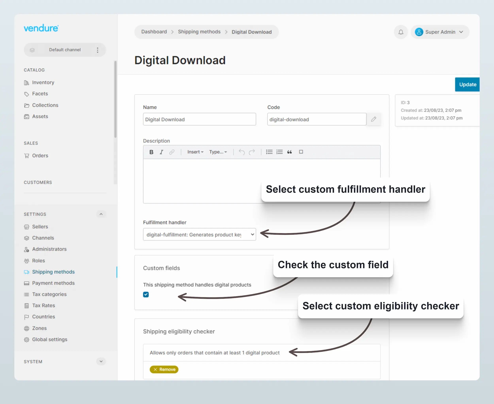
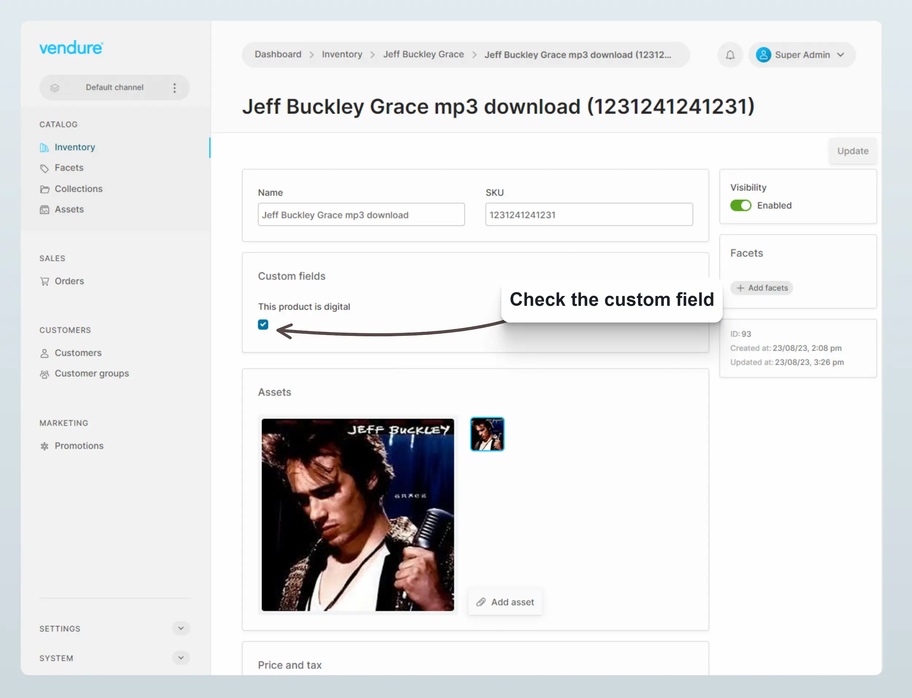

import Tabs from '@theme/Tabs';
import TabItem from '@theme/TabItem';

Digital products include things like ebooks, online courses, and software. They are products that are delivered to the customer electronically, and do not require
physical shipping.

This guide will show you how you can add support for digital products to Vendure.

## Creating the plugin

:::info
The complete source of the following example plugin can be found here: [example-plugins/digital-products](https://github.com/vendure-ecommerce/vendure/tree/master/packages/dev-server/example-plugins/digital-products)
:::

### Define custom fields

If some products are digital and some are physical, we can distinguish between them by adding a customField to the ProductVariant entity.

```ts title="src/plugins/digital-products/digital-products-plugin.ts"
import { LanguageCode, PluginCommonModule, VendurePlugin } from '@vendure/core';

@VendurePlugin({
    imports: [PluginCommonModule],
    configuration: config => {
        // highlight-start
        config.customFields.ProductVariant.push({
            type: 'boolean',
            name: 'isDigital',
            defaultValue: false,
            label: [{ languageCode: LanguageCode.en, value: 'This product is digital' }],
            public: true,
        });
        // highlight-end
        return config;
    },
})
export class DigitalProductsPlugin {}
```

We will also define a custom field on the `ShippingMethod` entity to indicate that this shipping method is only available for digital products:

```ts title="src/plugins/digital-products/digital-products-plugin.ts"
import { LanguageCode, PluginCommonModule, VendurePlugin } from '@vendure/core';

@VendurePlugin({
    imports: [PluginCommonModule],
    configuration: config => {
        // config.customFields.ProductVariant.push({ ... omitted
        // highlight-start
        config.customFields.ShippingMethod.push({
            type: 'boolean',
            name: 'digitalFulfilmentOnly',
            defaultValue: false,
            label: [{ languageCode: LanguageCode.en, value: 'Digital fulfilment only' }],
            public: true,
        });
        // highlight-end
        return config;
    },
})
```

Lastly we will define a custom field on the `Fulfillment` entity where we can store download links for the digital products. If your own implementation you may
wish to handle this part differently, e.g. storing download links on the `Order` entity or in a custom entity.

```ts title="src/plugins/digital-products/digital-products-plugin.ts"
import { LanguageCode, PluginCommonModule, VendurePlugin } from '@vendure/core';

@VendurePlugin({
    imports: [PluginCommonModule],
    configuration: config => {
        // config.customFields.ProductVariant.push({ ... omitted
        // config.customFields.ShippingMethod.push({ ... omitted
        // highlight-start
        config.customFields.Fulfillment.push({
            type: 'string',
            name: 'downloadUrls',
            nullable: true,
            list: true,
            label: [{ languageCode: LanguageCode.en, value: 'Urls of any digital purchases' }],
            public: true,
        });
        // highlight-end
        return config;
    },
})
```

### Create a custom FulfillmentHandler

The `FulfillmentHandler` is responsible for creating the `Fulfillment` entities when an Order is fulfilled. We will create a custom handler which
is responsible for performing the logic related to generating the digital download links.

In your own implementation, this may look significantly different depending on your requirements.

```ts title="src/plugins/digital-products/config/digital-fulfillment-handler.ts"
import { FulfillmentHandler, LanguageCode, OrderLine, TransactionalConnection } from '@vendure/core';
import { In } from 'typeorm';

let connection: TransactionalConnection;

/**
 * @description
 * This is a fulfillment handler for digital products which generates a download url
 * for each digital product in the order.
 */
export const digitalFulfillmentHandler = new FulfillmentHandler({
    code: 'digital-fulfillment',
    description: [
        {
            languageCode: LanguageCode.en,
            value: 'Generates product keys for the digital download',
        },
    ],
    args: {},
    init: injector => {
        connection = injector.get(TransactionalConnection);
    },
    createFulfillment: async (ctx, orders, lines) => {
        const digitalDownloadUrls: string[] = [];

        const orderLines = await connection.getRepository(ctx, OrderLine).find({
            where: {
                id: In(lines.map(l => l.orderLineId)),
            },
            relations: {
                productVariant: true,
            },
        });
        for (const orderLine of orderLines) {
            if (orderLine.productVariant.customFields.isDigital) {
                // This is a digital product, so generate a download url
                const downloadUrl = await generateDownloadUrl(orderLine);
                digitalDownloadUrls.push(downloadUrl);
            }
        }
        return {
            method: 'Digital Fulfillment',
            trackingCode: 'DIGITAL',
            customFields: {
                downloadUrls: digitalDownloadUrls,
            },
        };
    },
});

function generateDownloadUrl(orderLine: OrderLine) {
    // This is a dummy function that would generate a download url for the given OrderLine
    // by interfacing with some external system that manages access to the digital product.
    // In this example, we just generate a random string.
    const downloadUrl = `https://example.com/download?key=${Math.random().toString(36).substring(7)}`;
    return Promise.resolve(downloadUrl);
}
```

### Create a custom ShippingEligibilityChecker

We want to ensure that the digital shipping method is only applicable to orders containing at least one digital product.
We do this with a custom ShippingEligibilityChecker:

```ts title="src/plugins/digital-products/config/digital-shipping-eligibility-checker.ts"
import { LanguageCode, ShippingEligibilityChecker } from '@vendure/core';

export const digitalShippingEligibilityChecker = new ShippingEligibilityChecker({
    code: 'digital-shipping-eligibility-checker',
    description: [
        {
            languageCode: LanguageCode.en,
            value: 'Allows only orders that contain at least 1 digital product',
        },
    ],
    args: {},
    check: (ctx, order, args) => {
        const digitalOrderLines = order.lines.filter(l => l.productVariant.customFields.isDigital);
        return digitalOrderLines.length > 0;
    },
});
```

### Create a custom ShippingLineAssignmentStrategy

When adding shipping methods to the order, we want to ensure that digital products are correctly assigned to the digital shipping
method, and physical products are not.

```ts title="src/plugins/digital-products/config/digital-shipping-line-assignment-strategy.ts"
import {
    Order,
    OrderLine,
    RequestContext,
    ShippingLine,
    ShippingLineAssignmentStrategy,
} from '@vendure/core';

/**
 * @description
 * This ShippingLineAssignmentStrategy ensures that digital products are assigned to a
 * ShippingLine which has the `isDigital` flag set to true.
 */
export class DigitalShippingLineAssignmentStrategy implements ShippingLineAssignmentStrategy {
    assignShippingLineToOrderLines(
        ctx: RequestContext,
        shippingLine: ShippingLine,
        order: Order,
    ): OrderLine[] | Promise<OrderLine[]> {
        if (shippingLine.shippingMethod.customFields.isDigital) {
            return order.lines.filter(l => l.productVariant.customFields.isDigital);
        } else {
            return order.lines.filter(l => !l.productVariant.customFields.isDigital);
        }
    }
}
```

### Define a custom OrderProcess

In order to automatically fulfill any digital products as soon as the order completes, we can define a custom OrderProcess:

```ts title="src/plugins/digital-products/config/digital-order-process.ts"
import { OrderProcess, OrderService } from '@vendure/core';

import { digitalFulfillmentHandler } from './digital-fulfillment-handler';

let orderService: OrderService;

/**
 * @description
 * This OrderProcess ensures that when an Order transitions from ArrangingPayment to
 * PaymentAuthorized or PaymentSettled, then any digital products are automatically
 * fulfilled.
 */
export const digitalOrderProcess: OrderProcess<string> = {
    init(injector) {
        orderService = injector.get(OrderService);
    },
    async onTransitionEnd(fromState, toState, data) {
        if (
            fromState === 'ArrangingPayment' &&
            (toState === 'PaymentAuthorized' || toState === 'PaymentSettled')
        ) {
            const digitalOrderLines = data.order.lines.filter(l => l.productVariant.customFields.isDigital);
            if (digitalOrderLines.length) {
                await orderService.createFulfillment(data.ctx, {
                    lines: digitalOrderLines.map(l => ({ orderLineId: l.id, quantity: l.quantity })),
                    handler: { code: digitalFulfillmentHandler.code, arguments: [] },
                });
            }
        }
    },
};
```

### Complete plugin & add to config

The complete plugin can be found here: [example-plugins/digital-products](https://github.com/vendure-ecommerce/vendure/tree/master/packages/dev-server/example-plugins/digital-products)

We can now add the plugin to the VendureConfig:

```ts title="src/vendure-config.ts"
import { VendureConfig } from '@vendure/core';
import { DigitalProductsPlugin } from './plugins/digital-products/digital-products-plugin';

const config: VendureConfig = {
    // ... other config omitted
    plugins: [
        // ... other plugins omitted
        // highlight-next-line
        DigitalProductsPlugin,
    ],
};
```

## Create the ShippingMethod

Once these parts have been defined and bundled up in a Vendure plugin, we can create a new ShippingMethod via the Admin UI, and
make sure to check the "isDigital" custom field, and select the custom fulfillment handler and eligibility checker:



## Mark digital products

We can now also set any digital product variants by checking the custom field:



## Storefront integration

In the storefront, when the customer is checking out, we can use the `eligibleShippingMethods` query to determine which shipping methods
are available to the customer. If the customer has any digital products in the order, the "digital-download" shipping method will be available:


<Tabs>
<TabItem value="Query" label="Query" default>

```graphql
query {
  eligibleShippingMethods {
    id
    name
    price
    priceWithTax
    customFields {
      isDigital
    }
  }
}
```

</TabItem>
<TabItem value="Response" label="Response" >

```json
{
  "data": {
    "eligibleShippingMethods": [
      // highlight-start
      {
        "id": "3",
        "name": "Digital Download",
        "price": 0,
        "priceWithTax": 0,
        "customFields": {
          "isDigital": true
        }
      },
      // highlight-end
      {
        "id": "1",
        "name": "Standard Shipping",
        "price": 500,
        "priceWithTax": 500,
        "customFields": {
          "isDigital": false
        }
      },
      {
        "id": "2",
        "name": "Express Shipping",
        "price": 1000,
        "priceWithTax": 1000,
        "customFields": {
          "isDigital": false
        }
      }
    ]
  }
}
```

</TabItem>
</Tabs>

If the "digital download" shipping method is eligible, it should be set as a shipping method along with any other method
required by any physical products in the order.

<Tabs>
<TabItem value="Query" label="Query" default>

```graphql
mutation SetShippingMethod {
  setOrderShippingMethod(
      // highlight-next-line
      shippingMethodId: ["3", "1"]
    ) {
    ... on Order {
      id
      code
      total
      lines {
        id
        quantity
        linePriceWithTax
        productVariant {
          name
          sku
          customFields {
            isDigital
          }
        }
      }
      shippingLines {
        id
        shippingMethod {
          name
        }
        priceWithTax
      }
    }
  }
}
```

</TabItem>
<TabItem value="Response" label="Response" >

```json
{
  "data": {
    "setOrderShippingMethod": {
      "id": "11",
      "code": "C6H3UZ6WQ62LAPS8",
      "total": 5262,
      "lines": [
        {
          "id": "16",
          "quantity": 1,
          "linePriceWithTax": 1458,
          "productVariant": {
            "name": "Jeff Buckley Grace mp3 download",
            "sku": "1231241241231",
            "customFields": {
              // highlight-next-line
              "isDigital": true
            }
          }
        },
        {
          "id": "17",
          "quantity": 1,
          "linePriceWithTax": 4328,
          "productVariant": {
            "name": "Basketball",
            "sku": "WTB1418XB06",
            "customFields": {
              "isDigital": false
            }
          }
        }
      ],
      "shippingLines": [
        // highlight-start
        {
          "id": "13",
          "shippingMethod": {
            "name": "Digital Download"
          },
          "priceWithTax": 0
        },
        // highlight-end
        {
          "id": "14",
          "shippingMethod": {
            "name": "Standard Shipping"
          },
          "priceWithTax": 500
        }
      ]
    }
  }
}
```

</TabItem>
</Tabs>
