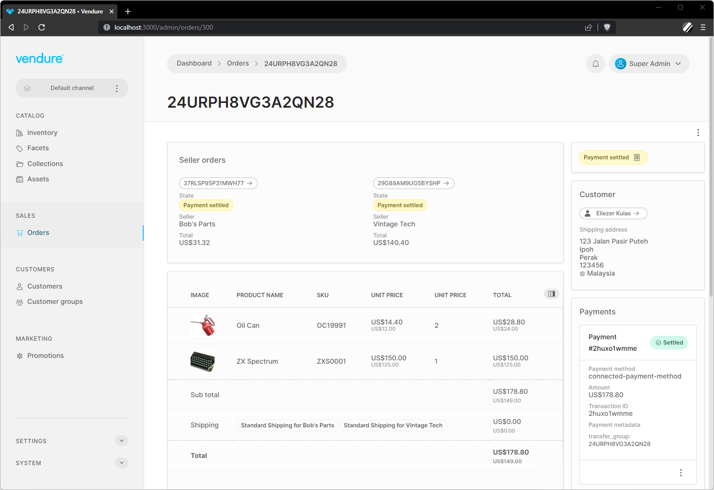

# Multi-vendor Marketplaces

Vendure v2.0 introduced a number of changes and new APIs to enable developers to build multi-vendor marketplace apps.

This is a type of application in which multiple sellers are able to list products, and then customers can create orders containing products from one or more of these sellers. Well-known examples include Amazon, Ebay, Etsy and Airbnb.

This guide introduces the major concepts & APIs you will need to understand in order to implement your own multi-vendor marketplace application. 

## Multi-vendor plugin

All the concepts presented here have been implemented in our [example multi-vendor plugin](https://github.com/vendure-ecommerce/vendure/tree/master/packages/dev-server/example-plugins/multivendor-plugin). The guides here will refer to specific parts of this plugin which you should consult to get a full understanding of how an implementation would look.

:::caution
**Note:** the [example multi-vendor plugin](https://github.com/vendure-ecommerce/vendure/tree/master/packages/dev-server/example-plugins/multivendor-plugin) is for educational purposes only, and for the sake of clarity leaves out several parts that would be required in a production-ready solution, such as email verification and setup of a real payment solution.
:::



## Sellers, Channels & Roles

The core of Vendure's multi-vendor support is Channels. Read the [Channels guide](/guides/core-concepts/channels/) to get a more detailed understanding of how they work.

Each Channel is assigned to a [Seller](/reference/typescript-api/entities/seller/), which is another term for the vendor who is selling things in our marketplace.

So the first thing to do is to implement a way to create a new Channel and Seller.

In the multi-vendor plugin, we have defined a new mutation in the Shop API which allows a new seller to register on our marketplace:

```graphql title="Shop API"
mutation RegisterSeller {
  registerNewSeller(input: {
    shopName: "Bob's Parts",
    seller: {
      firstName: "Bob"
      lastName: "Dobalina"
      emailAddress: "bob@bobs-parts.com"
      password: "test",
    }
  }) {
    id
    code
    token
  }
}
```

Executing the `registerNewSeller` mutation does the following:

- Create a new [Seller](/reference/typescript-api/entities/seller/) representing the shop "Bob's Parts"
- Create a new [Channel](/reference/typescript-api/entities/channel) and associate it with the new Seller
- Create a [Role](/reference/typescript-api/entities/role) & [Administrator](/reference/typescript-api/entities/administrator) for Bob to access his shop admin account
- Create a [ShippingMethod](/reference/typescript-api/entities/shipping-method) for Bob's shop
- Create a [StockLocation](/reference/typescript-api/entities/stock-location) for Bob's shop

Bob can now log in to the Admin UI using the provided credentials and begin creating products to sell!

### Keeping prices synchronized

In some marketplaces, the same product may be sold by multiple sellers. When this is the case, the product and its variants
will be assigned not only to the default channel, but to multiple other channels as well - see the 
[Channels, Currencies & Prices section](/guides/core-concepts/channels/#channels-currencies--prices) for a visual explanation of how this works.

This means that there will be multiple ProductVariantPrice entities per variant, one for each channel. 
 
In order
to keep prices synchronized across all channels, the example multi-vendor plugin sets the `syncPricesAcrossChannels` property
of the [DefaultProductVariantPriceUpdateStrategy](/reference/typescript-api/configuration/product-variant-price-update-strategy#defaultproductvariantpriceupdatestrategy)
to `true`. Your own multi-vendor implementation may require more sophisticated price synchronization logic, in which case
you can implement your own custom [ProductVariantPriceUpdateStrategy](/reference/typescript-api/configuration/product-variant-price-update-strategy).

## Assigning OrderLines to the correct Seller

In order to correctly split the Order later, we need to assign each added OrderLine to the correct Seller. This is done with the [OrderSellerStrategy](/reference/typescript-api/orders/order-seller-strategy/) API, and specifically the `setOrderLineSellerChannel()` method.

The following logic will run any time the `addItemToOrder` mutation is executed from our storefront:

```ts
export class MultivendorSellerStrategy implements OrderSellerStrategy {
  // other properties omitted for brevity   
    
  async setOrderLineSellerChannel(ctx: RequestContext, orderLine: OrderLine) {
    await this.entityHydrator.hydrate(ctx, orderLine.productVariant, { relations: ['channels'] });
    const defaultChannel = await this.channelService.getDefaultChannel();
  
    // If a ProductVariant is assigned to exactly 2 Channels, then one is the default Channel
    // and the other is the seller's Channel.
    if (orderLine.productVariant.channels.length === 2) {
      const sellerChannel = orderLine.productVariant.channels.find(
        c => !idsAreEqual(c.id, defaultChannel.id),
      );
      if (sellerChannel) {
        return sellerChannel;
      }
    }
  }
}
```

The end result is that each OrderLine in the Order will have its `sellerChannelId` property set to the correct Channel for the Seller.

## Shipping

When it comes time to choose a ShippingMethod for the Order, we need to ensure that the customer can only choose from the ShippingMethods which are supported by the Seller. To do this, we need to implement a [ShippingEligibilityChecker](/reference/typescript-api/shipping/shipping-eligibility-checker/) which will filter the available ShippingMethods based on the `sellerChannelId` properties of the OrderLines.

Here's how we do it in the example plugin:

```ts
export const multivendorShippingEligibilityChecker = new ShippingEligibilityChecker({
  // other properties omitted for brevity   
    
  check: async (ctx, order, args, method) => {
    await entityHydrator.hydrate(ctx, method, { relations: ['channels'] });
    await entityHydrator.hydrate(ctx, order, { relations: ['lines.sellerChannel'] });
    const sellerChannel = method.channels.find(c => c.code !== DEFAULT_CHANNEL_CODE);
    if (!sellerChannel) {
      return false;
    }
    for (const line of order.lines) {
      if (idsAreEqual(line.sellerChannelId, sellerChannel.id)) {
        return true;
      }
    }
    return false;
  },
});
```

In the storefront, when it comes time to assign ShippingMethods to the Order, we need to ensure that
every OrderLine is covered by a valid ShippingMethod. We pass the ids of the eligible ShippingMethods to the `setOrderShippingMethod` mutation:

```graphql
mutation SetShippingMethod($ids: [ID!]!) {
  setOrderShippingMethod(shippingMethodId: $ids) {
    ... on Order {
      id
      state
      # ...etc
    }
    ... on ErrorResult {
      errorCode
      message
    }
  }
}
```

Now we need a way to assign the correct method to each line in an Order. This is done with the [ShippingLineAssignmentStrategy](/reference/typescript-api/shipping/shipping-line-assignment-strategy/) API.

We will again be relying on the `sellerChannelId` property of the OrderLines to determine which ShippingMethod to assign to each line. Here's how we do it in the example plugin:

```ts
export class MultivendorShippingLineAssignmentStrategy implements ShippingLineAssignmentStrategy {
  // other properties omitted for brevity   
    
  async assignShippingLineToOrderLines(ctx: RequestContext, shippingLine: ShippingLine, order: Order) {
    // First we need to ensure the required relations are available
    // to work with.
    const defaultChannel = await this.channelService.getDefaultChannel();
    await this.entityHydrator.hydrate(ctx, shippingLine, { relations: ['shippingMethod.channels'] });
    const { channels } = shippingLine.shippingMethod;
  
    // We assume that, if a ShippingMethod is assigned to exactly 2 Channels,
    // then one is the default Channel and the other is the seller's Channel.
    if (channels.length === 2) {
      const sellerChannel = channels.find(c => !idsAreEqual(c.id, defaultChannel.id));
      if (sellerChannel) {
        // Once we have established the seller's Channel, we can filter the OrderLines
        // that belong to that Channel. The `sellerChannelId` was previously established
        // in the `OrderSellerStrategy.setOrderLineSellerChannel()` method.
        return order.lines.filter(line => idsAreEqual(line.sellerChannelId, sellerChannel.id));
      }
    }
    return order.lines;
  }
}
```

## Splitting orders & payment

When it comes to payments, there are many different ways that a multi-vendor marketplace might want to handle this. For example, the marketplace may collect all payments and then later disburse the funds to the Sellers. Or the marketplace may allow each Seller to connect their own payment gateway and collect payments directly.

In the example plugin, we have implemented a simplified version of a service like [Stripe Connect](https://stripe.com/connect), whereby each Seller has a `connectedAccountId` (we auto-generate a random string for the example when registering the Seller). When configuring the plugin we also specify a "platform fee" percentage, which is the percentage of the total Order value which the marketplace will collect as a fee. The remaining amount is then split between the Sellers.

The [OrderSellerStrategy](/reference/typescript-api/orders/order-seller-strategy/) API contains two methods which are used to first split the Order from a single order into one _Aggregate Order_ and multiple _Seller Orders_, and then to calculate the platform fee for each of the Seller Orders:

- `OrderSellerStrategy.splitOrder`: Splits the OrderLines and ShippingLines of the Order into multiple groups, one for each Seller.
- `OrderSellerStrategy.afterSellerOrdersCreated`: This method is run on every Seller Order created after the split, and we can use this to assign the platform fees to the Seller Order.

## Custom OrderProcess

Finally, we need a custom [OrderProcess](/reference/typescript-api/orders/order-process/) which will help keep the state of the resulting Aggregate Order and its Seller Orders in sync. For example, we want to make sure that the Aggregate Order cannot be transitioned to the `Shipped` state unless all of its Seller Orders are also in the `Shipped` state.

Conversely, we can automatically set the state of the Aggregate Order to `Shipped` once all of its Seller Orders are in the `Shipped` state.
