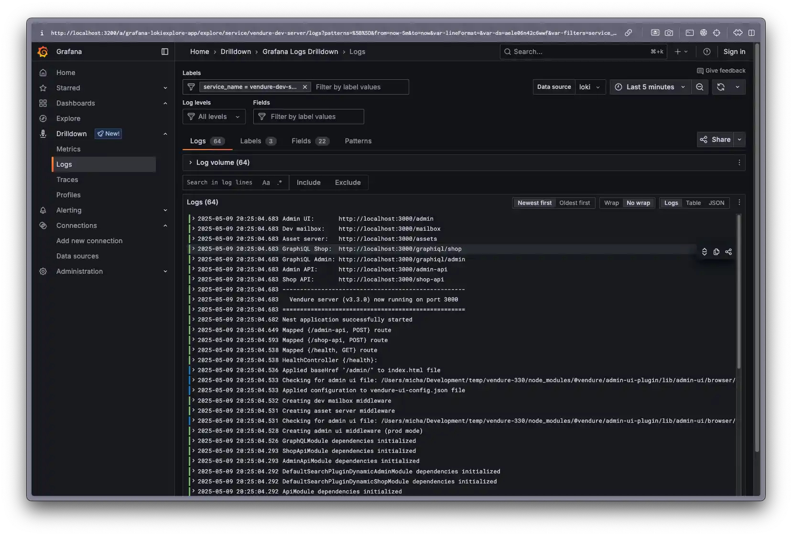
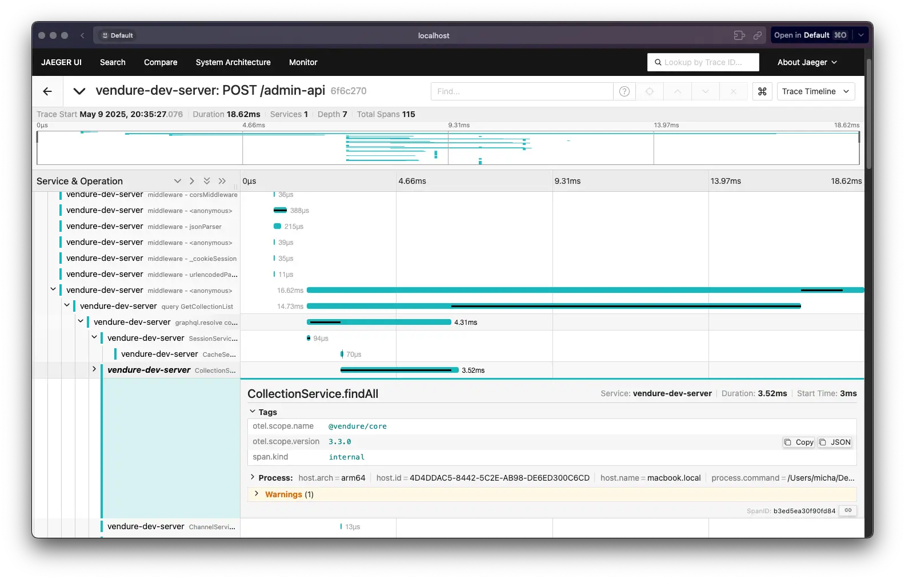
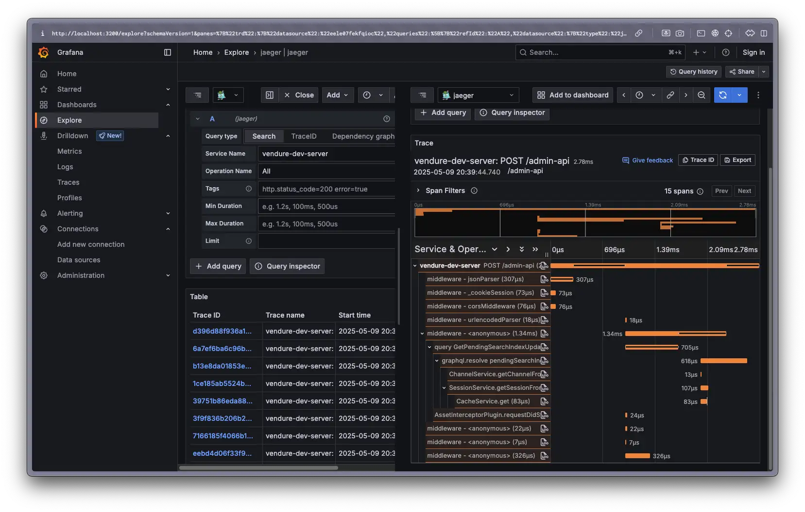

[Open Telemetry](https://opentelemetry.io/) is a set of APIs, libraries, agents, and instrumentation to provide observability for applications. 
It provides a standard way to collect and export telemetry data such as traces, metrics, and logs from applications.

From Vendure v3.3, Vendure has built-in support for Open Telemetry, via the `@vendure/telemetry-plugin` package. 
This package provides a set of decorators and utilities to instrument Vendure services and entities with Open Telemetry.

In this guide we will set up a local Vendure server with Open Telemetry, collecting traces and logs
using the following parts:

- [Open Telemetry](https://opentelemetry.io/): The standard for observability.
- [Vendure Telemetry Plugin](/reference/core-plugins/telemetry-plugin/): Instruments the Vendure server & worker for Open Telemetry.
- [Jaeger](https://www.jaegertracing.io/): A distributed tracing system that can be used to collect and visualize traces.
- [Loki](https://grafana.com/oss/loki/): A log aggregation system that can be used to collect and visualize logs.
- [Grafana](https://grafana.com/oss/grafana/): A visualization tool that can be used to visualize traces and logs from Jaeger and Loki.

:::info
There are many other tools and services that can be used with Open Telemetry, such as Prometheus, Zipkin, Sentry, Dynatrace and others.

In this guide we have chosen some widely-used and open-source tools to demonstrate the capabilities of Open Telemetry.
:::

## Setup

### Set up Jaeger, Loki & Grafana

We will be using Docker to run Jaeger, Loki, and Grafana locally. Create a file called `docker-compose.yml` 
in the root of your project (standard Vendure installations already have one) and add the following contents:

```yaml
services:
    jaeger:
        image: jaegertracing/all-in-one:latest
        ports:
            - '4318:4318' # OTLP HTTP receiver
            - '16686:16686' # Web UI
        environment:
            - COLLECTOR_OTLP_ENABLED=true
        volumes:
            - jaeger_data:/badger
        networks:
            - jaeger

    loki:
        image: grafana/loki:3.4
        ports:
            - '3100:3100'
        networks:
            - loki

    grafana:
        environment:
            - GF_PATHS_PROVISIONING=/etc/grafana/provisioning
            - GF_AUTH_ANONYMOUS_ENABLED=true
            - GF_AUTH_ANONYMOUS_ORG_ROLE=Admin
            - GF_FEATURE_TOGGLES_ENABLE=alertingSimplifiedRouting,alertingQueryAndExpressionsStepMode
        image: grafana/grafana:latest
        ports:
            - '3200:3000'
        networks:
            - loki
            - jaeger
        volumes:
            - grafana-storage:/var/lib/grafana

    networks:
        loki:
            driver: bridge
        jaeger:
            driver: bridge

    volumes:
        jaeger_data:
            driver: local
        grafana-storage:
            driver: local
```

You can start the services using the following command:

```bash
docker-compose up -d jaeger loki grafana
```

Once the images have downloaded and the containers are running, you can access:

- Jaeger at [http://localhost:16686](http://localhost:16686)
- Grafana at [http://localhost:3200](http://localhost:3200)

### Install the Telemetry Plugin

```bash
npm install @vendure/telemetry-plugin
```

Add the plugin to your Vendure config:

```ts
import { VendureConfig, LogLevel } from '@vendure/core';
import { TelemetryPlugin } from '@vendure/telemetry-plugin';

export const config: VendureConfig = {
    // ... other config options
    plugins: [
        TelemetryPlugin.init({
            loggerOptions: {
                // Optional: log to the console as well as
                // sending to the telemetry server. Can be
                // useful for debugging.
                logToConsole: LogLevel.Verbose,
            },
        }),
    ],
};
```

### Set environment variables

In order to send telemetry data to the Jaeger and Loki services, you need to set some environment variables.
In a standard Vendure installation, there is an `.env` file in the root of the project. We will add the following:

```env
# Open Telemetry
OTEL_EXPORTER_OTLP_ENDPOINT=http://localhost:3100/otlp
OTEL_EXPORTER_OTLP_TRACES_ENDPOINT=http://localhost:4318/v1/traces
OTEL_LOGS_EXPORTER=otlp
```

### Create a preload script

The Open Telemetry libraries for Node.js instrument underlying libraries such as NestJS, GraphQL,
Redis, database drivers, etc. to collect telemetry data. In order to do this, they need to be
preloaded before any of the Vendure application code. This is done by means of a preload script.

Create a file called `preload.ts` in the src dir of your project with the following contents:

```ts title="src/preload.ts"
import { OTLPLogExporter } from '@opentelemetry/exporter-logs-otlp-proto';
import { OTLPTraceExporter } from '@opentelemetry/exporter-trace-otlp-http';
import { BatchLogRecordProcessor } from '@opentelemetry/sdk-logs';
import { NodeSDK } from '@opentelemetry/sdk-node';
import { BatchSpanProcessor } from '@opentelemetry/sdk-trace-base';
import { getSdkConfiguration } from '@vendure/telemetry-plugin/preload';
import 'dotenv/config';

const traceExporter = new OTLPTraceExporter();
const logExporter = new OTLPLogExporter();

const config = getSdkConfiguration({
    config: {
        spanProcessors: [new BatchSpanProcessor(traceExporter)],
        logRecordProcessors: [new BatchLogRecordProcessor(logExporter)],
    },
});

const sdk = new NodeSDK(config);

sdk.start();
```

:::info
There are many, many configuration options available for Open Telemetry. The above is an example that works
with the services used in this guide. The important things is to make sure the use the
`getSdkConfiguration` function from the `@vendure/telemetry-plugin/preload` package, as this will ensure that
the Vendure core is instrumented correctly.
:::

To run the preload script, you need to set the `--require` flag when starting the Vendure server. We will 
also set an environment variable to distinguish the server from the worker process.

You can do this by adding the following script to your `package.json`:

```json
{
    "scripts": {
        "dev:server": "OTEL_RESOURCE_ATTRIBUTES=service.name=vendure-server ts-node --require ./src/preload.ts ./src/index.ts", // [!code highlight]
        "dev:worker": "OTEL_RESOURCE_ATTRIBUTES=service.name=vendure-worker ts-node --require ./src/preload.ts ./src/index-worker.ts", // [!code highlight]
        "dev": "concurrently npm:dev:*",
        "build": "tsc",
        "start:server": "OTEL_RESOURCE_ATTRIBUTES=service.name=vendure-server node --require ./dist/preload.js ./dist/index.js", // [!code highlight]
        "start:worker": "OTEL_RESOURCE_ATTRIBUTES=service.name=vendure-worker node --require ./dist/preload.js ./dist/index-worker.js", // [!code highlight]
        "start": "concurrently npm:start:*"
    },
}
```

## Viewing Logs

Once you have started up your server with the preload script, Loki should start receiving logs.

Let's take a look at the logs in Grafana.

Open the Grafana dashboard at [http://localhost:3200](http://localhost:3200) and
select **Connections** > **Data Sources** from the left-hand menu. Then click the "Add data source" button.

Find "Loki" and select it. In the config form that opens, set the URL to `http://loki:3100` and click "Save & Test".

Now you can select **Drilldown** > **Logs** from the left-hand menu. In the "Data source" dropdown, select "Loki".



## Viewing Traces

You can view traces in Jaeger by going to [http://localhost:16686](http://localhost:16686).

Select the "vendure-dev-server" service from the dropdown and click "Find Traces".

Clicking a trace will show you the details of the trace.



You can also view traces in Grafana by connecting it to Jaeger.

To do this, go to the Grafana dashboard at [http://localhost:3200](http://localhost:3200) and
select **Connections** > **Data Sources** from the left-hand menu. Then click the "Add data source" button.

Find "Jaeger" and select it. In the config form that opens, set the URL to `http://jaeger:16686` and click "Save & Test".

Now you can select **Explore** from the left-hand menu, select "Jaeger" from the dropdown and then click the 
"search" tab and select the "vendure-dev-server" service from the dropdown.

Clicking the blue "Run Query" button will show you the traces for that service.



## Instrumenting Your Plugins

You can also instrument your own plugins and services with Open Telemetry. To do so,
add the [Instrument decorator](/reference/typescript-api/telemetry/instrument) to your **service class**:

```ts
import { Injectable } from '@nestjs/common';
import { Instrument } from '@vendure/core'; // [!code highlight]

@Instrument() // [!code highlight]
@Injectable()
export class MyService {

    async myMethod() {
        // ...
    }
}
```

You should now be able to see calls to `MyService.myMethod` in your traces.

:::warning
You should _not_ decorate GraphQL resolvers & REST controllers with this decorator. Those will
already be instrumented, and adding the `@Instrument()` decorator will potentially
interfere with other NestJS decorators on your resolver methods.
:::
