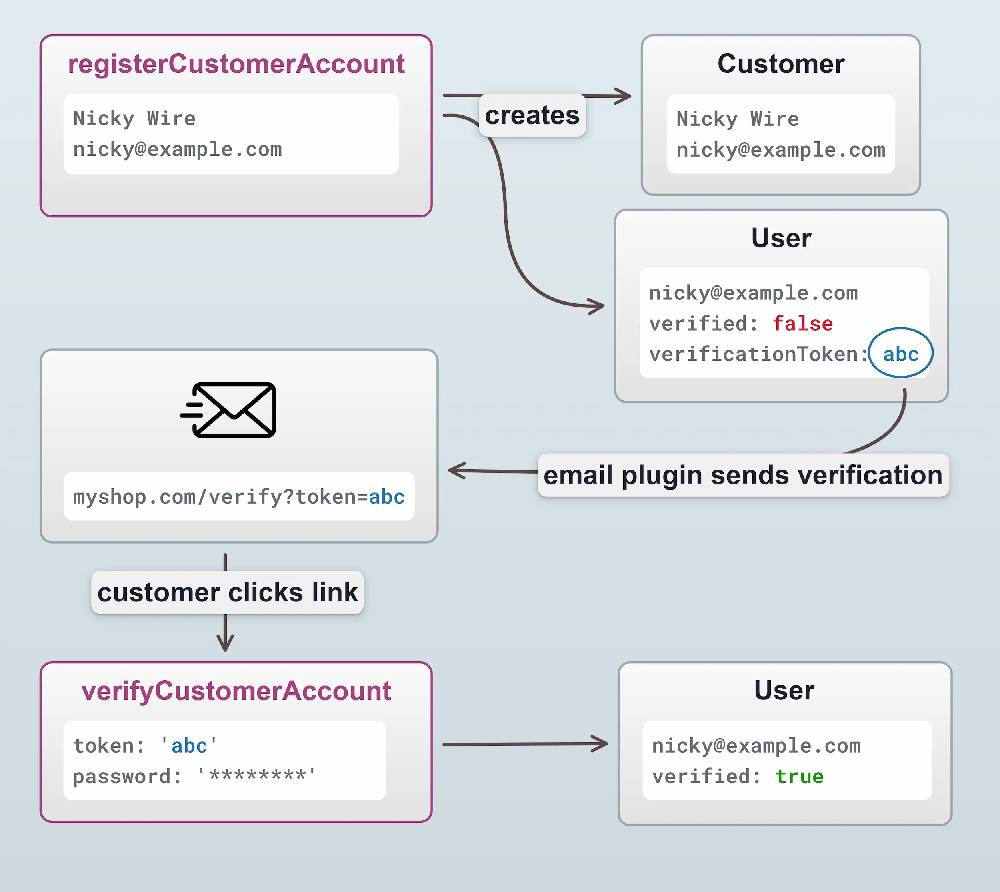
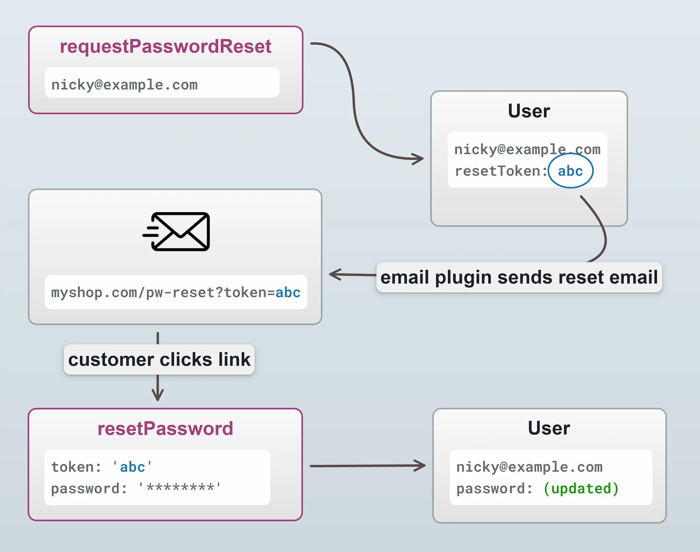

import Tabs from '@theme/Tabs';
import TabItem from '@theme/TabItem';

Customers can register accounts and thereby gain the ability to:

- View past orders
- Store multiple addresses
- Maintain an active order across devices
- Take advantage of plugins that expose functionality to registered customers only, such as wishlists & loyalty points.

## Querying the active customer

The [`activeCustomer` query](/reference/graphql-api/shop/queries/#activecustomer) will return a [`Customer`](/reference/graphql-api/shop/object-types#customer) object if the customer is registered and logged in, otherwise it will return `null`. This can be used in the storefront header for example to
determine whether to display a "sign in" or "my account" link.


<Tabs>
<TabItem value="Query" label="Query" default>

```graphql
query GetCustomerAddresses {
  activeCustomer {
    id
    title
    firstName
    lastName
    emailAddress
  }
}
```

</TabItem>
<TabItem value="Result" label="Result">

```json
{
  "data": {
    "activeCustomer": {
      "id": "12345",
      "title": "Mr.",
      "firstName": "John",
      "lastName": "Doe",
      "emailAddress": "john.doe@email.com"
    }
  }
}
```

</TabItem>
</Tabs>

## Logging in and out

The [`login` mutation](/reference/graphql-api/shop/mutations#login) is used to attempt to log in using email address and password.
Given correct credentials, a new authenticated session will begin for that customer.


<Tabs>
<TabItem value="Query" label="Query" default>

```graphql
mutation LogIn($emailAddress: String!, $password: String!, $rememberMe: Boolean!) {
  login(username: $emailAddress, password: $password, rememberMe: $rememberMe) {
    ... on  CurrentUser {
      id
      identifier
    }
    ... on ErrorResult {
      errorCode
      message
    }
  }
}
```

</TabItem>
<TabItem value="Variables" label="Variables">

```json
{
  "emailAddress": "john.doe@email.com",
  "password": "**********",
  "rememberMe": true,
}
```

</TabItem>
<TabItem value="Result" label="Result">

```json
{
  "data": {
    "login": {
      "id": "12345",
      "identifier": "john.doe@email.com"
    }
  }
}
```

</TabItem>
</Tabs>

The [`logout` mutation](/reference/graphql-api/shop/mutations#logout) will end an authenticated customer session.


<Tabs>
<TabItem value="Query" label="Query" default>

```graphql
mutation LogOut {
  logout {
    success
  }
}
```

</TabItem>
<TabItem value="Result" label="Result">

```json
{
  "data": {
    "logout": {
      "success": true,
    }
  }
}
```

</TabItem>
</Tabs>

:::note
The `login` mutation, as well as the following mutations related to registration & password recovery only
apply when using the built-in [`NativeAuthenticationStrategy`](/reference/typescript-api/auth/native-authentication-strategy/).

If you are using alternative authentication strategies in your storefront, you would use the [`authenticate` mutation](/reference/graphql-api/shop/mutations/#authenticate) as covered in the [External Authentication guide](/guides/core-concepts/auth/#external-authentication).
:::

## Registering a customer account

The [`registerCustomerAccount` mutation](/reference/graphql-api/shop/mutations/#registercustomeraccount) is used to register a new customer account.

There are three possible registration flows:
If [`authOptions.requireVerification`](/reference/typescript-api/auth/auth-options/#requireverification) is set to `true` (the default):

1. **The Customer is registered _with_ a password**. A verificationToken will be created (and typically emailed to the Customer). That
verificationToken would then be passed to the verifyCustomerAccount mutation _without_ a password. The Customer is then
verified and authenticated in one step.
2. **The Customer is registered _without_ a password**. A verificationToken will be created (and typically emailed to the Customer). That
verificationToken would then be passed to the verifyCustomerAccount mutation _with_ the chosen password of the Customer. The Customer is then
verified and authenticated in one step.

If `authOptions.requireVerification` is set to `false`:

3. The Customer _must_ be registered _with_ a password. No further action is needed - the Customer is able to authenticate immediately.

Here's a diagram of the second scenario, where the password is supplied during the _verification_ step.



Here's how the mutations would look for the above flow:


<Tabs>
<TabItem value="Mutation" label="Mutation" default>

```graphql
mutation Register($input: RegisterCustomerInput!) {
  registerCustomerAccount(input: $input) {
    ... on Success {
      success
    }
    ...on ErrorResult {
      errorCode
      message
    }
  }
}
```

</TabItem>
<TabItem value="Variables" label="Variables">

```json
{
  "input: {
    "title": "Mr."
    "firstName": "Nicky",
    "lastName": "Wire",
    "emailAddress": "nicky@example.com",
    "phoneNumber": "1234567",
  }
}
```

</TabItem>
<TabItem value="Result" label="Result">

```json
{
  "data": {
    "registerCustomerAccount": {
      "success": true,
    }
  }
}
```

</TabItem>
</Tabs>

Note that in the variables above, we did **not** specify a password, as this will be done at the verification step.
If a password _does_ get passed at this step, then it won't be needed at the verification step. This is a decision
you can make based on the desired user experience of your storefront.

Upon registration, the [EmailPlugin](/reference/core-plugins/email-plugin/) will generate an email to the
customer containing a link to the verification page. In a default Vendure installation this is set in the vendure config file:

```ts title="src/vendure-config.ts"
EmailPlugin.init({
    route: 'mailbox',
    handlers: defaultEmailHandlers,
    templatePath: path.join(__dirname, '../static/email/templates'),
    outputPath: path.join(__dirname, '../static/email/output'),
    globalTemplateVars: {
        fromAddress: '"Vendure Demo Store" <noreply@vendure.io>',
        // highlight-next-line
        verifyEmailAddressUrl: 'https://demo.vendure.io/storefront/account/verify',
        passwordResetUrl: 'https://demo.vendure.io/storefront/account/reset-password',
        changeEmailAddressUrl: 'https://demo.vendure.io/storefront/account/change-email-address'
    },
    devMode: true,
}),
```

The verification page needs to get the token from the query string, and pass it to the [`verifyCustomerAccount` mutation](/reference/graphql-api/shop/mutations/#verifycustomeraccount):


<Tabs>
<TabItem value="Mutation" label="Mutation" default>

```graphql
mutation Verify($password: String!, $token: String!) {
  verifyCustomerAccount(password: $password, token: $token) {
    ...on CurrentUser {
      id
      identifier
    }
    ...on ErrorResult {
      errorCode
      message
    }
  }
}
```

</TabItem>
<TabItem value="Variables" label="Variables">

```json
{
  "password": "*********",
  "token": "MjAxOS0xMC0wMlQxNToxOTo1NC45NDVa_1DYEWYAB7S3S82JT"
}
```

</TabItem>
<TabItem value="Result" label="Result">

```json
{
  "data": {
    "verifyCustomerAccount": {
      "id": "123",
      "identifier": "nicky@example.com"
    }
  }
}
```

</TabItem>
</Tabs>

## Password reset

Here's how to implement a password reset flow. It is conceptually very similar to the verification flow described above.



A password reset is triggered by the [`requestPasswordReset` mutation](/reference/graphql-api/shop/mutations/#requestpasswordreset):

<Tabs>
<TabItem value="Mutation" label="Mutation" default>

```graphql
mutation RequestPasswordReset($emailAddress: String!) {
  requestPasswordReset(emailAddress: $emailAddress) {
    ... on Success {
      success
    }
    ... on ErrorResult {
      errorCode
      message
    }
  }
}
```

</TabItem>
<TabItem value="Variables" label="Variables">

```json
{
  "emailAddress": "nicky@example.com",
}
```

</TabItem>
<TabItem value="Result" label="Result">

```json
{
  "data": {
    "requestPasswordReset": {
      "success": true,
    }
  }
}
```

</TabItem>
</Tabs>

Again, this mutation will trigger an event which the EmailPlugin's default email handlers will pick up and send
an email to the customer. The password reset page then needs to get the token from the url and pass it to the
[`resetPassword` mutation](/reference/graphql-api/shop/mutations/#resetpassword):


<Tabs>
<TabItem value="Mutation" label="Mutation" default>

```graphql
mutation ResetPassword($token: String! $password: String!) {
  resetPassword(token: $token password: $password) {
    ...on CurrentUser {
      id
      identifier
    }
    ... on ErrorResult {
      errorCode
      message
    }
  }
}
```

</TabItem>
<TabItem value="Variables" label="Variables">

```json
{
  "token": "MjAxOS0xMC0wMlQxNToxOTo1NC45NDVa_1DYEWYAB7S3S82JT",
  "password": "************"
}
```

</TabItem>
<TabItem value="Result" label="Result">

```json
{
  "data": {
    "resetPassword": {
      "id": "123",
      "identifier": "nicky@example.com"
    }
  }
}
```

</TabItem>
</Tabs>
