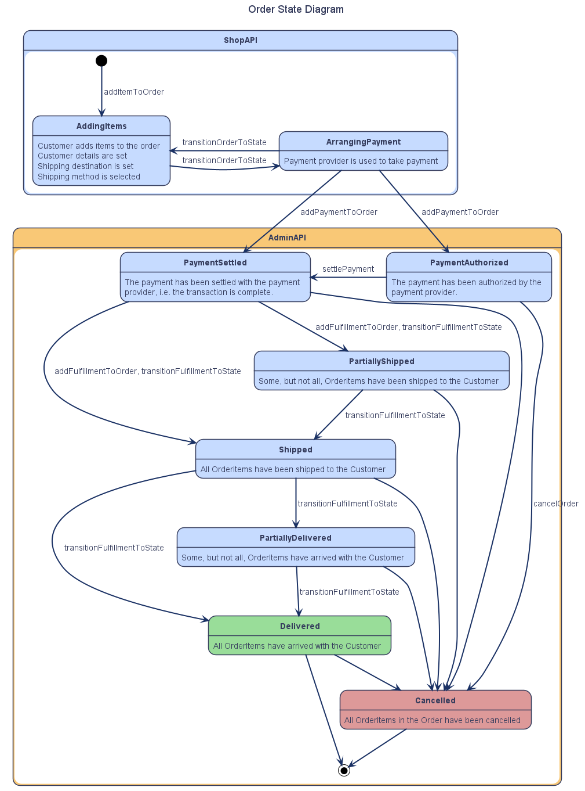
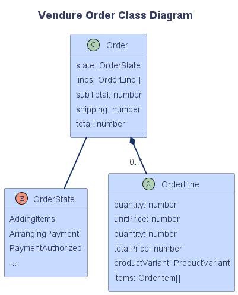

# Order Workflow

An Order is a collection of one or more ProductVariants which can be purchased by a Customer. Orders are represented internally by the [Order entity](/reference/typescript-api/entities/order/) and in the GraphQL API by the [Order type](/reference/graphql-api/admin/enums/#ordertype).

## Order State

Every Order has a `state` property of type [`OrderState`](/reference/typescript-api/orders/order-process/#orderstate). The following diagram shows the default states and how an Order transitions from one to the next.

:::note
Note that this default workflow can be modified to better fit your business processes. See the [Customizing the Order Process guide](/guides/core-concepts/orders/#custom-order-processes).
:::



## Structure of an Order

In Vendure an [Order](/reference/typescript-api/entities/order) consists of one or more [OrderLines](/reference/typescript-api/entities/order-line) (representing a given quantity of a particular SKU).

Here is a simplified diagram illustrating this relationship:



## Shop client order workflow

The [GraphQL Shop API Guide](/guides/storefront/active-order) lists the GraphQL operations you will need to implement this workflow in your storefront client application.

In this section, we'll cover some examples of how these operations would look in your storefront.

### Manipulating the Order

First, let's define a fragment for our Order that we can re-use in subsequent operations:

```graphql
fragment ActiveOrder on Order {
  id
  code
  state
  couponCodes
  subTotalWithTax
  shippingWithTax
  totalWithTax
  totalQuantity
  lines {
    id
    productVariant {
      id
      name
    }
    featuredAsset {
      id
      preview
    }
    quantity
    linePriceWithTax
  }
}
```

Then we can add an item to the Order:

```graphql
mutation AddItemToOrder($productVariantId: ID! $quantity: Int!){
  addItemToOrder(productVariantId: $productVariantId, quantity: $quantity) {
    ... ActiveOrder
    ... on ErrorResult {
      errorCode
      message
    }
  }
}
```

To remove an item from the order

```graphql
mutation RemoveItemFromOrder($orderLineId: ID!){
  removeOrderLine(orderLineId: $orderLineId) {
    ... ActiveOrder
    ... on ErrorResult {
      errorCode
      message
    }
  }
}
```

To alter the quantity of an existing OrderLine

```graphql
mutation AdjustOrderLine($orderLineId: ID! $quantity: Int!){
  adjustOrderLine(orderLineId: $orderLineId, quantity: $quantity) {
    ... ActiveOrder
    ... on ErrorResult {
      errorCode
      message
    }
  }
}
```

At any time we can query the contents of the active Order:

```graphql
query ActiveOrder {
  activeOrder {
    ... ActiveOrder
  }  
}
```

### Checking out

During the checkout process, we'll need to make sure a Customer is assigned to the Order. If the Customer is already signed in, then this can be skipped since Vendure will have already assigned them. If not, then you'd execute:

```graphql
mutation SetCustomerForOrder($input: CreateCustomerInput!){
  setCustomerForOrder(input: $input) {
    ... ActiveOrder
    ... on ErrorResult {
      errorCode
      message
    }
  }
}
```

Then we need to set the shipping address:

```graphql
mutation SetShippingAddress($input: CreateAddressInput!){
  setOrderShippingAddress(input: $input) {
    ... ActiveOrder
    ... on ErrorResult {
      errorCode
      message
    }
  }
}
```

Once the shipping address is set, we can find out which ShippingMethods can be used on this Order:

```graphql
query GetShippingMethods{
  eligibleShippingMethods {
    id
    name
    code
    description
    priceWithTax
  }
}
```

The Customer can then choose one of the available ShippingMethods, and we then set it on the Order:

```graphql
mutation SetShippingMethod($shippingMethodId: ID!){
  setOrderShippingMethod(shippingMethodId: $shippingMethodId) {
    ... ActiveOrder
    ... on ErrorResult {
      errorCode
      message
    }
  }
}
```

We can now do the same for PaymentMethods:

```graphql
query GetPaymentMethods{
  eligiblePaymentMethods {
    id
    name
    code
    description
    isEligible
    eligibilityMessage
  }
}
```

Once the customer is ready to pay, we need to transition the Order to the `ArrangingPayment` state. In this state, no further modifications are permitted. If you _do_ need to modify the Order contents, you can always transition back to the `AddingItems` state:

```graphql
mutation TransitionOrder($state: String!){
  transitionOrderToState(state: $state) {
    ... ActiveOrder
    ... on ErrorResult {
      errorCode
      message
    }
  }
}
```

Finally, add a Payment to the Order:

```graphql
mutation AddPayment($input: PaymentInput!){
  addPaymentToOrder(input: $input) {
    ... ActiveOrder
    ... on ErrorResult {
      errorCode
      message
    }
  }
}
```

If the Payment is successful, the Order will now be complete. You can forward the Customer to a confirmation page using the Order's `code`:

```graphql
query OrderByCode($code: String!) {
  orderByCode(code: $code) {
    ...ActiveOrder
  }
}
```

## ActiveOrderStrategy

In the above examples, the active Order is always associated with the current session and is therefore implicit - which is why there is no need to pass an ID to each of the above operations.

Sometimes you _do_ want to be able to explicitly specify the Order you wish to operate on. In this case, you need to define a custom [ActiveOrderStrategy](/reference/typescript-api/orders/active-order-strategy).
