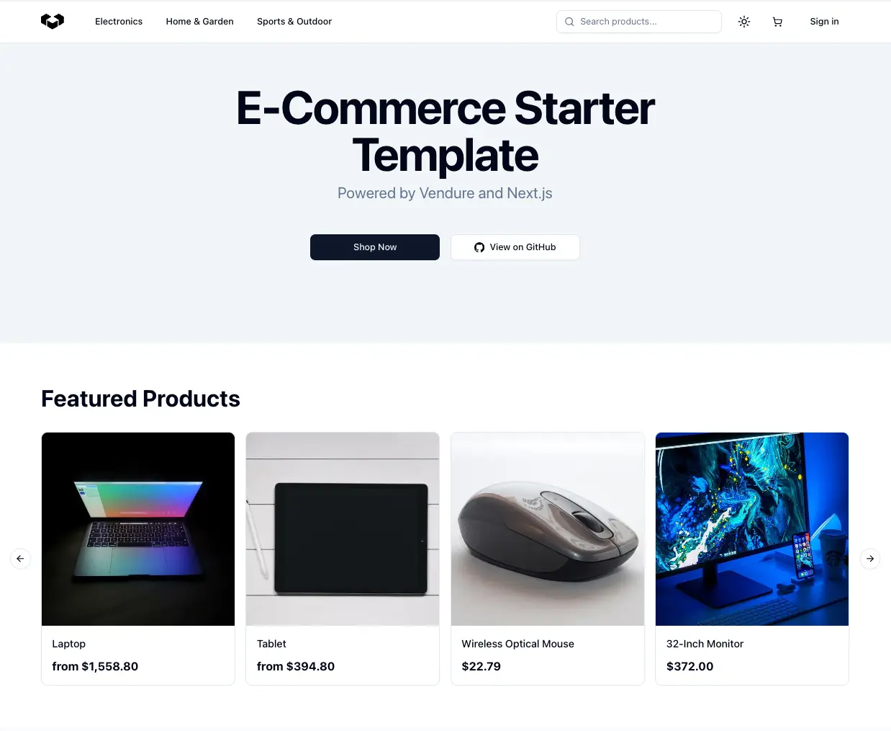

## Next.js Storefront Starter

The Vendure team has created an official Next.js Storefront Starter that you can use as a base for your own storefront.

:::info
From v3.5.2 onwards, new Vendure projects created using the `@vendure/create` tool can choose to include this Next.js Storefront Starter by default.
:::

This starter includes all basic functionality out of the box, including:

- Product listing
- Product details
- Search with facets
- Cart functionality
- Checkout flow
- Account management
- Styling with Tailwind

- 🔗 [next.vendure.io](https://next.vendure.io/)
- 💻 [github.com/vendurehq/storefront-nextjs-starter](https://github.com/vendurehq/nextjs-starter-vendure)

:::note
Prefer to build your own solution? Follow the rest of the guides in this section to learn how to build a Storefront from scratch.
:::

## Community-maintained Starters

The Next.js starter is the official Vendure Storefront starter, but there are also several further starters that were originally created
as demos by the Vendure team, and are now community-maintained.

### Remix Storefront

- 🔗 [remix-storefront.vendure.io](https://remix-storefront.vendure.io/)
- 💻 [github.com/vendurehq/storefront-remix-starter](https://github.com/vendurehq/storefront-remix-starter)

[Remix](https://remix.run/) is a React-based full-stack JavaScript framework which focuses on web standards, modern web app UX, and which helps you build better websites.

Our official Remix Storefront starter provides you with a lightning-fast, modern storefront solution which can be deployed to any of the popular cloud providers like Vercel, Netlify, or Cloudflare Pages.

### Qwik Storefront

- 🔗 [qwik-storefront.vendure.io](https://qwik-storefront.vendure.io/)
- 💻 [github.com/vendurehq/storefront-qwik-starter](https://github.com/vendurehq/storefront-qwik-starter)

[Qwik](https://qwik.builder.io/) is a cutting-edge web framework that offers unmatched performance.

Our official Qwik Storefront starter provides you with a lightning-fast, modern storefront solution which can be deployed to any of the popular cloud providers like Vercel, Netlify, or Cloudflare Pages.

### Angular Storefront

- 🔗 [angular-storefront.vendure.io](https://angular-storefront.vendure.io/)
- 💻 [github.com/vendurehq/storefront-angular-starter](https://github.com/vendurehq/storefront-angular-starter)

[Angular](https://angular.io/) is a popular, stable, enterprise-grade framework made by Google.

Our official Angular Storefront starter is a modern Progressive Web App that uses Angular Universal server-side rendering.

