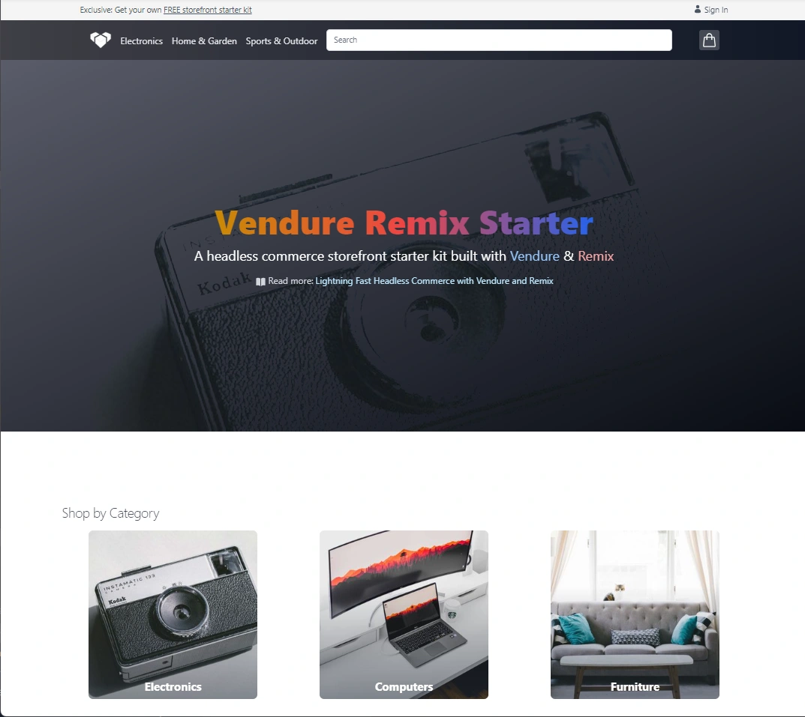

Since building an entire Storefront from scratch can be a daunting task, we have prepared a few starter projects that you can use as a base for your own storefront.

These starters provide basic functionality including:

- Product listing
- Product details
- Search with facets
- Cart functionality
- Checkout flow
- Account management
- Styling with Tailwind

The idea is that you clone the starter project and then customize it to your needs.

:::note
Prefer to build your own solution? Follow the rest of the guides in this section to learn how to build a Storefront from scratch.
:::

## Remix Storefront

- 🔗 [remix-storefront.vendure.io](https://remix-storefront.vendure.io/)
- 💻 [github.com/vendure-ecommerce/storefront-remix-starter](https://github.com/vendure-ecommerce/storefront-remix-starter)

[Remix](https://remix.run/) is a React-based full-stack JavaScript framework which focuses on web standards, modern web app UX, and which helps you build better websites.

Our official Remix Storefront starter provides you with a lightning-fast, modern storefront solution which can be deployed to any of the popular cloud providers like Vercel, Netlify, or Cloudflare Pages.

## Qwik Storefront

- 🔗 [qwik-storefront.vendure.io](https://qwik-storefront.vendure.io/)
- 💻 [github.com/vendure-ecommerce/storefront-qwik-starter](https://github.com/vendure-ecommerce/storefront-qwik-starter)

[Qwik](https://qwik.builder.io/) is a cutting-edge web framework that offers unmatched performance.

Our official Qwik Storefront starter provides you with a lightning-fast, modern storefront solution which can be deployed to any of the popular cloud providers like Vercel, Netlify, or Cloudflare Pages.

## Angular Storefront

- 🔗 [angular-storefront.vendure.io](https://angular-storefront.vendure.io/)
- 💻 [github.com/vendure-ecommerce/storefront-angular-starter](https://github.com/vendure-ecommerce/storefront-angular-starter)

[Angular](https://angular.io/) is a popular, stable, enterprise-grade framework made by Google.

Our official Angular Storefront starter is a modern Progressive Web App that uses Angular Universal server-side rendering.

