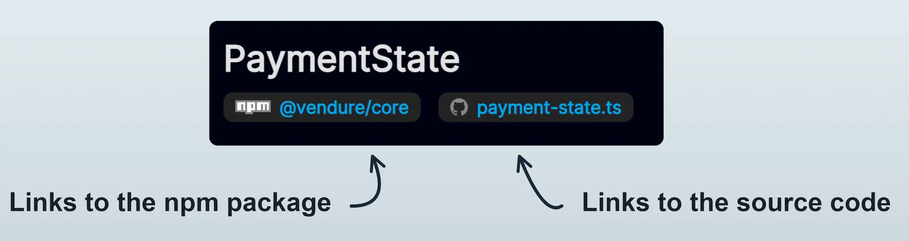

This section contains reference documentation for the various APIs exposed by Vendure.

:::note

All of the information in this section is generated directly from the Vendure source code. You can jump directly
to the source file using the links below each heading.

:::

### TypeScript API

These are the classes, interfaces and other TypeScript object which are used when **writing plugins** or custom business logic.

### Core Plugins

These are the TypeScript APIs for the core Vendure plugins.

### GraphQL API

These are the GraphQL APIs you will use to build your storefront (Shop API) or admin integrations (Admin API).

### Admin UI API

These are the Angular components and services you can use when building Admin UI extensions.
