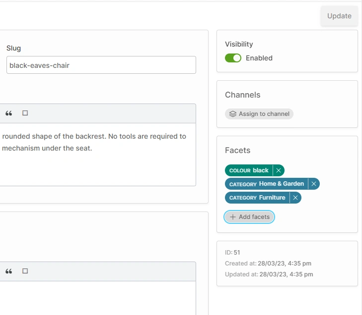

# Facets

Facets are the primary means to attach structured data to your Products & ProductVariants. Typical uses of Facets include:

* Enabling faceted search & filtering in the storefront
* Organizing Products into Collections
* Labelling Products for inclusion in Promotions 

A Facet has one or more FacetValues, for example:

* Facet: "Brand"
* Values: "Apple", "Logitech", "Sony", "LG" ...

## Assigning to Products & Variants

In the Product detail page, you can assign FacetValues by clicking the _ADD FACETS_ button toward the bottom of the Product or ProductVariant views.

## Public vs Private Facets

The visibility of a Facet can be set to either _public_ or _private_.

* **Public** facets are visible via the Shop API, meaning they can be listed in the storefront and used for faceted searches.
* **Private** facets are only visible to Administrators, and cannot be used in storefront faceted searches. 

Private facets can be useful for labelling Products for internal use. For example, you could create a "profit margin" Facet with "high" and "low" values. You wouldn't want to display these in the storefront, but you may want to use them e.g. in Promotion logic.
