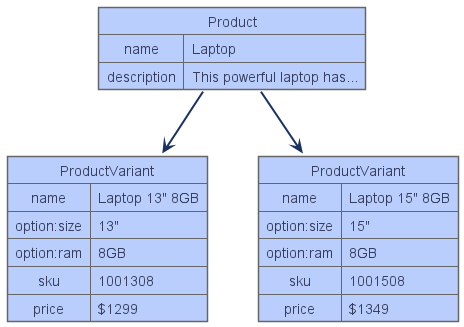
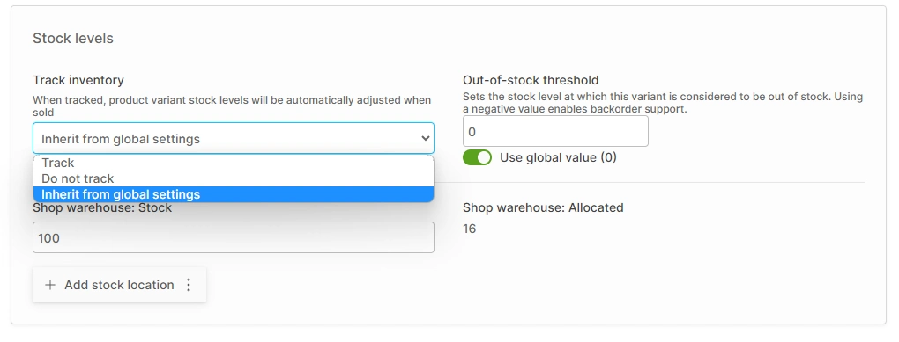

# Products

Products represent the items you want to sell to your customers.

## Products vs ProductVariants

In Vendure, every Product has one or more _ProductVariants_. You can think of a Product as a "container" which houses the variants: 

In the diagram above you'll notice that it is the ProductVariants which have an SKU (_stock-keeping unit_: a unique product code) and a price.

**Products** provide the overall name, description, slug, images. A product _does not_ have a price, sku, or stock level. 

**ProductVariants** have a price, sku, stock level, tax settings. They are the actual things that get added to orders and purchased.

## Tracking Inventory

Vendure can track the stock levels of each of your ProductVariants. This is done by setting the "track inventory" option to "track" (or "inherit from global settings" if the [global setting]() is set to track).

When tracking inventory:

* When a customer checks out, the contents of the order will be "allocated". This means that the stock has not yet been sold, but it is no longer available to purchase (no longer _saleable_).
* Once a Fulfillment has been created (see the Orders section), those allocated items will be converted into sales, meaning the stock level will be lowered by the corresponding quantity.
* If a customer attempts to add more of a ProductVariant than are currently _saleable_, they will encounter an error.

### Back orders

Back orders can be enabled by setting a **negative value** as the "Out-of-stock threshold". This can be done via [global settings]() or on a per-variant basis.
