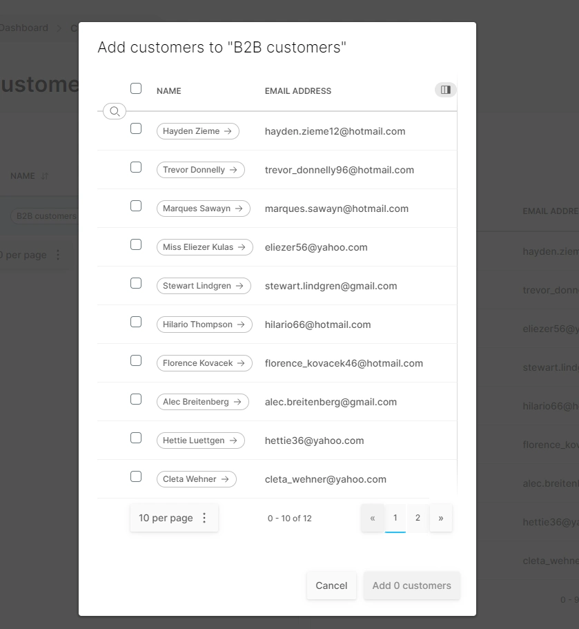

# Customers

A Customer is anybody who has:

* Placed an order
* Registered an account

The Customers section allows you to view and search for your customers. Clicking "edit" in the list view brings up the detail view, allowing you to edit the customer details and view orders and history.

## Guest, Registered, Verified

* **Guest:** Vendure allows "guest checkouts", which means people may place orders without needing to register an account with the storefront. 
* **Registered:** When a customer registers for an account (using their email address by default), they are assigned this status.
* **Verified:** A registered customer becomes verified once they have been able to confirm ownership of their email account. Note that if alternative authentication methods are set up on your store (e.g. Facebook login), then this workflow might be slightly different.

## Customer Groups

Customer Groups can be used for things like:

* Grouping wholesale customers so that alternative tax calculations may be applied
* Grouping members of a loyalty scheme for access to exclusive Promotions
* Segmenting customers for other marketing purposes

