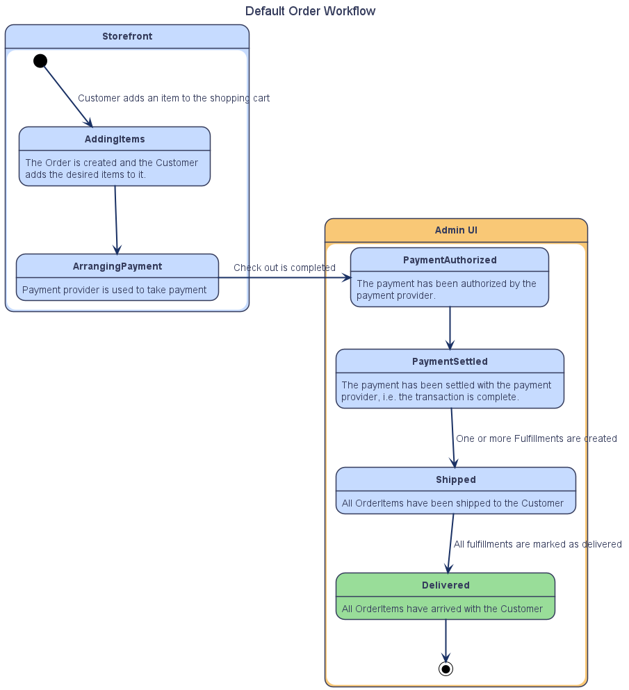
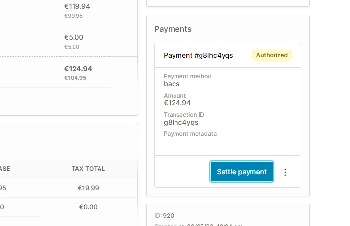
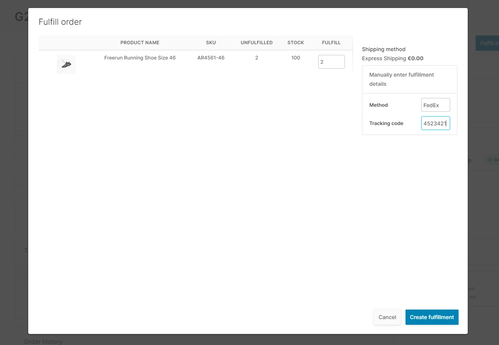
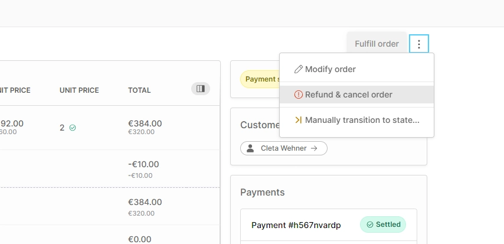
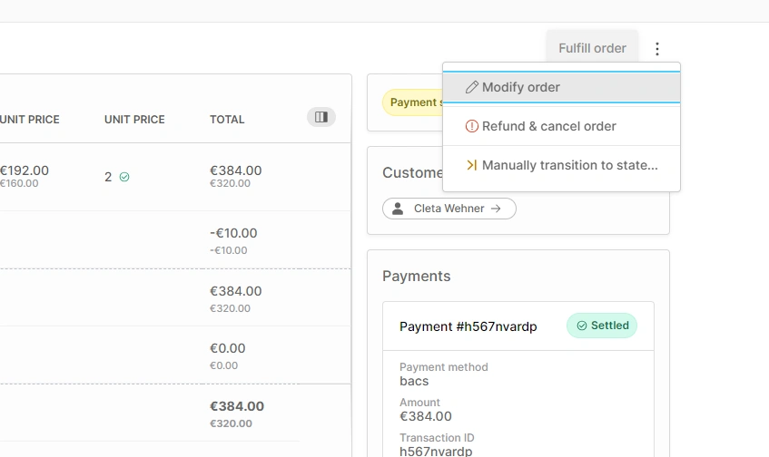
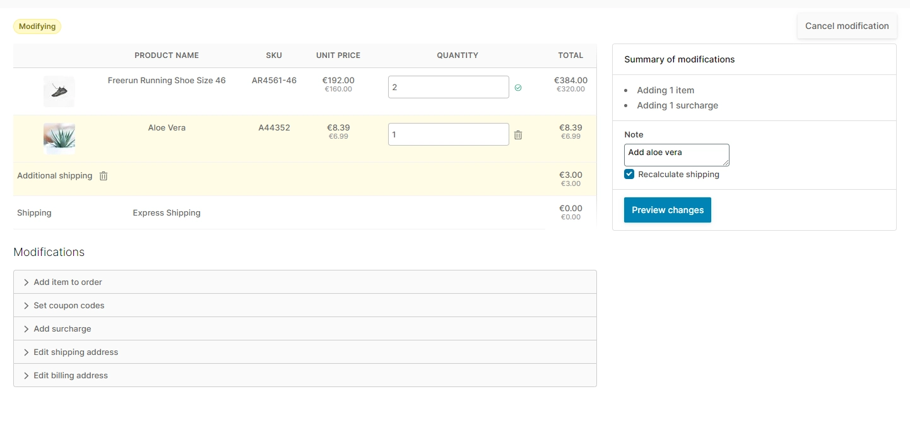

# Orders

An Order is created whenever someone adds an item to their cart in the storefront. In Vendure, there is no distinction between a "cart" and an "order". Thus a "cart" is just an Order which has not yet passed through the checkout process.

## The Order Workflow

The exact set of stages that an Order goes through can be customized in Vendure to suit your particular business needs, but we can look at the default steps to get a good idea of the typical workflow:

When a new Order arrives, you would:

1. **Settle the payment** if not already done (this may or may not be needed depending on the way your payment provider is configured).
    
1. **Create a Fulfillment** by clicking the "Fulfill Order" button in the top-right of the order detail page. A Fulfillment represents the physical package which will be sent to the customer. You may split up your order into multiple Fulfillments, if that makes sense from a logistical point of view.
    
1. **Mark the Fulfillment as "shipped"** once the physical package leaves your warehouse. 
1. **Mark the Fulfillment as "delivered"** once you have notice of the package arriving with the customer. 
   

## Refunds

You can refund one or more items from an Order by clicking this menu item, which is available once the payments are settled:

This will bring up a dialog which allows you to select which items to refund, as well as whether to refund shipping. You can also make an arbitrary adjustment to the refund amount if needed.

A Refund is then made against the payment method used in that order. Some payment methods will handle refunds automatically, and others will expect you to perform the refund manually in your payment provider's admin interface, and then record the fact manually.

## Cancellation

One or more items may also be cancelled in a similar way to how refunds are handled. Performing a cancellation will return the selected items back into stock.

Cancellations and refunds are often done together, but do not have to be. For example, you may refund a faulty item without requiring the customer to return it. This would be a pure refund.

## Modifying an Order

An Order can be modified after checkout is completed. 

Modification allows you to:

* Alter the quantities of any items in the order
* Remove items from the order  
* Add new items to the order
* Add arbitrary surcharges or discounts
* Alter the shipping & billing address

Once you have made the desired modifications, you preview the changes including the price difference.

If the modifications have resulted in an increased price (as in the above example), the Order will then be set into the "Arranging additional payment" state. This allows you to process another payment from the customer to make up the price difference.

On the other hand, if the new price is less than what was originally paid (e.g. if the quantity is decreased), then a Refund will be generated against the payment method used.

