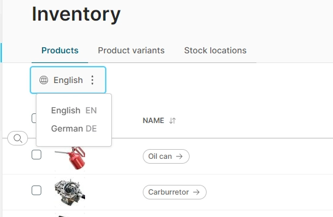

# Global Settings

The global settings allow you to define certain configurations that affect _all_ channels.

* **Available languages** defines which languages you wish to make available for translations. When more than one language has been enabled, you will see the language switcher appear when viewing translatable objects such as products, collections, facets and shipping methods.
  
* **Global out-of-stock threshold** sets the stock level at which a product variant is considered to be out of stock. Using a negative value enables backorder support. This setting can be overridden by individual product variants (see the [tracking inventory](#tracking-inventory) guide).
* **Track inventory by default** sets whether stock levels should be tracked. This setting can be overridden by individual product variants (see the [tracking inventory](#tracking-inventory) guide).
