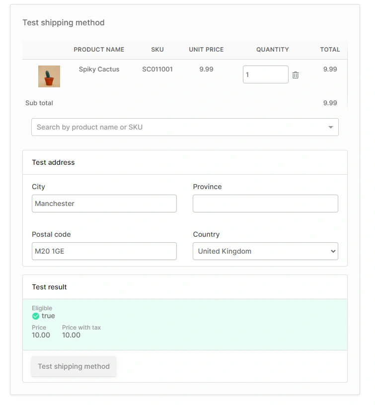

# Shipping Methods

Shipping methods define:

* Whether an order is eligible for a particular shipping method
* How much the shipping should cost for a given order
* How the order will be fulfilled

Let's take a closer look at each of these parts:

## Shipping eligibility checker

This is how we decide whether a particular shipping method may be applied to an order. This allows you to limit a particular shipping method based on things like:

* Minimum order amount
* Order weight
* Shipping destination
* Particular contents of the order
* etc.

By default, Vendure comes with a checker which can impose a minimum order amount. To implement more complex checks, your developers are able to create custom checkers to suit your requirements.

## Shipping calculator

The calculator is used to determine how much to charge for shipping an order. Calculators can be written to implement things like:

* Determining shipping based on a 3rd-party service such as Shippo
* Looking up prices from data supplied by couriers
* Flat-rate shipping

By default, Vendure comes with a simple flat-rate shipping calculator. Your developers can create more sophisticated integrations according to your business requirements.

## Fulfillment handler

By "fulfillment" we mean how we physically get the goods into the hands of the customer. Common fulfillment methods include:

* Courier services such as FedEx, DPD, DHL, etc.
* Collection by customer
* Delivery via email for digital goods or licenses

By default, Vendure comes with a "manual fulfillment handler", which allows you to manually enter the details of whatever actual method is used. For example, if you send the order by courier, you can enter the courier name and parcel number manually when creating an order.

Your developers can however create much more sophisticated fulfillment handlers, which can enable things like automated calls to courier APIs, automated label generation, and so on.

## Testing a Shipping Method

At the bottom of the shipping method **detail page** you can test the current method by creating a fake order and shipping address and testing a) whether this method would be eligible, and b) how much it would cost.

Additionally, on the shipping method **list page** you can test _all_ shipping methods at once.
