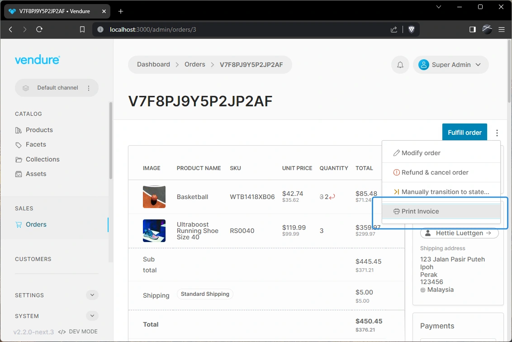

import Tabs from '@theme/Tabs';
import TabItem from '@theme/TabItem';

The `ActionBar` is the horizontal area at the top of each list or detail page, which contains the main buttons for that page.
This guide explains how to add new buttons and dropdown menu items to the ActionBar.

For example, consider an "order invoice" extension that allows you to print invoices for orders. You can add a "print invoice" 
button to the ActionBar of the order detail page, either as a button or as a dropdown menu item.

## ActionBar button example

Adding a button is done using the [`addActionBarItem`](/reference/admin-ui-api/action-bar/add-action-bar-item/) function.

```ts title="src/plugins/invoice/ui/providers.ts"
import { addActionBarItem } from '@vendure/admin-ui/core';

export default [
    addActionBarItem({
        id: 'print-invoice',
        locationId: 'order-detail',
        label: 'Print invoice',
        icon: 'printer',
        routerLink: route => {
            const id = route.snapshot.params.id;
            return ['./extensions/order-invoices', id];
        },
        requiresPermission: 'ReadOrder',
    }),
];
```


In each list or detail view in the app, the ActionBar has a unique `locationId` which is how the app knows in which view to place your button.
The complete list of available locations into which you can add new ActionBar can be found in the [PageLocationId docs](/reference/admin-ui-api/action-bar/page-location-id/).
You can also press `ctrl + u` when in development mode to see the location of all UI extension points.

## ActionBar dropdown menu example

Vendure v2.2.0 introduced the ability to add dropdown menu items to the ActionBar. If you want to add an action which is
less commonly used, or want to take up less space in the action bar, then a dropdown menu item is a good choice.
This is done using the [`addActionBarDropdownMenuItem`](/reference/admin-ui-api/action-bar/add-action-bar-dropdown-menu-item/) function.

Let's re-work the "print invoice" button example to display it instead as a dropdown menu item:

```ts title="src/plugins/invoice/ui/providers.ts"
import { addActionBarDropdownMenuItem } from '@vendure/admin-ui/core';

export default [
    addActionBarDropdownMenuItem({
        id: 'print-invoice',
        locationId: 'order-detail',
        label: 'Print invoice',
        icon: 'printer',
        routerLink: route => {
            const id = route.snapshot.params.id;
            return ['./extensions/order-invoices', id];
        },
        requiresPermission: 'ReadOrder',
        // When set to `true`, a horizontal divider will be
        // displayed above this item in the dropdown menu.
        hasDivider: true,
    }),
];
```



## Handling button clicks

There are two ways to handle the click event of an ActionBar button or dropdown menu item:

1. Use the `routerLink` property to navigate to a new route when the button is clicked.
2. Use the `onClick` property to execute a function when the button is clicked.

### Using routerLink

The `routerLink` property allows you to specify a route to navigate to when the button is clicked. The route can be a constant value, or it can be a function which receives the current route as well as a [`context` object](/reference/admin-ui-api/action-bar/action-bar-context) as arguments.

<Tabs>
<TabItem value="routerLink constant" label="routerLink constant" default>

```ts title="src/plugins/invoice/ui/providers.ts"
import { addActionBarItem } from '@vendure/admin-ui/core';

export default [
    addActionBarItem({
        id: 'print-invoice',
        label: 'Print invoice',
        locationId: 'order-detail',
        // highlight-start
        // The route can be a constant value...
        routerLink: ['./extensions/order-invoices'],
        // highlight-end
    }),
];
```

</TabItem>
<TabItem value="routerLink function" label="routerLink function">

```ts title="src/plugins/invoice/ui/providers.ts"
import { addActionBarItem } from '@vendure/admin-ui/core';

export default [
    addActionBarItem({
        id: 'print-invoice',
        label: 'Print invoice',
        locationId: 'order-detail',
        // highlight-start
        // The route can be a function
        routerLink: route => {
            const id = route.snapshot.params.id;
            return ['./extensions/order-invoices', id];
        },
        // highlight-end
    }),
];
```

</TabItem>
</Tabs>

### Using onClick

The onClick property of the addActionBarItem function allows you to define a function that will be executed when the ActionBar button is clicked. This function receives two arguments: the click event and the current context.

The context object provides access to commonly-used services, which allows you to perform GraphQL queries and mutations, and the current route, which can be used to get parameters from the URL.

Here's an example of how to use the onClick property to perform a GraphQL mutation when the ActionBar button is clicked:

```ts title="src/plugins/invoice/ui/providers.ts"
import gql from 'graphql-tag';
import { firstValueFrom } from 'rxjs';
import { addActionBarItem } from '@vendure/admin-ui/core';

const mutation = gql`
    mutation MyMutation($orderId: ID!) {
        myMutation(orderId: $orderId)
    }
`;

export default [
    addActionBarItem({
        id: 'myButtonId',
        label: 'My Button Label',
        locationId: 'order-detail',
        // highlight-start
        onClick: async (event, context) => {
            try {
                const orderId = context.route.snapshot.params.id;
                await firstValueFrom(context.dataService.mutate(mutation, { orderId }));
            } catch (error) {
                context.notificationService.error('Error executing mutation: ' + error.message);
            }
        },
        // highlight-end
    }),
];
```

In this example, clicking the ActionBar button triggers a GraphQL mutation. The `context.dataService` is utilized to execute the mutation. It can also be employed to retrieve additional information about the current order if needed. The `context.route` is used to extract the ID of the current order from the URL.

The utility function `firstValueFrom` from the RxJS library is used in this example to convert the Observable returned by `context.dataService.mutate(...)` into a Promise. This conversion allows the use of the `await` keyword to pause execution until the Observable emits its first value or completes.

## Setting visibility & disabled state

Use the `buttonState` property (added in v2.1) to control the visibility and disabled state of the button. This property is a function which receives the current context as an argument and returns an Observable of the button state:

```ts title="src/plugins/invoice/ui/providers.ts"
import { map, switchMap } from 'rxjs/operators';
import { addActionBarItem } from '@vendure/admin-ui/core';

export default [
    addActionBarItem({
        id: 'print-invoice',
        label: 'Print invoice',
        locationId: 'order-detail',
        buttonState: context => {
            // For any of the detail pages, we can get an observable stream
            // of the entity via `context.entity$`:
            return context.entity$.pipe(
                map(order => ({
                    disabled: order?.state === 'AddingItems',
                    visible: true,
                })),
            );
        },
    }),
];
```

:::note
The `context.entity$` property was introduced in Vendure v2.2. If you are using v2.1, you can achieve equivalent functionality
with this code:

```ts
buttonState: context => {
    return context.route.data.pipe(
        switchMap(data => data.detail.entity),
        map((order: any) => ({
            disabled: order.state === 'AddingItems',
            visible: true,
        })),
    );
}
```

:::

## Restricting access by permissions

You can use the `requiresPermission` property to restrict access to the button by permission. This property accepts a single permission string or an array of permission strings. If the current user does not have the required permission, the button will not be visible.

```ts title="src/plugins/invoice/ui/providers.ts"
import { addActionBarItem } from '@vendure/admin-ui/core';

export default [
    addActionBarItem({
        id: 'print-invoice',
        label: 'Print invoice',
        locationId: 'order-detail',
        routerLink: ['./extensions/order-invoices'],
        // highlight-next-line
        requiresPermission: 'CreateInvoice',
    }),
];
```
