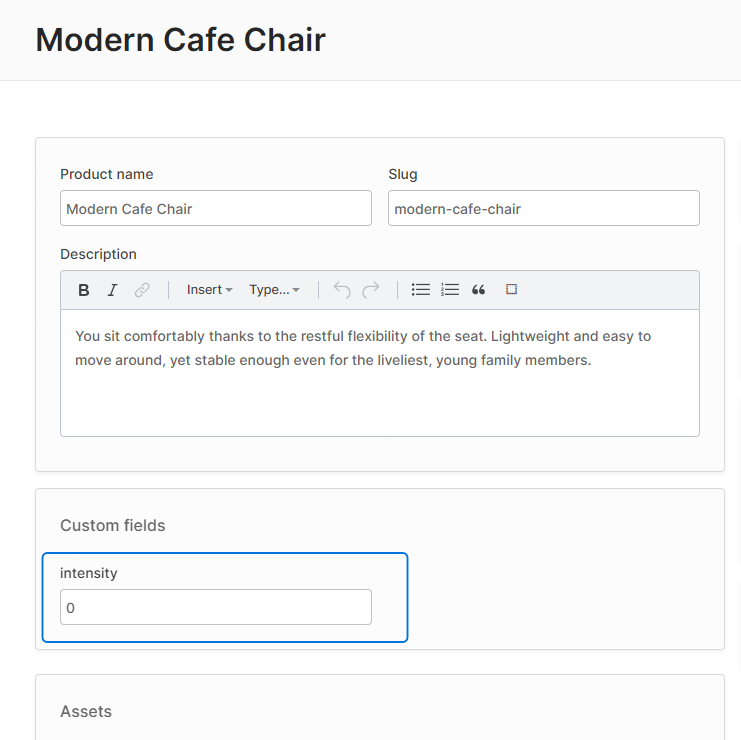

import Tabs from '@theme/Tabs';
import TabItem from '@theme/TabItem';

You can define custom Angular or React components which can be used to render [Custom Fields](/guides/developer-guide/custom-fields/) you have defined on your entities as well as [configurable args](/reference/typescript-api/configurable-operation-def/config-args/) used by custom [Configurable Operations](/guides/developer-guide/strategies-configurable-operations/#configurable-operations).

## For Custom Fields

Let's say you define a custom "intensity" field on the Product entity:

```ts title="src/vendure-config.ts"
import { VendureConfig } from '@vendure/core';

export const config: VendureConfig = {
    // ...
    customFields: {
        Product: [
            { name: 'intensity', type: 'int', min: 0, max: 100, defaultValue: 0 },
        ],
    },
}
```

By default, the "intensity" field will be displayed as a number input:



But let's say we want to display a **range slider** instead.

### 1. Define a component

First we need to define a new Angular or React component to render the slider:

<Tabs groupId="framework">
<TabItem value="Angular" label="Angular" default>

Angular components will have the `readonly`, `config` and `formControl` properties populated automatically.

```ts title="src/plugins/common/ui/components/slider-form-input/slider-form-input.component.ts"
import { Component } from '@angular/core';
import { FormControl } from '@angular/forms';
import { IntCustomFieldConfig, SharedModule, FormInputComponent } from '@vendure/admin-ui/core';

@Component({
    template: `
      <input
          type="range"
          [min]="config.min || 0"
          [max]="config.max || 100"
          [formControl]="formControl" />
      {{ formControl.value }}
  `,
    standalone: true,
    imports: [SharedModule],
})
export class SliderControlComponent implements FormInputComponent<IntCustomFieldConfig> {
    readonly: boolean;
    config: IntCustomFieldConfig;
    formControl: FormControl;
}
```

</TabItem>
<TabItem value="React" label="React">

React components can use the [`useFormControl`](/reference/admin-ui-api/react-hooks/use-form-control) hook to access the form control and set its value. The 
component will also receive `config` and `readonly` data as props. 

```tsx title="src/plugins/common/ui/components/SliderFormInput.tsx"
import React from 'react';
import { useFormControl, ReactFormInputOptions, useInjector } from '@vendure/admin-ui/react';

export function SliderFormInput({ readonly, config }: ReactFormInputOptions) {
    const { value, setFormValue } = useFormControl();
    const handleChange = (e: React.ChangeEvent<HTMLInputElement>) => {
        const val = +e.target.value;
        setFormValue(val);
    };
    return (
        <>
            <input
                type="range"
                readOnly={readonly}
                min={config.min || 0}
                max={config.max || 100}
                value={value}
                onChange={handleChange}
            />
            {value}
        </>
    );
};
```

</TabItem>
</Tabs>

### 2. Register the component

Next we will register this component in our `providers.ts` file and give it a unique ID, `'slider-form-input'`:

<Tabs groupId="framework">
<TabItem value="Angular" label="Angular" default>

```ts title="src/plugins/common/ui/providers.ts"
import { registerFormInputComponent } from '@vendure/admin-ui/core';
import { SliderControlComponent } from './components/slider-form-input/slider-form-input.component';

export default [
    registerFormInputComponent('slider-form-input', SliderControlComponent),
];
```

</TabItem>
<TabItem value="React" label="React">

```ts title="src/plugins/common/ui/providers.ts"
import { registerReactFormInputComponent } from '@vendure/admin-ui/react';
import { SliderControl } from './components/SliderFormInput';

export default [
    registerReactFormInputComponent('slider-form-input', SliderFormInput),
];
```

</TabItem>
</Tabs>

### 3. Register the providers

The `providers.ts` is then passed to the `compileUiExtensions()` function as described in the [UI Extensions Getting Started guide](/guides/extending-the-admin-ui/getting-started/):

```ts title="src/vendure-config.ts"
import * as path from 'path';
import { VendureConfig } from '@vendure/core';
import { AdminUiPlugin } from '@vendure/admin-ui-plugin';
import { compileUiExtensions } from '@vendure/ui-devkit/compiler';

export const config: VendureConfig = {
    // ...
    plugins: [
        AdminUiPlugin.init({
            port: 3302,
            app: compileUiExtensions({
                outputPath: path.join(__dirname, '../admin-ui'),
                extensions: [{
                    id: 'common',
                    // highlight-start
                    extensionPath: path.join(__dirname, 'plugins/common/ui'),
                    providers: ['providers.ts'],
                    // highlight-end
                }],
            }),
        }),
    ],
};
```

### 4. Update the custom field config

Once registered, this new slider input can be used in our custom field config:

```ts title="src/vendure-config.ts"
customFields: {
    Product: [
        {
            name: 'intensity', type: 'int', min: 0, max: 100, defaultValue: 0,
            // highlight-next-line
            ui: {component: 'slider-form-input'}
        },
    ],
}
```

As we can see, adding the `ui` property to the custom field config allows us to specify our custom slider component.
The component id _'slider-form-input'_ **must match** the string passed as the first argument to `registerFormInputComponent()`.

:::info
If we want, we can also pass any other arbitrary data in the `ui` object, which will then be available in our component as `this.config.ui.myField`. Note that only JSON-compatible data types are permitted, so no functions or class instances.
:::


Re-compiling the Admin UI will result in our SliderControl now being used for the "intensity" custom field:


## Custom Field Controls for Relations

If you have a custom field of the `relation` type (which allows you to relate entities with one another), you can also define custom field controls for them. The basic mechanism is exactly the same as with primitive custom field types (i.e. `string`, `int` etc.), but there are a couple of important points to know:

1. The value of the `formControl` will be the _related entity object_ rather than an id. The Admin UI will internally take care of converting the entity object into an ID when performing the create/update mutation.
2. Your control will most likely need to fetch data in order to display a list of selections for the user.

Here's an example of a custom field control for a `relation` field which relates a Product to a custom `ProductReview` entity:

```ts title="src/plugins/reviews/ui/components/relation-review-input/relation-review-input.component.ts"
import { Component, OnInit } from '@angular/core';
import { FormControl } from '@angular/forms';
import { ActivatedRoute } from '@angular/router';
import { RelationCustomFieldConfig } from '@vendure/common/lib/generated-types';
import { FormInputComponent, DataService, SharedModule } from '@vendure/admin-ui/core';
import { Observable } from 'rxjs';
import { switchMap } from 'rxjs/operators';

import { GET_REVIEWS_FOR_PRODUCT } from '../product-reviews-list/product-reviews-list.graphql';

@Component({
    selector: 'relation-review-input',
    template: `
        <div *ngIf="formControl.value as review">
            <vdr-chip>{{ review.rating }} / 5</vdr-chip>
            {{ review.summary }}
            <a [routerLink]="['/extensions', 'product-reviews', review.id]">
                <clr-icon shape="link"></clr-icon>
            </a>
        </div>
        <select [formControl]="formControl" [compareWith]="compareFn">
            <option [ngValue]="null">Select a review...</option>
            <option *ngFor="let item of reviews$ | async" [ngValue]="item">
                <b>{{ item.summary }}</b>
                {{ item.rating }} / 5
            </option>
        </select>
    `,
    standalone: true,
    imports: [SharedModule],
})
export class RelationReviewInputComponent implements OnInit, FormInputComponent<RelationCustomFieldConfig> {
    readonly: boolean;
    formControl: FormControl;
    config: RelationCustomFieldConfig;

    reviews$: Observable<any[]>;

    constructor(private dataService: DataService, private route: ActivatedRoute) {}

    ngOnInit() {
        this.reviews$ = this.route.data.pipe(
            switchMap(data => data.entity),
            switchMap((product: any) => {
                return this.dataService
                    .query(GET_REVIEWS_FOR_PRODUCT, { productId: product.id })
                    .mapSingle(({ product }) => product?.reviews.items ?? []);
            }),
        );
    }

    compareFn(item1: { id: string } | null, item2: { id: string } | null) {
        return item1 && item2 ? item1.id === item2.id : item1 === item2;
    }
}
```

## For ConfigArgs

[ConfigArgs](/reference/typescript-api/configurable-operation-def/config-args/) are used by classes which extend [Configurable Operations](/guides/developer-guide/strategies-configurable-operations/#configurable-operations) (such as ShippingCalculator or PaymentMethodHandler). These ConfigArgs allow user-input values to be passed to the operation's business logic.

They are configured in a very similar way to custom fields, and likewise can use custom form inputs by specifying the `ui` property. 

Here's an example:

```ts title="src/config/order-fixed-discount-action.ts"
export const orderFixedDiscount = new PromotionOrderAction({
    code: 'order_fixed_discount',
    args: {
        discount: {
            type: 'int',
            // highlight-start
            ui: {
                component: 'currency-form-input',
            },
            // highlight-end
        },
    },
    execute(ctx, order, args) {
        return -args.discount;
    },
    description: [{languageCode: LanguageCode.en, value: 'Discount order by fixed amount'}],
});
```


